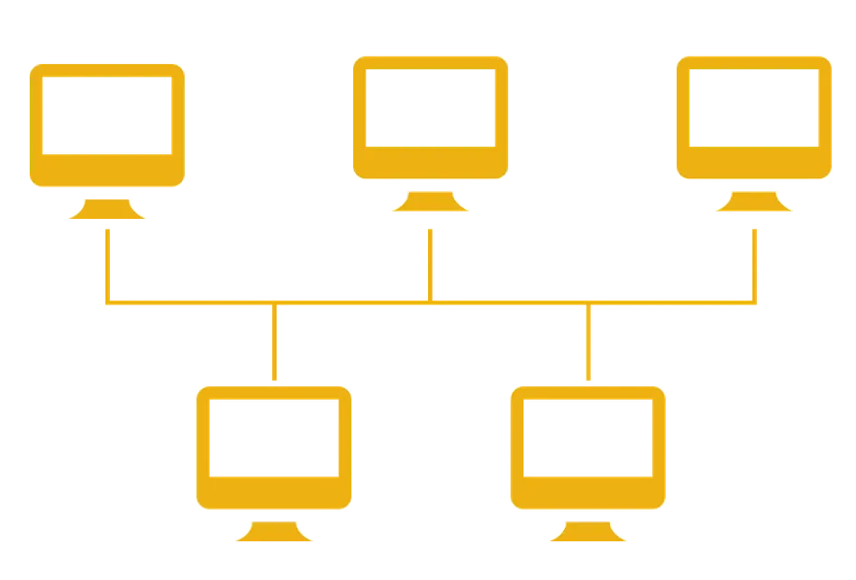
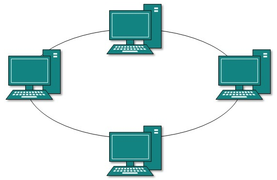

# COMPUTER NETWORK NOTES

### **What is network?**
Network refers to a collection of interconnected devices such as computers, servers and other hardware that communicate with each other to share information and resources. These devices are connected by communication channels such as cables, fiber optics or wireless signals which allow data to be exchanged.

### Key Components of a Network: 
1. **Nodes:** Devices such as Computers, Printers, Routers and Servers connected to the network.
2. **Links:** Physical (wired) or wireless connections that enable communication between devices.
3. **Protocols:** Rules that govern data transmission between devices
4. **Data:** Information transferred across the network in form of packets.

### Types of Network: 
1. #### Local Area Network:
A network that connects devices over a small geographic area such as home, office or building.

2. #### Wide Area Network:
A network that spans a large geographic area, often connecting multiple LANs. Requires networking infrastructure like routers.

3. #### Metropolitan Area Network:
A network that covers large area than LAN but smaller than WAN, typically within a city or campus. Often used to connect multiple LANs within a metropolitan area

4. #### Personal Area Network:
A small network typically used for personal devices like phone, tablets and laptops. Eg. Bluetooth connection between wireless earbuds and smartphone.

### **What is WWW?**
World Wide Web(WWW) where documents and other resources are identified by URL's which are interlinked by hyperlinks(link, a digital reference, referring to another document or resource) and are accessible over the internet.

### **What are protocols?**
Protocols are standarized rules and conventions that define how data is transmitted and received between devices over a network. These protocols ensure that devices can communicate effectively even if they are from different manufacturers or run on different softwares.

## Network Topologies: 
Topologies refer to the arrangement of various elements(nodes, links etc) in a computer network.

1. ### Bus Topology
  All devices are connected to a single central cable, known as bus or backbone.
  
   
  
  __Advantages:__
  - Simple to implement and extend. 
  - Requires less cable than other topologies. 
  
  __Disadvantages:__
  - A failure in the central cable can disable the entire network. 
  - Performance degrades as more devices are added.

2. ### Ring Topology
   Each Device is connected to two other devices, forming a circular pathway for data. Data travels in one direction (or in both directions in a dual ring topology)
   
 

   __Advantages:__
    - Data is transferred quickly with minimal collisions.
    - Predictable network performance

    __Disadvantages:__
    - A failure in any cable or device can break the loop and take down the network.
    - Difficult to troubleshoot and modify.

3. ### Star Topology
All devices are connected to a central hub or switch. Data is sent to the central hub from a device which then routes to the destination device.

    __Advantages:__
     - Easy to install and manage.
     - Failure in one cable does not affect other devices.

     __Disadvantages:__
      - If central hub fails, entire network goes down.

4. ### Mesh Topology
Every device is connected to every other device. There are two types: Full Mesh (where every device is interconnected) and Partial Mesh (where some devices are interconnected).

     __Advantages:__
      - Highly robust and reliable; if one link fails, data can take alternative paths.
      - No single point of failure.

     __Disadvantages:__
     - Expensive to implement.
     - Complex to install and manage.
   
