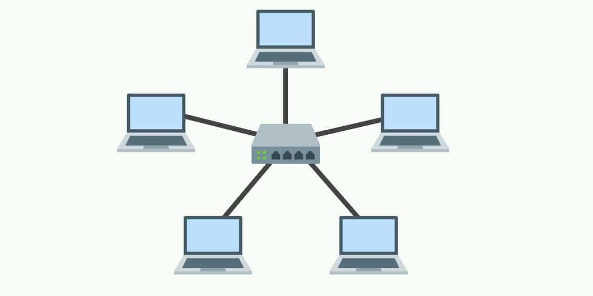
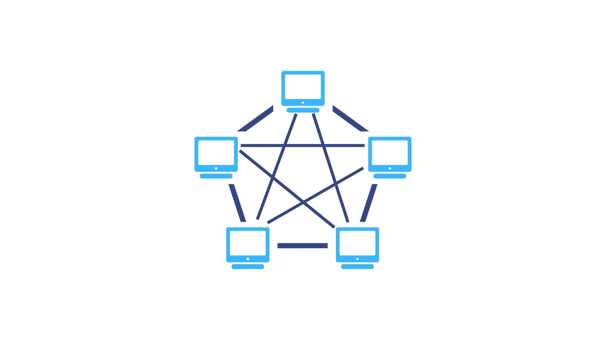
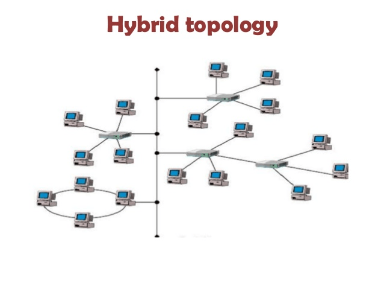
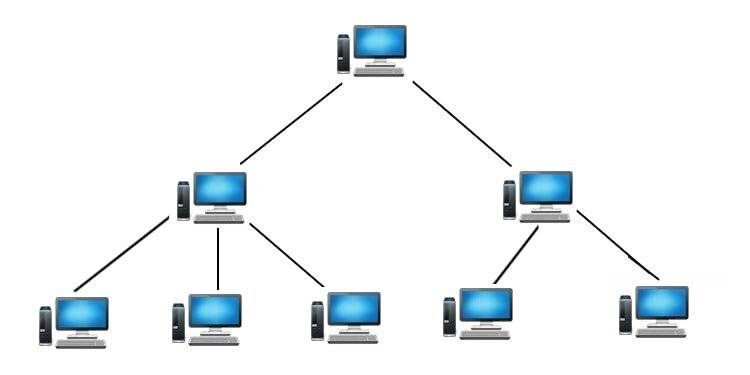

# COMPUTER NETWORK NOTES

### **What is network?**
Network refers to a collection of interconnected devices such as computers, servers and other hardware that communicate with each other to share information and resources. These devices are connected by communication channels such as cables, fiber optics or wireless signals which allow data to be exchanged.

### Key Components of a Network: 
1. **Nodes:** Devices such as Computers, Printers, Routers and Servers connected to the network.
2. **Links:** Physical (wired) or wireless connections that enable communication between devices.
3. **Protocols:** Rules that govern data transmission between devices
4. **Data:** Information transferred across the network in form of packets.

### Types of Network: 
1. #### Local Area Network:
A network that connects devices over a small geographic area such as home, office or building.

2. #### Wide Area Network:
A network that spans a large geographic area, often connecting multiple LANs. Requires networking infrastructure like routers.

3. #### Metropolitan Area Network:
A network that covers large area than LAN but smaller than WAN, typically within a city or campus. Often used to connect multiple LANs within a metropolitan area

4. #### Personal Area Network:
A small network typically used for personal devices like phone, tablets and laptops. Eg. Bluetooth connection between wireless earbuds and smartphone.

### **What is WWW?**
World Wide Web(WWW) where documents and other resources are identified by URL's which are interlinked by hyperlinks(link, a digital reference, referring to another document or resource) and are accessible over the internet.

### **What are protocols?**
Protocols are standarized rules and conventions that define how data is transmitted and received between devices over a network. These protocols ensure that devices can communicate effectively even if they are from different manufacturers or run on different softwares.

## Network Topologies: 
Topologies refer to the arrangement of various elements(nodes, links etc) in a computer network.

1. ### Bus Topology
  All devices are connected to a single central cable, known as bus or backbone.
  
   
  
    Advantages:
    - Simple to implement and extend. 
    - Requires less cable than other topologies. 
  
    Disadvantages:
    - A failure in the central cable can disable the entire network. 
    - Performance degrades as more devices are added.

2. ### Ring Topology
   Each Device is connected to two other devices, forming a circular pathway for data. Data travels in one direction (or in both directions in a dual ring topology)
   
 

     Advantages:
    - Data is transferred quickly with minimal collisions.
    - Predictable network performance
    
    Disadvantages:
    - A failure in any cable or device can break the loop and take down the network.
    - Difficult to troubleshoot and modify.

3. ### Star Topology
All devices are connected to a central hub or switch. Data is sent to the central hub from a device which then routes to the destination device.

    Advantages:
     - Easy to install and manage.
     - Failure in one cable does not affect other devices.

     Disadvantages:
      - If central hub fails, entire network goes down.

4. ### Mesh Topology
Every device is connected to every other device. There are two types: Full Mesh (where every device is interconnected) and Partial Mesh (where some devices are interconnected).

     Advantages:
      - Highly robust and reliable; if one link fails, data can take alternative paths.
      - No single point of failure.

     Disadvantages:
     - Expensive to implement.
     - Complex to install and manage.

5. ### Hybrid Topology
A combination of two or more different topologies to form a resultant topology that leverages advantages of each

    Advantages:
    - Flexible and Scalable
    - Fault tolerant

    Disadvantages:
    - More Complex to Design and Manage
    - Generally more expensive due to combination of multiple topologies.

6. ### Tree Topology
A hybrid topology combining characteristics of star and bus topologies. It has a root node and all other nodes are connected to it in a hierarchical manner.

    Advantages:
    - Scalable and easy to expand.
    - Centralized monitoring and management.

    Disadvantages:
    - If root node fails, the entire segment goes down.
    - Requires more cable.

## Some Devices
1. ### Repeater:
It operates at the Physical Layer of the OSI model. A Repeater is used to amplify or regenrate weak signals over long distances. It takes signal from one part of the network, amplifies it, and retransmits it, extending the range of the network.

**Use Case:** Used in long-distance networking, such as Ethernet or wireless networks, to extend the physical length over which data can travel.

2. ### Hub:
A hub is a basic networking device that connects mulitple computers or devices in a network. It broadcasts incoming data to all devices connected to it, regardless of which device the data is intended for. It works at the Physical Layer of the OSI model.

**Use Case:** Mostly used in older network setups. It's largely replaced by switches due to inefficiency.

Types:

Active Hub: Amplifies the incoming signal.

Passive Hub: Simply passes the signal without amplification.

3. ### Switch:
It is an advanced version of a hub. It connects multiple devices and intelligently sends data only to the specific or port where it is needed, reducing traffic and collisions. Switches maintain a MAC address table to identify connected devices.
It works at the Data Link Layer but Layer 3 switches also incorporate routing functions.

**Use Case:** Used in LANs for efficient data transfer between devices.

4. ### Bridge:
It connects and filters traffic between two or more network segements. It examines incoming traffic and forwards it only to the segment where the destination device resides. Bridges help reduce traffic and extend networks by connecting separate LAN segments. It works at the Data Link Layer.

**Use Case:** Used to divide larger networks into smaller, more manageable segments, reducing traffic.

5. ### Router:
A router is a device that routes data between different networks. It directs data packets based on their IP addresses, ensuring data is sent along the most efficient path between source and destination. Routers also enable different networks to communicate, such as bewteen a home network and the internet. It works at the Network Layer(Layer 3).

**Use Case:** Used in WANs(Wide Area Network) and to connect a local network to the internet.

6. ### Modem:
A modem converts digital data from a computer into analog signals for transmission over phone lines, and vice versa. This allows devices to connect to the internet via an ISP.

**Use Case:** Used in homes and businesses to access the internet vis DSL, cable or fiber optic connections.

