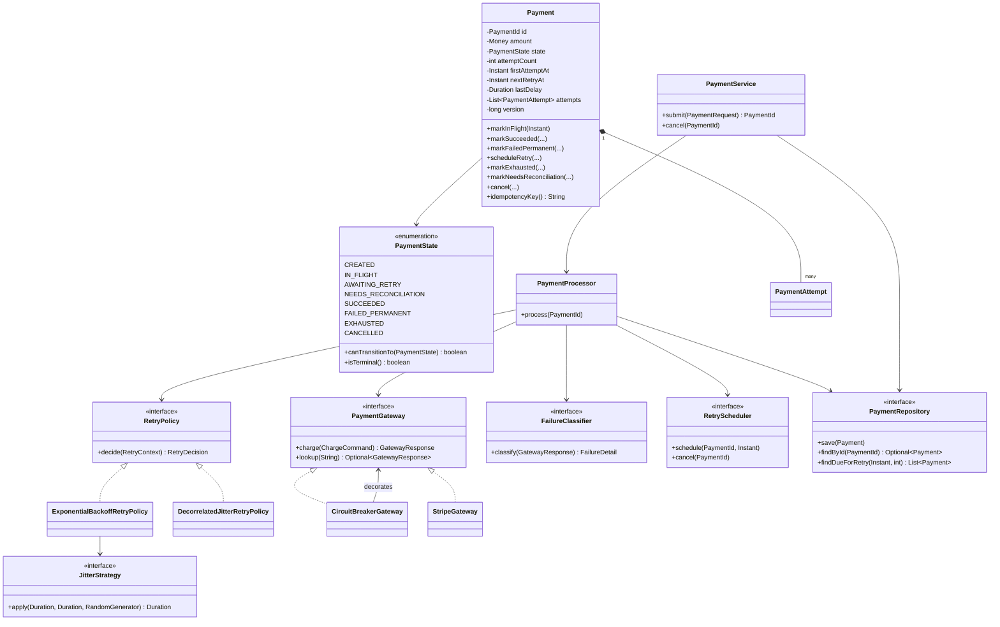

# LLD Q1 — Design a Payment Retry System (Java)

> **Interview framing:** This is a *Low Level Design* question, not a distributed systems question. The interviewer wants to see class boundaries, interfaces, state modelling, and how you reason about correctness under failure. Code quality and vocabulary matter more than drawing boxes on a whiteboard.

---

## Table of Contents

1. [The Problem in One Paragraph](#1-the-problem-in-one-paragraph)
2. [Clarifying Questions to Ask First](#2-clarifying-questions-to-ask-first)
3. [Requirements](#3-requirements)
4. [Core Concept 1 — Idempotency](#4-core-concept-1--idempotency)
5. [Core Concept 2 — Exponential Backoff with Jitter](#5-core-concept-2--exponential-backoff-with-jitter)
6. [Core Concept 3 — The Payment State Machine](#6-core-concept-3--the-payment-state-machine)
7. [Class Design Overview](#7-class-design-overview)
8. [The Code](#8-the-code)
9. [End-to-End Walkthroughs](#9-end-to-end-walkthroughs)
10. [Extensibility](#10-extensibility)
11. [Failure Scenarios](#11-failure-scenarios)
12. [Testing Strategy](#12-testing-strategy)
13. [Interview Cheat Sheet](#13-interview-cheat-sheet)

---

## 1. The Problem in One Paragraph

We charge a customer through an external payment gateway (Stripe / Razorpay / Adyen). That call can fail for many reasons: the network dropped, the gateway is rate-limiting us, the issuing bank had a temporary glitch, or the card is genuinely dead. Some of those failures are worth retrying, some are not. We must retry the retriable ones **without ever double-charging the customer**, we must space retries out so we don't hammer a struggling gateway, and we must be able to answer at any moment: *what is the current state of this payment, and what happens to it next?*

The three requirements in the prompt map onto three distinct design problems:

| Requirement | Design problem it creates |
|---|---|
| Idempotency across retries | The same logical payment may hit the gateway N times. Every one of those calls must be recognised by the gateway as "the same charge". |
| Exponential backoff with jitter | Retry timing must be a **pluggable policy object**, not `Thread.sleep(1000)` scattered in a loop. |
| Failure state transitions | Payment lifecycle must be an explicit, guarded state machine — illegal transitions should be impossible to express. |

---

## 2. Clarifying Questions to Ask First

Ask 3–4 of these out loud. It signals seniority and it narrows scope so you don't over-build.

1. **"Is the retry in-process or durable?"** — i.e. if the JVM dies mid-backoff, must the retry still happen? *(Assume yes: retries are durable, backed by persistent state. This is the interesting version.)*
2. **"Does the downstream gateway support idempotency keys?"** — *(Assume yes; almost all do. I'll also show what to do when it doesn't.)*
3. **"Single payment attempt per request, or batch/recurring billing?"** — *(Assume single, with a note on how batching changes scheduling.)*
4. **"What are the retry budget constraints?"** — max attempts, max total wall-clock window (e.g. "give up after 24 hours"). *(Assume both: 5 attempts OR 24h, whichever first.)*
5. **"Do we need to support cancellation of a scheduled retry?"** — *(Assume yes, it's a cheap requirement that forces a good state machine.)*
6. **"Who consumes the outcome?"** — do we emit events for downstream (order fulfilment, emails)? *(Assume an event publisher port exists.)*

---

## 3. Requirements

### 3.1 Functional

| # | Requirement |
|---|---|
| F1 | Submit a payment; charge it via an external gateway. |
| F2 | Classify every gateway outcome as **success**, **retriable failure**, **terminal failure**, or **indeterminate**. |
| F3 | Automatically retry retriable failures on an exponential backoff schedule with jitter. |
| F4 | Never charge the customer more than once for one logical payment, regardless of retries, crashes, or duplicate client submissions. |
| F5 | Stop retrying when the attempt budget or time budget is exhausted; move to a terminal state. |
| F6 | Allow a scheduled retry to be cancelled before it fires. |
| F7 | Expose the full attempt history (audit trail) for every payment. |
| F8 | Emit domain events on every state transition. |

### 3.2 Non-Functional

| # | Requirement | How the design satisfies it |
|---|---|---|
| N1 | **Correctness under concurrency** — two workers must not process the same retry simultaneously | Optimistic locking (`version`) + state guard on `AWAITING_RETRY → IN_FLIGHT` |
| N2 | **Crash safety** — state must survive process death | All state persisted before and after each gateway call |
| N3 | **Testability** — backoff must be deterministic in tests | `Clock` and `RandomGenerator` injected, never `System.currentTimeMillis()` / `Math.random()` |
| N4 | **Extensibility** — new gateways/policies without touching the orchestrator | Ports & adapters; `PaymentGateway`, `RetryPolicy`, `RetryScheduler` are interfaces |
| N5 | **Observability** — every attempt is recorded with reason codes | `PaymentAttempt` value objects appended to an immutable-ish list |
| N6 | **Politeness to the gateway** | Jitter + cap + (optionally) circuit breaker decorator |

### 3.3 Explicitly Out of Scope

Card tokenisation/PCI storage, refunds & chargebacks, multi-currency FX, ledger double-entry accounting, gateway failover routing. *(Mention these as out of scope — it shows you know they exist.)*

---

## 4. Core Concept 1 — Idempotency

### 4.1 The failure mode we are defending against

```
Our service                       Gateway
    |                                |
    |----- POST /charge $100 ------->|
    |                                |  money moves ✅
    |         X  (TCP reset)         |
    |<-------- (no response) --------|
    |                                |
  "did that work?"  <-- we cannot tell
```

If we naively retry, the customer is charged twice. **An indeterminate outcome is the hardest case in the whole design**, and interviewers specifically probe it.

### 4.2 Three layers of idempotency

You should be able to name all three. Most candidates only name the middle one.

#### Layer 1 — Client → Us (request de-duplication)

The caller supplies a `Idempotency-Key` header (or we derive one from `orderId`). We keep a store:

```
clientKey  →  paymentId
```

A duplicate submission returns the **existing** payment instead of creating a second one. This must be an atomic "insert if absent, else read" — a unique index on `client_key` in the DB gives you this for free.

#### Layer 2 — Us → Gateway (charge de-duplication) ← **the key one for retries**

**The rule: one logical payment = one gateway idempotency key, reused across *every* retry attempt.**

This is the single most important line in the whole answer. A common wrong answer is to generate a fresh key per attempt — that defeats the entire purpose, because the gateway then treats retry #2 as a brand new charge.

```java
// ✅ correct — stable for the life of the payment
String gatewayKey = payment.id().value();

// ❌ wrong — a new key per attempt means N charges
String gatewayKey = UUID.randomUUID().toString();
```

How the gateway uses it: the gateway stores `(merchantId, idempotencyKey) → response`. If it has already seen the key, it **replays the stored response** instead of moving money again. So our retry after a network timeout gets back the *original* success, and we correctly mark the payment `SUCCEEDED` without double-charging.

> **Nuance worth mentioning:** gateway idempotency keys usually **expire** (Stripe: 24h). If our retry window is longer than that window, the key is no longer a defence. For long-tail retries we must first call the gateway's *search/lookup* API (`GET /charges?idempotency_key=...` or by our own `reference` field) to check whether a charge already exists before issuing a new one. This is the `NEEDS_RECONCILIATION` state in our machine.

#### Layer 3 — Internal (worker de-duplication)

If two workers both pick up the same due retry, both would call the gateway. Layer 2 protects the *customer* (gateway dedupes), but we'd still double-write our own state. Fix with an atomic state claim:

```sql
UPDATE payments
   SET state = 'IN_FLIGHT', version = version + 1, locked_by = :workerId
 WHERE id = :id AND state = 'AWAITING_RETRY' AND version = :expectedVersion;
-- rows affected = 0  →  someone else got it, drop the work
```

In code this surfaces as `OptimisticLockException` from the repository.

### 4.3 Idempotency summary table

| Layer | Protects against | Mechanism | Key |
|---|---|---|---|
| Client → Us | User double-clicks "Pay" | Unique index on client key | `clientRequestKey` |
| Us → Gateway | Retry after timeout double-charging | Gateway idempotency key | `paymentId` (**stable across retries**) |
| Worker → Worker | Two schedulers firing the same retry | Optimistic lock + state guard | `version` |

---

## 5. Core Concept 2 — Exponential Backoff with Jitter

### 5.1 Why exponential

A failing dependency needs breathing room. Constant-interval retries from thousands of clients keep the dependency pinned down (a *retry storm*, which turns a blip into an outage). Delay grows as:

```
delay(n) = min(cap, base × multiplier^(n-1))
```

With `base = 1s, multiplier = 2, cap = 60s`:

```
attempt 1 fails → wait  1s
attempt 2 fails → wait  2s
attempt 3 fails → wait  4s
attempt 4 fails → wait  8s
attempt 5 fails → wait 16s
```

The `cap` matters: without it, attempt 12 waits ~34 minutes, and attempt 20 waits ~6 days.

### 5.2 Why jitter

Pure exponential backoff has a fatal flaw: **synchronisation**. If 10,000 payments fail at the same instant (gateway blipped), all 10,000 retry at exactly `t+1s`, then all at `t+3s`, and so on. You've built a thundering herd with extra steps — the retries themselves cause the next failure.

Jitter randomises each client's delay so the herd spreads out.

```
No jitter:            With full jitter:
   ▓▓▓▓▓▓▓▓                ░ ░  ░   ░ ░  ░  ░ ░
   ▓▓▓▓▓▓▓▓             ░   ░  ░  ░   ░  ░   ░
───┴───────┴──────   ───┴──┴──┴──┴──┴──┴──┴──┴──
   t+1s   t+3s              spread across window
```

### 5.3 The three standard jitter strategies

From the classic AWS Architecture Blog post *"Exponential Backoff and Jitter"*. Know all three and know the trade-off.

Let `exp = min(cap, base × 2^(n-1))`.

| Strategy | Formula | Behaviour |
|---|---|---|
| **Full jitter** | `random(0, exp)` | Maximum spread. Best contention reduction. Some retries fire almost immediately, so expected delay is halved. |
| **Equal jitter** | `exp/2 + random(0, exp/2)` | Guarantees a minimum wait while still spreading. Good compromise when you don't want near-zero delays. |
| **Decorrelated jitter** | `min(cap, random(base, prevDelay × 3))` | Stateful — depends on the previous delay. Grows faster on average, spreads well, and self-corrects. AWS's general recommendation. |

For payments I default to **full jitter** with a **floor**, because a near-instant retry against a gateway that just soft-declined is wasteful. That's a one-line change in the policy class, which is exactly why the policy is an interface.

### 5.4 The other budget: time, not just attempts

`maxAttempts` alone is a weak stopping rule. If delays are capped at 60s, 5 attempts finish in ~2 minutes — fine. But with a longer schedule, "5 attempts" could span days. Real payment retry policies (dunning) use **both**:

- stop after `maxAttempts` (e.g. 5), **and**
- stop after `maxElapsed` since first attempt (e.g. 24h).

Whichever trips first wins. Both live in the `RetryPolicy`, not in the orchestrator.

---

## 6. Core Concept 3 — The Payment State Machine

### 6.1 States

| State | Meaning | Terminal? |
|---|---|---|
| `CREATED` | Persisted, no gateway call made yet | No |
| `IN_FLIGHT` | A gateway call is currently in progress (claimed by a worker) | No |
| `AWAITING_RETRY` | Failed retriably; a retry is scheduled for `nextRetryAt` | No |
| `NEEDS_RECONCILIATION` | Indeterminate outcome (timeout). We must *ask* the gateway what happened before doing anything else | No |
| `SUCCEEDED` | Money captured | **Yes** |
| `FAILED_PERMANENT` | Hard decline / invalid request — retrying can never help | **Yes** |
| `EXHAUSTED` | Retriable, but we ran out of attempts or time | **Yes** |
| `CANCELLED` | Cancelled by user/system before a retry fired | **Yes** |

> **Design note:** separating `FAILED_PERMANENT` from `EXHAUSTED` is deliberate and interviewers notice it. They mean different things operationally: `FAILED_PERMANENT` means *stop, ask the customer for a new card*; `EXHAUSTED` means *the payment might still be viable, escalate to a human / dunning campaign*. Collapsing them into one `FAILED` loses that signal.

### 6.2 Transition diagram

```
                       ┌──────────┐
                       │ CREATED  │
                       └────┬─────┘
                            │ submit
                            ▼
        ┌──────────────►┌──────────┐
        │  claim retry  │IN_FLIGHT │
        │               └────┬─────┘
        │        ┌───────────┼───────────┬──────────────┐
        │        │           │           │              │
        │  success│    retriable│   terminal│    timeout/unknown│
        │        ▼           ▼           ▼              ▼
        │  ┌──────────┐ ┌──────────────┐ ┌──────────────────┐ ┌───────────────────────┐
        │  │SUCCEEDED │ │AWAITING_RETRY│ │FAILED_PERMANENT  │ │NEEDS_RECONCILIATION   │
        │  └──────────┘ └──────┬───────┘ └──────────────────┘ └──────────┬────────────┘
        │       (terminal)     │              (terminal)                  │
        └──────────────────────┤                                          │
                               │ budget exhausted          reconcile ─────┤
                               ▼                                          │
                        ┌───────────┐        ┌─────────────────────────────┘
                        │ EXHAUSTED │        │ resolves to SUCCEEDED,
                        └───────────┘        │ AWAITING_RETRY, or
                         (terminal)          ▼ FAILED_PERMANENT
                               ▲
                     cancel    │
                  ┌────────────┴──┐
                  │   CANCELLED   │   (only reachable from AWAITING_RETRY)
                  └───────────────┘
```

### 6.3 Transition table (this is what you encode in code)

| From | To | Trigger | Guard |
|---|---|---|---|
| `CREATED` | `IN_FLIGHT` | `submit()` | — |
| `AWAITING_RETRY` | `IN_FLIGHT` | `claimForRetry()` | `now >= nextRetryAt` and optimistic lock held |
| `NEEDS_RECONCILIATION` | `IN_FLIGHT` | `claimForReconcile()` | — |
| `IN_FLIGHT` | `SUCCEEDED` | gateway `APPROVED` | — |
| `IN_FLIGHT` | `FAILED_PERMANENT` | gateway `HARD_DECLINE` / `INVALID_REQUEST` | — |
| `IN_FLIGHT` | `AWAITING_RETRY` | retriable failure **and** policy says retry | policy returns a delay |
| `IN_FLIGHT` | `EXHAUSTED` | retriable failure **and** policy says stop | budget spent |
| `IN_FLIGHT` | `NEEDS_RECONCILIATION` | timeout / unknown | — |
| `AWAITING_RETRY` | `CANCELLED` | `cancel()` | only from this state |

**Everything not in this table must throw.** That's the whole point of a guarded state machine: illegal transitions become impossible rather than merely unlikely.

---

## 7. Class Design Overview

### 7.1 Package layout (ports & adapters / hexagonal)

```
com.payments.retry
├── domain/                       ← pure, no I/O, no frameworks
│   ├── Payment.java                  (aggregate root — owns the state machine)
│   ├── PaymentId.java                (value object)
│   ├── PaymentState.java             (enum + legal transition map)
│   ├── PaymentAttempt.java           (immutable record — audit trail entry)
│   ├── Money.java                    (value object)
│   ├── FailureCategory.java          (enum)
│   ├── FailureDetail.java            (record: category + code + message)
│   └── IllegalTransitionException.java
│
├── retry/                        ← the retry brain
│   ├── RetryPolicy.java              (interface)
│   ├── RetryContext.java             (record — input to the policy)
│   ├── RetryDecision.java            (sealed — Retry(delay) | Stop(reason))
│   ├── JitterStrategy.java           (interface + FULL / EQUAL / NONE impls)
│   ├── ExponentialBackoffRetryPolicy.java
│   └── DecorrelatedJitterRetryPolicy.java
│
├── gateway/                      ← the outbound port
│   ├── PaymentGateway.java           (interface)
│   ├── ChargeCommand.java            (record — carries the idempotency key)
│   ├── GatewayResponse.java          (record)
│   ├── GatewayOutcome.java           (enum)
│   ├── FailureClassifier.java        (maps GatewayOutcome → FailureCategory)
│   └── adapters/StripeGateway.java, CircuitBreakerGateway.java (decorator)
│
├── persistence/
│   ├── PaymentRepository.java        (interface)
│   ├── IdempotencyStore.java         (interface — client-key dedupe)
│   └── OptimisticLockException.java
│
├── scheduling/
│   ├── RetryScheduler.java           (interface)
│   ├── InMemoryRetryScheduler.java   (DelayQueue — dev/test)
│   └── DatabasePollingScheduler.java (production)
│
└── application/
    ├── PaymentService.java           (entry point / use case)
    ├── PaymentProcessor.java         (executes one attempt end-to-end)
    └── PaymentEventPublisher.java    (interface)
```

### 7.2 Why these boundaries

| Boundary | Reason |
|---|---|
| `Payment` owns its own transitions | The aggregate is the only place state changes. No service can put a payment into an illegal state. This is the difference between an *anaemic* model and a real domain model. |
| `RetryPolicy` is an interface returning a `RetryDecision` | The orchestrator asks "should I retry, and when?" and does not know or care about exponents, jitter, or budgets. Swappable per-merchant, per-currency, per-failure-type. |
| `PaymentGateway` is an interface owned by *us* | Dependency inversion: the domain defines the port; Stripe/Adyen adapters implement it. Also makes decorators (retry-free circuit breaker, metrics, logging) trivial. |
| `FailureClassifier` is separate from the gateway | The *policy* of what counts as retriable is business logic and changes independently of the wire protocol. Different merchants may classify `INSUFFICIENT_FUNDS` differently. |
| `RetryScheduler` is an interface | In-memory `DelayQueue` for tests, DB-polling or SQS-delay in production, with zero orchestrator changes. |
| `Clock` and `RandomGenerator` injected everywhere | Backoff becomes deterministic and unit-testable. Never call `Instant.now()` or `Math.random()` inline. |

### 7.3 Class diagram (Mermaid)



---

## 8. The Code

> **Java version:** records and sealed interfaces are Java 17. The one place I use a *pattern* `switch` (over `RetryDecision` in `PaymentProcessor`) needs **Java 21** — on 17 write it as `if (d instanceof RetryDecision.Retry r) … else if (d instanceof RetryDecision.Stop s) …`, which is Java 16+. Worth knowing if the interviewer pins a version.
>
> Classes marked `// adapter` in the bootstrap (`InMemoryPaymentRepository`, `StripeGateway`, …) are the infrastructure implementations — trivial and omitted for space.

### 8.1 Domain — value objects

```java
// domain/PaymentId.java
package com.payments.retry.domain;

import java.util.Objects;
import java.util.UUID;

/**
 * Identity of a logical payment. This value is ALSO the idempotency key we send
 * to the gateway, which is why it must be generated once, at creation, and never
 * regenerated for a retry.
 */
public record PaymentId(String value) {
    public PaymentId {
        Objects.requireNonNull(value, "payment id must not be null");
        if (value.isBlank()) {
            throw new IllegalArgumentException("payment id must not be blank");
        }
    }

    public static PaymentId newId() {
        return new PaymentId(UUID.randomUUID().toString());
    }

    @Override
    public String toString() {
        return value;
    }
}
```

```java
// domain/Money.java
package com.payments.retry.domain;

import java.math.BigDecimal;
import java.util.Currency;
import java.util.Objects;

/** Never use double for money. Minor units (paise/cents) as a long is even safer. */
public record Money(BigDecimal amount, Currency currency) {
    public Money {
        Objects.requireNonNull(amount);
        Objects.requireNonNull(currency);
        if (amount.signum() <= 0) {
            throw new IllegalArgumentException("amount must be positive");
        }
    }

    public static Money of(String amount, String currencyCode) {
        return new Money(new BigDecimal(amount), Currency.getInstance(currencyCode));
    }

    /** Minor units — what most gateway APIs actually want on the wire. */
    public long minorUnits() {
        return amount.movePointRight(currency.getDefaultFractionDigits())
                     .longValueExact();
    }
}
```

```java
// domain/FailureCategory.java
package com.payments.retry.domain;

/**
 * The ONLY four things that can happen to an attempt, from the retry engine's
 * point of view. Everything the gateway tells us collapses into one of these.
 */
public enum FailureCategory {
    /** Attempt succeeded — not a failure at all. */
    NONE,

    /** Transient. Retrying the SAME request may succeed. (5xx, timeout-with-no-charge,
     *  rate limit, issuer temporarily unavailable, "try again later" soft decline.) */
    RETRIABLE,

    /** Deterministic. Retrying will fail identically forever.
     *  (stolen card, invalid CVV, closed account, malformed request, auth error.) */
    TERMINAL,

    /** We do not know whether money moved. MUST reconcile before any retry —
     *  blind retry here is how customers get double-charged. */
    INDETERMINATE
}
```

```java
// domain/FailureDetail.java
package com.payments.retry.domain;

import java.util.Objects;

/**
 * Classified outcome of one attempt. `code` is the gateway's raw reason code and is
 * kept verbatim for observability and for per-code policy overrides later.
 */
public record FailureDetail(FailureCategory category, String code, String message) {

    public static final FailureDetail SUCCESS =
            new FailureDetail(FailureCategory.NONE, "OK", "approved");

    public FailureDetail {
        Objects.requireNonNull(category);
        code = (code == null) ? "UNKNOWN" : code;
        message = (message == null) ? "" : message;
    }

    public boolean isSuccess() {
        return category == FailureCategory.NONE;
    }
}
```

```java
// domain/AttemptResult.java
package com.payments.retry.domain;

public enum AttemptResult { SUCCESS, FAILURE, UNKNOWN }
```

```java
// domain/PaymentAttempt.java
package com.payments.retry.domain;

import java.time.Duration;
import java.time.Instant;

/**
 * Immutable audit-trail entry. One per gateway call. This list is what you show
 * support agents and what you replay when debugging "why was this charged twice".
 */
public record PaymentAttempt(
        int attemptNumber,
        Instant startedAt,
        Instant completedAt,
        AttemptResult result,
        FailureDetail failure,
        String gatewayReference) {

    public Duration latency() {
        return Duration.between(startedAt, completedAt);
    }
}
```

```java
// domain/IllegalTransitionException.java
package com.payments.retry.domain;

public class IllegalTransitionException extends IllegalStateException {
    public IllegalTransitionException(PaymentId id, PaymentState from, PaymentState to) {
        super("Payment %s cannot transition %s -> %s".formatted(id, from, to));
    }
}
```

### 8.2 Domain — the state machine

The legal transitions live **in the enum**, next to the states they describe. Nothing outside the domain can construct an illegal transition.

```java
// domain/PaymentState.java
package com.payments.retry.domain;

import java.util.Collections;
import java.util.EnumMap;
import java.util.EnumSet;
import java.util.Map;
import java.util.Set;

public enum PaymentState {
    CREATED,
    IN_FLIGHT,
    AWAITING_RETRY,
    NEEDS_RECONCILIATION,
    SUCCEEDED,
    FAILED_PERMANENT,
    EXHAUSTED,
    CANCELLED;

    private static final Map<PaymentState, Set<PaymentState>> ALLOWED =
            new EnumMap<>(PaymentState.class);

    static {
        ALLOWED.put(CREATED, EnumSet.of(IN_FLIGHT, CANCELLED));
        ALLOWED.put(IN_FLIGHT, EnumSet.of(
                SUCCEEDED, FAILED_PERMANENT, AWAITING_RETRY, EXHAUSTED, NEEDS_RECONCILIATION));
        ALLOWED.put(AWAITING_RETRY, EnumSet.of(IN_FLIGHT, EXHAUSTED, CANCELLED));
        ALLOWED.put(NEEDS_RECONCILIATION, EnumSet.of(
                IN_FLIGHT, SUCCEEDED, FAILED_PERMANENT, AWAITING_RETRY, EXHAUSTED));
        // terminal states have no outgoing edges
        ALLOWED.put(SUCCEEDED, Collections.emptySet());
        ALLOWED.put(FAILED_PERMANENT, Collections.emptySet());
        ALLOWED.put(EXHAUSTED, Collections.emptySet());
        ALLOWED.put(CANCELLED, Collections.emptySet());
    }

    public boolean canTransitionTo(PaymentState target) {
        return ALLOWED.get(this).contains(target);
    }

    public boolean isTerminal() {
        return ALLOWED.get(this).isEmpty();
    }
}
```

> **Talking point:** putting the table in a `static` `EnumMap` means adding a state forces you to think about its edges at compile time-ish (you'll get an NPE in tests immediately if you forget). An alternative is `EnumSet` fields on each constant; both are fine, the point is that the table is *data*, in one place, not `if` statements scattered across services.

### 8.3 Domain — the `Payment` aggregate root

This is the heart of the design. **All** mutation goes through guarded methods; there are no public setters.

```java
// domain/Payment.java
package com.payments.retry.domain;

import java.time.Duration;
import java.time.Instant;
import java.util.ArrayList;
import java.util.Collections;
import java.util.List;
import java.util.Objects;
import java.util.Optional;

public final class Payment {

    // ---- identity & immutable request data -------------------------------
    private final PaymentId id;
    private final String clientRequestKey;   // layer-1 idempotency (caller supplied)
    private final String customerId;
    private final String paymentMethodToken;
    private final Money amount;
    private final Instant createdAt;

    // ---- mutable lifecycle state ----------------------------------------
    private PaymentState state;
    private int attemptCount;
    private Instant firstAttemptAt;          // start of the time budget
    private Instant currentAttemptStartedAt;
    private Instant nextRetryAt;
    private Duration lastDelay = Duration.ZERO;   // needed by decorrelated jitter
    private FailureDetail lastFailure;
    private String gatewayReference;
    private String terminalReason;
    private final List<PaymentAttempt> attempts = new ArrayList<>();

    /** Optimistic-lock token. Incremented by the repository on every successful save. */
    private long version;

    // ---------------------------------------------------------------------
    private Payment(PaymentId id, String clientRequestKey, String customerId,
                    String paymentMethodToken, Money amount, Instant createdAt) {
        this.id = Objects.requireNonNull(id);
        this.clientRequestKey = Objects.requireNonNull(clientRequestKey);
        this.customerId = Objects.requireNonNull(customerId);
        this.paymentMethodToken = Objects.requireNonNull(paymentMethodToken);
        this.amount = Objects.requireNonNull(amount);
        this.createdAt = Objects.requireNonNull(createdAt);
        this.state = PaymentState.CREATED;
        this.attemptCount = 0;
        this.version = 0L;
    }

    public static Payment create(String clientRequestKey, String customerId,
                                 String paymentMethodToken, Money amount, Instant now) {
        return new Payment(PaymentId.newId(), clientRequestKey, customerId,
                           paymentMethodToken, amount, now);
    }

    // =====================================================================
    //  IDEMPOTENCY
    // =====================================================================

    /**
     * THE critical method. The gateway idempotency key is derived from the payment
     * id, so it is byte-identical on attempt 1 and attempt 5. If this ever returned
     * something attempt-dependent, retries would double-charge.
     */
    public String idempotencyKey() {
        return "pay_" + id.value();
    }

    // =====================================================================
    //  TRANSITIONS
    // =====================================================================

    /** CREATED | AWAITING_RETRY | NEEDS_RECONCILIATION -> IN_FLIGHT */
    public void markInFlight(Instant now) {
        transitionTo(PaymentState.IN_FLIGHT);
        this.attemptCount++;
        this.currentAttemptStartedAt = now;
        if (this.firstAttemptAt == null) {
            this.firstAttemptAt = now;   // time budget starts at attempt 1
        }
        this.nextRetryAt = null;
    }

    /** IN_FLIGHT -> SUCCEEDED */
    public void markSucceeded(Instant now, String gatewayReference) {
        transitionTo(PaymentState.SUCCEEDED);
        this.gatewayReference = gatewayReference;
        this.lastFailure = null;
        recordAttempt(now, AttemptResult.SUCCESS, FailureDetail.SUCCESS, gatewayReference);
    }

    /** IN_FLIGHT -> FAILED_PERMANENT */
    public void markFailedPermanent(Instant now, FailureDetail failure) {
        transitionTo(PaymentState.FAILED_PERMANENT);
        this.lastFailure = failure;
        this.terminalReason = "NON_RETRIABLE:" + failure.code();
        recordAttempt(now, AttemptResult.FAILURE, failure, null);
    }

    /** IN_FLIGHT -> AWAITING_RETRY */
    public void scheduleRetry(Instant now, Duration delay, FailureDetail failure) {
        transitionTo(PaymentState.AWAITING_RETRY);
        this.lastFailure = failure;
        this.lastDelay = delay;
        this.nextRetryAt = now.plus(delay);
        recordAttempt(now, AttemptResult.FAILURE, failure, null);
    }

    /** IN_FLIGHT -> EXHAUSTED (retriable, but out of budget) */
    public void markExhausted(Instant now, FailureDetail failure, String reason) {
        transitionTo(PaymentState.EXHAUSTED);
        this.lastFailure = failure;
        this.terminalReason = reason;
        this.nextRetryAt = null;
        recordAttempt(now, AttemptResult.FAILURE, failure, null);
    }

    /** IN_FLIGHT -> NEEDS_RECONCILIATION (we don't know if money moved) */
    public void markNeedsReconciliation(Instant now, FailureDetail failure) {
        transitionTo(PaymentState.NEEDS_RECONCILIATION);
        this.lastFailure = failure;
        recordAttempt(now, AttemptResult.UNKNOWN, failure, null);
    }

    /** AWAITING_RETRY | CREATED -> CANCELLED */
    public void cancel(String reason) {
        transitionTo(PaymentState.CANCELLED);
        this.terminalReason = reason;
        this.nextRetryAt = null;
    }

    private void transitionTo(PaymentState target) {
        if (!state.canTransitionTo(target)) {
            throw new IllegalTransitionException(id, state, target);
        }
        this.state = target;
    }

    private void recordAttempt(Instant completedAt, AttemptResult result,
                               FailureDetail failure, String gatewayRef) {
        Instant startedAt = (currentAttemptStartedAt == null) ? completedAt
                                                              : currentAttemptStartedAt;
        attempts.add(new PaymentAttempt(
                attemptCount, startedAt, completedAt, result, failure, gatewayRef));
    }

    // =====================================================================
    //  QUERIES
    // =====================================================================

    public boolean isDue(Instant now) {
        return state == PaymentState.AWAITING_RETRY
                && nextRetryAt != null
                && !now.isBefore(nextRetryAt);
    }

    public PaymentId id()                       { return id; }
    public String clientRequestKey()            { return clientRequestKey; }
    public String customerId()                  { return customerId; }
    public String paymentMethodToken()          { return paymentMethodToken; }
    public Money amount()                       { return amount; }
    public Instant createdAt()                  { return createdAt; }
    public PaymentState state()                 { return state; }
    public int attemptCount()                   { return attemptCount; }
    public Duration lastDelay()                 { return lastDelay; }
    public long version()                       { return version; }
    public Optional<Instant> firstAttemptAt()   { return Optional.ofNullable(firstAttemptAt); }
    public Optional<Instant> nextRetryAt()      { return Optional.ofNullable(nextRetryAt); }
    public Optional<String> gatewayReference()  { return Optional.ofNullable(gatewayReference); }
    public Optional<String> terminalReason()    { return Optional.ofNullable(terminalReason); }
    public Optional<FailureDetail> lastFailure(){ return Optional.ofNullable(lastFailure); }
    public List<PaymentAttempt> attempts()      { return Collections.unmodifiableList(attempts); }

    /** Called only by the persistence adapter after a successful write. */
    public void bumpVersion() { this.version++; }
}
```

### 8.4 Gateway port (outbound)

```java
// gateway/GatewayOutcome.java
package com.payments.retry.gateway;

public enum GatewayOutcome {
    APPROVED,
    SOFT_DECLINE,        // issuer says "maybe later" (do-not-honour, temp hold)
    HARD_DECLINE,        // stolen card, closed account, invalid CVV
    INSUFFICIENT_FUNDS,  // deliberately its own case — see note in the classifier
    RATE_LIMITED,        // 429
    GATEWAY_ERROR,       // 5xx
    INVALID_REQUEST,     // 4xx from OUR bug — never retry, it will never work
    AUTHENTICATION_ERROR,// bad API key — never retry, page someone
    TIMEOUT,             // no response; state unknown
    NETWORK_ERROR        // connection reset; state unknown
}
```

```java
// gateway/GatewayResponse.java
package com.payments.retry.gateway;

import java.time.Duration;
import java.util.Optional;

public record GatewayResponse(
        GatewayOutcome outcome,
        String reasonCode,
        String message,
        String gatewayReference,
        /** Populated from a Retry-After header when the gateway tells us when to come back. */
        Duration retryAfter) {

    public static GatewayResponse approved(String reference) {
        return new GatewayResponse(GatewayOutcome.APPROVED, "approved", "ok", reference, null);
    }

    public static GatewayResponse of(GatewayOutcome outcome, String code, String message) {
        return new GatewayResponse(outcome, code, message, null, null);
    }

    public Optional<Duration> retryAfterHint() {
        return Optional.ofNullable(retryAfter);
    }

    public boolean isApproved() {
        return outcome == GatewayOutcome.APPROVED;
    }
}
```

```java
// gateway/ChargeCommand.java
package com.payments.retry.gateway;

import com.payments.retry.domain.Money;

/**
 * Note that the idempotency key is a first-class, REQUIRED field of the command.
 * Making it non-optional at the type level means you cannot forget it.
 */
public record ChargeCommand(
        String idempotencyKey,
        String customerId,
        String paymentMethodToken,
        Money amount,
        int attemptNumber) {

    public ChargeCommand {
        if (idempotencyKey == null || idempotencyKey.isBlank()) {
            throw new IllegalArgumentException("idempotency key is mandatory");
        }
    }
}
```

```java
// gateway/PaymentGateway.java
package com.payments.retry.gateway;

import java.util.Optional;

public interface PaymentGateway {

    /**
     * Implementations MUST send {@code command.idempotencyKey()} to the provider
     * (e.g. the {@code Idempotency-Key} header) and MUST NOT throw for business
     * declines — a decline is a {@link GatewayResponse}, not an exception.
     * Transport problems may throw {@link GatewayCommunicationException}.
     */
    GatewayResponse charge(ChargeCommand command);

    /**
     * Reconciliation hook: "did a charge with this idempotency key already happen?"
     * Used to resolve NEEDS_RECONCILIATION without risking a double charge.
     */
    Optional<GatewayResponse> lookupByIdempotencyKey(String idempotencyKey);

    String name();
}
```

```java
// gateway/GatewayCommunicationException.java
package com.payments.retry.gateway;

/** Thrown only for transport-level problems where the outcome is genuinely unknown. */
public class GatewayCommunicationException extends RuntimeException {
    private final boolean requestDefinitelyNotSent;

    public GatewayCommunicationException(String message, Throwable cause,
                                         boolean requestDefinitelyNotSent) {
        super(message, cause);
        this.requestDefinitelyNotSent = requestDefinitelyNotSent;
    }

    /**
     * If we failed to even open the socket / resolve DNS, we KNOW no money moved,
     * so this is a plain RETRIABLE rather than INDETERMINATE. Being able to make
     * this distinction is worth real money in production.
     */
    public boolean requestDefinitelyNotSent() {
        return requestDefinitelyNotSent;
    }
}
```

### 8.5 Failure classification

Deliberately a separate collaborator: *what is retriable* is business policy and changes far more often than the HTTP plumbing.

```java
// gateway/FailureClassifier.java
package com.payments.retry.gateway;

import com.payments.retry.domain.FailureDetail;

@FunctionalInterface
public interface FailureClassifier {
    FailureDetail classify(GatewayResponse response);
}
```

```java
// gateway/DefaultFailureClassifier.java
package com.payments.retry.gateway;

import com.payments.retry.domain.FailureCategory;
import com.payments.retry.domain.FailureDetail;

public final class DefaultFailureClassifier implements FailureClassifier {

    @Override
    public FailureDetail classify(GatewayResponse r) {
        FailureCategory category = switch (r.outcome()) {
            case APPROVED -> FailureCategory.NONE;

            // Worth retrying later — the world may change.
            case SOFT_DECLINE,
                 RATE_LIMITED,
                 GATEWAY_ERROR      -> FailureCategory.RETRIABLE;

            // Insufficient funds is retriable, but on a MUCH longer schedule
            // (payday dunning: +1d, +3d, +7d), not on a seconds-scale backoff.
            // Modelled as RETRIABLE here and handled by a policy override — see §10.2.
            case INSUFFICIENT_FUNDS -> FailureCategory.RETRIABLE;

            // Deterministic. Retrying is pure waste and can trigger fraud flags.
            case HARD_DECLINE,
                 INVALID_REQUEST,
                 AUTHENTICATION_ERROR -> FailureCategory.TERMINAL;

            // We do not know whether money moved. Reconcile, never blind-retry.
            case TIMEOUT, NETWORK_ERROR -> FailureCategory.INDETERMINATE;
        };
        return new FailureDetail(category, r.reasonCode(), r.message());
    }
}
```

> **Talking point:** the `switch` is *exhaustive over the enum* with no `default`. Add a new `GatewayOutcome` and the compiler forces you to classify it. That's the kind of detail that separates a good LLD answer from an average one.

### 8.6 Retry policy — the pluggable brain

```java
// retry/RetryContext.java
package com.payments.retry.retry;

import com.payments.retry.domain.FailureDetail;
import java.time.Duration;
import java.time.Instant;

/**
 * Everything a policy is allowed to see. Deliberately does NOT expose the Payment
 * aggregate — policies should not be able to mutate domain state.
 */
public record RetryContext(
        int attemptsMade,
        Instant firstAttemptAt,
        Instant now,
        Duration lastDelay,
        FailureDetail failure,
        Duration gatewayRetryAfterHint) {

    public Duration elapsed() {
        return Duration.between(firstAttemptAt, now);
    }
}
```

```java
// retry/RetryDecision.java
package com.payments.retry.retry;

import java.time.Duration;

/** Sealed so the caller's switch is exhaustive — no forgotten branch. */
public sealed interface RetryDecision {

    record Retry(Duration delay) implements RetryDecision {
        public Retry {
            if (delay.isNegative()) {
                throw new IllegalArgumentException("delay must not be negative");
            }
        }
    }

    record Stop(StopReason reason) implements RetryDecision {}

    enum StopReason {
        ATTEMPTS_EXHAUSTED,
        TIME_BUDGET_EXHAUSTED,
        NON_RETRIABLE_FAILURE
    }

    static RetryDecision retryIn(Duration d) { return new Retry(d); }
    static RetryDecision stop(StopReason r)  { return new Stop(r); }
}
```

```java
// retry/RetryPolicy.java
package com.payments.retry.retry;

@FunctionalInterface
public interface RetryPolicy {
    RetryDecision decide(RetryContext context);
}
```

```java
// retry/JitterStrategy.java
package com.payments.retry.retry;

import java.time.Duration;
import java.util.random.RandomGenerator;

/**
 * Spreads retries so N clients that failed together do not retry together.
 * `computed` is the raw exponential value; `floor` is a minimum we never go below.
 */
@FunctionalInterface
public interface JitterStrategy {

    Duration apply(Duration computed, Duration floor, RandomGenerator rng);

    /** No jitter. Only for tests and for demonstrating the thundering-herd problem. */
    JitterStrategy NONE = (computed, floor, rng) -> max(computed, floor);

    /** delay = random(0, computed), clamped to floor.  Maximum spread. */
    JitterStrategy FULL = (computed, floor, rng) -> {
        long millis = Math.max(1L, computed.toMillis());
        return max(Duration.ofMillis(rng.nextLong(millis + 1)), floor);
    };

    /** delay = computed/2 + random(0, computed/2). Spread, but never near-zero. */
    JitterStrategy EQUAL = (computed, floor, rng) -> {
        long half = Math.max(1L, computed.toMillis() / 2);
        return max(Duration.ofMillis(half + rng.nextLong(half + 1)), floor);
    };

    private static Duration max(Duration a, Duration b) {
        return a.compareTo(b) >= 0 ? a : b;
    }
}
```

```java
// retry/ExponentialBackoffRetryPolicy.java
package com.payments.retry.retry;

import com.payments.retry.domain.FailureCategory;
import java.time.Duration;
import java.time.Instant;
import java.util.Objects;
import java.util.random.RandomGenerator;

/**
 *   raw     = min(maxDelay, baseDelay * multiplier^(attemptsMade - 1))
 *   delay   = jitter(raw, minDelay)
 *
 * Stops when EITHER the attempt budget OR the wall-clock budget is spent, and also
 * refuses to schedule a retry that would land outside the wall-clock budget.
 */
public final class ExponentialBackoffRetryPolicy implements RetryPolicy {

    private final int maxAttempts;
    private final Duration maxElapsed;
    private final Duration baseDelay;
    private final Duration maxDelay;
    private final Duration minDelay;
    private final double multiplier;
    private final JitterStrategy jitter;
    private final RandomGenerator rng;
    private final boolean honourRetryAfterHint;

    private ExponentialBackoffRetryPolicy(Builder b) {
        this.maxAttempts = b.maxAttempts;
        this.maxElapsed = b.maxElapsed;
        this.baseDelay = b.baseDelay;
        this.maxDelay = b.maxDelay;
        this.minDelay = b.minDelay;
        this.multiplier = b.multiplier;
        this.jitter = b.jitter;
        this.rng = b.rng;
        this.honourRetryAfterHint = b.honourRetryAfterHint;
    }

    @Override
    public RetryDecision decide(RetryContext ctx) {
        if (ctx.failure().category() == FailureCategory.TERMINAL) {
            return RetryDecision.stop(RetryDecision.StopReason.NON_RETRIABLE_FAILURE);
        }
        if (ctx.attemptsMade() >= maxAttempts) {
            return RetryDecision.stop(RetryDecision.StopReason.ATTEMPTS_EXHAUSTED);
        }
        if (ctx.elapsed().compareTo(maxElapsed) >= 0) {
            return RetryDecision.stop(RetryDecision.StopReason.TIME_BUDGET_EXHAUSTED);
        }

        Duration delay = computeDelay(ctx);

        // Don't schedule work we already know we'd have to cancel.
        Instant wouldFireAt = ctx.now().plus(delay);
        Instant deadline = ctx.firstAttemptAt().plus(maxElapsed);
        if (wouldFireAt.isAfter(deadline)) {
            return RetryDecision.stop(RetryDecision.StopReason.TIME_BUDGET_EXHAUSTED);
        }
        return RetryDecision.retryIn(delay);
    }

    private Duration computeDelay(RetryContext ctx) {
        // A 429 Retry-After from the gateway beats our guess — obey it (clamped).
        if (honourRetryAfterHint && ctx.gatewayRetryAfterHint() != null) {
            Duration hint = ctx.gatewayRetryAfterHint();
            return hint.compareTo(maxDelay) > 0 ? maxDelay : hint;
        }
        int exponent = Math.max(0, ctx.attemptsMade() - 1);
        double rawMillis = baseDelay.toMillis() * Math.pow(multiplier, exponent);
        long cappedMillis = (long) Math.min(rawMillis, (double) maxDelay.toMillis());
        return jitter.apply(Duration.ofMillis(cappedMillis), minDelay, rng);
    }

    public static Builder builder() { return new Builder(); }

    public static final class Builder {
        private int maxAttempts = 5;
        private Duration maxElapsed = Duration.ofHours(24);
        private Duration baseDelay = Duration.ofSeconds(1);
        private Duration maxDelay = Duration.ofMinutes(5);
        private Duration minDelay = Duration.ofMillis(200);
        private double multiplier = 2.0;
        private JitterStrategy jitter = JitterStrategy.FULL;
        private RandomGenerator rng = RandomGenerator.getDefault();
        private boolean honourRetryAfterHint = true;

        public Builder maxAttempts(int v)            { this.maxAttempts = v; return this; }
        public Builder maxElapsed(Duration v)        { this.maxElapsed = v; return this; }
        public Builder baseDelay(Duration v)         { this.baseDelay = v; return this; }
        public Builder maxDelay(Duration v)          { this.maxDelay = v; return this; }
        public Builder minDelay(Duration v)          { this.minDelay = v; return this; }
        public Builder multiplier(double v)          { this.multiplier = v; return this; }
        public Builder jitter(JitterStrategy v)      { this.jitter = Objects.requireNonNull(v); return this; }
        public Builder random(RandomGenerator v)     { this.rng = Objects.requireNonNull(v); return this; }
        public Builder honourRetryAfterHint(boolean v){ this.honourRetryAfterHint = v; return this; }

        public ExponentialBackoffRetryPolicy build() {
            if (maxAttempts < 1) throw new IllegalArgumentException("maxAttempts >= 1");
            if (multiplier < 1.0) throw new IllegalArgumentException("multiplier >= 1.0");
            if (minDelay.compareTo(maxDelay) > 0)
                throw new IllegalArgumentException("minDelay <= maxDelay");
            return new ExponentialBackoffRetryPolicy(this);
        }
    }
}
```

```java
// retry/DecorrelatedJitterRetryPolicy.java
package com.payments.retry.retry;

import com.payments.retry.domain.FailureCategory;
import java.time.Duration;
import java.util.random.RandomGenerator;

/**
 * AWS "decorrelated jitter":  delay = min(cap, random(base, previousDelay * 3))
 *
 * Stateful in the sense that it reads the PREVIOUS delay from the context, which is
 * exactly why RetryContext carries `lastDelay` and why the Payment aggregate persists
 * it. Spreads at least as well as full jitter while climbing faster on average.
 */
public final class DecorrelatedJitterRetryPolicy implements RetryPolicy {

    private final Duration base;
    private final Duration cap;
    private final int maxAttempts;
    private final Duration maxElapsed;
    private final RandomGenerator rng;

    public DecorrelatedJitterRetryPolicy(Duration base, Duration cap, int maxAttempts,
                                         Duration maxElapsed, RandomGenerator rng) {
        this.base = base;
        this.cap = cap;
        this.maxAttempts = maxAttempts;
        this.maxElapsed = maxElapsed;
        this.rng = rng;
    }

    @Override
    public RetryDecision decide(RetryContext ctx) {
        if (ctx.failure().category() == FailureCategory.TERMINAL) {
            return RetryDecision.stop(RetryDecision.StopReason.NON_RETRIABLE_FAILURE);
        }
        if (ctx.attemptsMade() >= maxAttempts) {
            return RetryDecision.stop(RetryDecision.StopReason.ATTEMPTS_EXHAUSTED);
        }
        if (ctx.elapsed().compareTo(maxElapsed) >= 0) {
            return RetryDecision.stop(RetryDecision.StopReason.TIME_BUDGET_EXHAUSTED);
        }

        long baseMs = base.toMillis();
        long prevMs = ctx.lastDelay().isZero() ? baseMs : ctx.lastDelay().toMillis();
        long upper  = Math.max(baseMs + 1, prevMs * 3);          // exclusive bound
        long candidate = baseMs + rng.nextLong(upper - baseMs);  // random(base, prev*3)
        long delayMs = Math.min(candidate, cap.toMillis());
        return RetryDecision.retryIn(Duration.ofMillis(delayMs));
    }
}
```

### 8.7 Persistence ports

```java
// persistence/OptimisticLockException.java
package com.payments.retry.persistence;

import com.payments.retry.domain.PaymentId;

public class OptimisticLockException extends RuntimeException {
    public OptimisticLockException(PaymentId id, long expectedVersion) {
        super("Payment %s was modified concurrently (expected version %d)"
                .formatted(id, expectedVersion));
    }
}
```

```java
// persistence/PaymentRepository.java
package com.payments.retry.persistence;

import com.payments.retry.domain.Payment;
import com.payments.retry.domain.PaymentId;
import java.time.Instant;
import java.util.List;
import java.util.Optional;

public interface PaymentRepository {

    /**
     * Persists with an optimistic-lock check:
     *   UPDATE payments SET ..., version = version + 1
     *    WHERE id = ? AND version = ?
     * Zero rows affected => somebody else changed it => throw.
     */
    void save(Payment payment) throws OptimisticLockException;

    Optional<Payment> findById(PaymentId id);

    /** Poll-based scheduler support: AWAITING_RETRY rows whose nextRetryAt <= now. */
    List<Payment> findDueForRetry(Instant now, int limit);

    /** Reconciliation worker support. */
    List<Payment> findNeedingReconciliation(int limit);
}
```

```java
// persistence/IdempotencyStore.java
package com.payments.retry.persistence;

import com.payments.retry.domain.PaymentId;
import java.util.Optional;

/** Layer-1 idempotency: caller's request key -> the payment we already created. */
public interface IdempotencyStore {

    /**
     * Atomic "insert if absent". Returns empty if `paymentId` was stored (first time),
     * or the previously stored id if this key was already used. Backed by a unique
     * index / Redis SETNX — must NOT be a read-then-write.
     */
    Optional<PaymentId> putIfAbsent(String clientRequestKey, PaymentId paymentId);
}
```

### 8.8 Scheduling port

```java
// scheduling/RetryScheduler.java
package com.payments.retry.scheduling;

import com.payments.retry.domain.PaymentId;
import java.time.Instant;

public interface RetryScheduler {
    void schedule(PaymentId paymentId, Instant fireAt);
    void cancel(PaymentId paymentId);
}
```

```java
// scheduling/InMemoryRetryScheduler.java
package com.payments.retry.scheduling;

import com.payments.retry.domain.PaymentId;
import java.time.Clock;
import java.time.Duration;
import java.time.Instant;
import java.util.Map;
import java.util.concurrent.ConcurrentHashMap;
import java.util.concurrent.ScheduledExecutorService;
import java.util.concurrent.ScheduledFuture;
import java.util.concurrent.TimeUnit;
import java.util.function.Consumer;

/**
 * Dev/test implementation. NOT crash-safe: if the JVM dies, the timer dies with it.
 * That is exactly why the durable source of truth is `nextRetryAt` in the DB and why
 * DatabasePollingScheduler exists — this class is only a latency optimisation.
 */
public final class InMemoryRetryScheduler implements RetryScheduler {

    private final ScheduledExecutorService executor;
    private final Consumer<PaymentId> onFire;
    private final Clock clock;
    private final Map<PaymentId, ScheduledFuture<?>> pending = new ConcurrentHashMap<>();

    public InMemoryRetryScheduler(ScheduledExecutorService executor,
                                  Consumer<PaymentId> onFire,
                                  Clock clock) {
        this.executor = executor;
        this.onFire = onFire;
        this.clock = clock;
    }

    @Override
    public void schedule(PaymentId paymentId, Instant fireAt) {
        long delayMs = Math.max(0, Duration.between(clock.instant(), fireAt).toMillis());
        ScheduledFuture<?> future = executor.schedule(() -> {
            pending.remove(paymentId);
            onFire.accept(paymentId);
        }, delayMs, TimeUnit.MILLISECONDS);

        ScheduledFuture<?> previous = pending.put(paymentId, future);
        if (previous != null) {
            previous.cancel(false);   // never double-schedule the same payment
        }
    }

    @Override
    public void cancel(PaymentId paymentId) {
        ScheduledFuture<?> future = pending.remove(paymentId);
        if (future != null) {
            future.cancel(false);
        }
    }
}
```

```java
// scheduling/DatabasePollingScheduler.java
package com.payments.retry.scheduling;

import com.payments.retry.domain.Payment;
import com.payments.retry.domain.PaymentId;
import com.payments.retry.persistence.PaymentRepository;
import java.time.Clock;
import java.time.Instant;
import java.util.List;
import java.util.function.Consumer;

/**
 * Production-grade: the DB is the queue. Crash-safe by construction, because the
 * decision to retry was durably written before this ever runs. `schedule` is a no-op
 * — the row IS the schedule. Multiple instances are safe because the claim
 * (AWAITING_RETRY -> IN_FLIGHT with a version check) is atomic.
 */
public final class DatabasePollingScheduler implements RetryScheduler {

    private final PaymentRepository repository;
    private final Consumer<PaymentId> onFire;
    private final Clock clock;
    private final int batchSize;

    public DatabasePollingScheduler(PaymentRepository repository, Consumer<PaymentId> onFire,
                                    Clock clock, int batchSize) {
        this.repository = repository;
        this.onFire = onFire;
        this.clock = clock;
        this.batchSize = batchSize;
    }

    @Override public void schedule(PaymentId paymentId, Instant fireAt) { /* row is the schedule */ }
    @Override public void cancel(PaymentId paymentId)                   { /* state change is the cancel */ }

    /** Called every few seconds by a fixed-rate executor. */
    public void tick() {
        Instant now = clock.instant();
        List<Payment> due = repository.findDueForRetry(now, batchSize);
        for (Payment p : due) {
            onFire.accept(p.id());
        }
    }
}
```

### 8.9 Application layer — the orchestrator

```java
// application/PaymentEventPublisher.java
package com.payments.retry.application;

import com.payments.retry.domain.Payment;

@FunctionalInterface
public interface PaymentEventPublisher {
    void publishStateChange(Payment payment);
}
```

```java
// application/PaymentProcessor.java
package com.payments.retry.application;

import com.payments.retry.domain.*;
import com.payments.retry.gateway.*;
import com.payments.retry.persistence.*;
import com.payments.retry.retry.*;
import com.payments.retry.scheduling.RetryScheduler;

import java.time.Clock;
import java.time.Duration;
import java.time.Instant;
import java.util.Optional;

/**
 * Executes exactly ONE attempt for one payment, then either finishes it or schedules
 * the next attempt. It contains no timing maths, no failure taxonomy and no state
 * rules — it delegates all three. That is what keeps it ~80 lines instead of 400.
 */
public final class PaymentProcessor {

    private final PaymentRepository repository;
    private final PaymentGateway gateway;
    private final FailureClassifier classifier;
    private final RetryPolicy retryPolicy;
    private final RetryScheduler scheduler;
    private final PaymentEventPublisher events;
    private final Clock clock;

    public PaymentProcessor(PaymentRepository repository, PaymentGateway gateway,
                            FailureClassifier classifier, RetryPolicy retryPolicy,
                            RetryScheduler scheduler, PaymentEventPublisher events,
                            Clock clock) {
        this.repository = repository;
        this.gateway = gateway;
        this.classifier = classifier;
        this.retryPolicy = retryPolicy;
        this.scheduler = scheduler;
        this.events = events;
        this.clock = clock;
    }

    public void process(PaymentId paymentId) {
        Payment payment = repository.findById(paymentId)
                .orElseThrow(() -> new IllegalArgumentException("unknown payment " + paymentId));

        // (1) Idempotency layer 3: claim the work atomically. If another worker won
        //     the race, the version check fails and we quietly walk away.
        if (payment.state().isTerminal()) {
            return;
        }
        try {
            payment.markInFlight(clock.instant());
            repository.save(payment);
        } catch (OptimisticLockException | IllegalTransitionException e) {
            return; // someone else owns this attempt — not an error
        }

        // (2) Call the gateway with the STABLE idempotency key.
        GatewayResponse response = invokeGateway(payment);

        // (3) Classify and transition.
        FailureDetail detail = classifier.classify(response);
        Instant now = clock.instant();

        switch (detail.category()) {
            case NONE -> payment.markSucceeded(now, response.gatewayReference());
            case TERMINAL -> payment.markFailedPermanent(now, detail);
            case INDETERMINATE -> payment.markNeedsReconciliation(now, detail);
            case RETRIABLE -> applyRetryDecision(payment, detail, response, now);
        }

        // (4) Persist the outcome, then schedule follow-up work.
        repository.save(payment);
        events.publishStateChange(payment);

        payment.nextRetryAt().ifPresent(at -> scheduler.schedule(payment.id(), at));
    }

    private GatewayResponse invokeGateway(Payment payment) {
        ChargeCommand command = new ChargeCommand(
                payment.idempotencyKey(),      // <-- identical on every attempt
                payment.customerId(),
                payment.paymentMethodToken(),
                payment.amount(),
                payment.attemptCount());
        try {
            return gateway.charge(command);
        } catch (GatewayCommunicationException e) {
            // If we know the request never left the box, it is a plain retriable
            // failure. Otherwise the outcome is unknown and must be reconciled.
            return e.requestDefinitelyNotSent()
                    ? GatewayResponse.of(GatewayOutcome.GATEWAY_ERROR, "not_sent", e.getMessage())
                    : GatewayResponse.of(GatewayOutcome.TIMEOUT, "unknown", e.getMessage());
        }
    }

    private void applyRetryDecision(Payment payment, FailureDetail detail,
                                    GatewayResponse response, Instant now) {
        RetryContext context = new RetryContext(
                payment.attemptCount(),
                payment.firstAttemptAt().orElse(now),
                now,
                payment.lastDelay(),
                detail,
                response.retryAfterHint().orElse(null));

        RetryDecision decision = retryPolicy.decide(context);

        // Sealed interface => this switch is exhaustive, no default branch needed.
        switch (decision) {
            case RetryDecision.Retry r -> payment.scheduleRetry(now, r.delay(), detail);
            case RetryDecision.Stop s  -> payment.markExhausted(now, detail, s.reason().name());
        }
    }

    /**
     * Resolves NEEDS_RECONCILIATION. We ASK the gateway what happened rather than
     * guessing, which is the only safe way out of an indeterminate state.
     */
    public void reconcile(PaymentId paymentId) {
        Payment payment = repository.findById(paymentId).orElseThrow();
        if (payment.state() != PaymentState.NEEDS_RECONCILIATION) {
            return;
        }
        Instant now = clock.instant();
        Optional<GatewayResponse> found = gateway.lookupByIdempotencyKey(payment.idempotencyKey());

        if (found.isPresent() && found.get().isApproved()) {
            // Money DID move on the attempt that timed out. Do not charge again.
            payment.markInFlight(now);
            payment.markSucceeded(now, found.get().gatewayReference());
        } else {
            // No charge exists at the gateway => safe to retry the same key.
            FailureDetail detail = payment.lastFailure()
                    .orElse(new FailureDetail(FailureCategory.RETRIABLE, "unknown", "reconciled"));
            payment.markInFlight(now);
            applyRetryDecision(payment, detail,
                    GatewayResponse.of(GatewayOutcome.GATEWAY_ERROR, "reconciled", ""), now);
        }
        repository.save(payment);
        events.publishStateChange(payment);
        payment.nextRetryAt().ifPresent(at -> scheduler.schedule(payment.id(), at));
    }
}
```

```java
// application/PaymentService.java
package com.payments.retry.application;

import com.payments.retry.domain.Money;
import com.payments.retry.domain.Payment;
import com.payments.retry.domain.PaymentId;
import com.payments.retry.domain.PaymentState;
import com.payments.retry.persistence.IdempotencyStore;
import com.payments.retry.persistence.PaymentRepository;
import com.payments.retry.scheduling.RetryScheduler;

import java.time.Clock;
import java.util.Optional;

/** Entry point / use-case boundary. */
public final class PaymentService {

    private final PaymentRepository repository;
    private final IdempotencyStore idempotencyStore;
    private final PaymentProcessor processor;
    private final RetryScheduler scheduler;
    private final Clock clock;

    public PaymentService(PaymentRepository repository, IdempotencyStore idempotencyStore,
                          PaymentProcessor processor, RetryScheduler scheduler, Clock clock) {
        this.repository = repository;
        this.idempotencyStore = idempotencyStore;
        this.processor = processor;
        this.scheduler = scheduler;
        this.clock = clock;
    }

    /**
     * Idempotency layer 1: a duplicate clientRequestKey returns the ORIGINAL payment
     * instead of creating a second one. The user double-clicking "Pay" is not an
     * edge case, it is the common case.
     */
    public PaymentId submit(String clientRequestKey, String customerId,
                            String paymentMethodToken, Money amount) {

        Payment payment = Payment.create(clientRequestKey, customerId,
                                         paymentMethodToken, amount, clock.instant());

        Optional<PaymentId> existing = idempotencyStore.putIfAbsent(clientRequestKey, payment.id());
        if (existing.isPresent()) {
            return existing.get();          // duplicate submission — no new charge
        }

        repository.save(payment);
        processor.process(payment.id());    // in prod: hand to a worker, don't block the caller
        return payment.id();
    }

    /** F6: cancel a retry that has not fired yet. */
    public void cancel(PaymentId paymentId, String reason) {
        Payment payment = repository.findById(paymentId).orElseThrow();
        if (payment.state() != PaymentState.AWAITING_RETRY
                && payment.state() != PaymentState.CREATED) {
            throw new IllegalStateException(
                    "cannot cancel payment in state " + payment.state());
        }
        payment.cancel(reason);
        repository.save(payment);
        scheduler.cancel(paymentId);
    }

    public Optional<Payment> find(PaymentId id) {
        return repository.findById(id);
    }
}
```

### 8.10 Wiring it together

```java
// Bootstrap.java
import com.payments.retry.application.*;
import com.payments.retry.domain.Money;
import com.payments.retry.gateway.*;
import com.payments.retry.persistence.*;
import com.payments.retry.retry.*;
import com.payments.retry.scheduling.*;

import java.time.Clock;
import java.time.Duration;
import java.util.concurrent.Executors;
import java.util.concurrent.ScheduledExecutorService;
import java.util.random.RandomGenerator;

public final class Bootstrap {
    public static void main(String[] args) {
        Clock clock = Clock.systemUTC();

        PaymentRepository repository = new InMemoryPaymentRepository();      // adapter
        IdempotencyStore idempotency = new InMemoryIdempotencyStore();       // adapter
        PaymentGateway gateway = new CircuitBreakerGateway(
                new StripeGateway(), 5, Duration.ofSeconds(30), clock);      // decorated

        RetryPolicy policy = ExponentialBackoffRetryPolicy.builder()
                .maxAttempts(5)
                .maxElapsed(Duration.ofHours(24))
                .baseDelay(Duration.ofSeconds(2))
                .multiplier(2.0)
                .maxDelay(Duration.ofMinutes(5))
                .minDelay(Duration.ofMillis(500))
                .jitter(JitterStrategy.FULL)
                .random(RandomGenerator.getDefault())
                .build();

        ScheduledExecutorService executor = Executors.newScheduledThreadPool(4);

        // Two-phase wiring because processor and scheduler reference each other.
        PaymentProcessor[] holder = new PaymentProcessor[1];
        RetryScheduler scheduler = new InMemoryRetryScheduler(
                executor, id -> holder[0].process(id), clock);

        holder[0] = new PaymentProcessor(
                repository, gateway, new DefaultFailureClassifier(),
                policy, scheduler, payment -> {}, clock);

        PaymentService service = new PaymentService(
                repository, idempotency, holder[0], scheduler, clock);

        service.submit("order-1001", "cust_42", "pm_visa_4242", Money.of("499.00", "INR"));
    }
}
```

> The `holder[0]` trick is the honest way to show the processor↔scheduler cycle. In a real app Spring resolves it with `@Lazy`, or you break the cycle by making the scheduler publish to a queue that a worker drains — which is what you'd actually do in production.

### 8.11 Circuit breaker decorator (bonus, shows the value of the port)

```java
// gateway/CircuitBreakerGateway.java
package com.payments.retry.gateway;

import java.time.Clock;
import java.time.Duration;
import java.time.Instant;
import java.util.Optional;
import java.util.concurrent.atomic.AtomicInteger;
import java.util.concurrent.atomic.AtomicReference;

/**
 * Retries protect ONE payment. A circuit breaker protects the GATEWAY from all
 * payments at once. They solve different problems and you want both: without a
 * breaker, 10k simultaneously-retrying payments still bury a recovering provider.
 *
 * Because PaymentGateway is an interface, this needs zero changes anywhere else.
 */
public final class CircuitBreakerGateway implements PaymentGateway {

    private enum State { CLOSED, OPEN, HALF_OPEN }

    private final PaymentGateway delegate;
    private final int failureThreshold;
    private final Duration openDuration;
    private final Clock clock;

    private final AtomicInteger consecutiveFailures = new AtomicInteger();
    private final AtomicReference<State> state = new AtomicReference<>(State.CLOSED);
    private final AtomicReference<Instant> openedAt = new AtomicReference<>();

    public CircuitBreakerGateway(PaymentGateway delegate, int failureThreshold,
                                 Duration openDuration, Clock clock) {
        this.delegate = delegate;
        this.failureThreshold = failureThreshold;
        this.openDuration = openDuration;
        this.clock = clock;
    }

    @Override
    public GatewayResponse charge(ChargeCommand command) {
        if (!allowRequest()) {
            // Fail fast as RETRIABLE — the payment goes back on the backoff schedule
            // instead of consuming a real gateway slot.
            return GatewayResponse.of(GatewayOutcome.GATEWAY_ERROR,
                                      "circuit_open", "circuit breaker is open");
        }
        try {
            GatewayResponse response = delegate.charge(command);
            if (isInfrastructureFailure(response)) {
                onFailure();
            } else {
                onSuccess();     // a business decline is a HEALTHY gateway
            }
            return response;
        } catch (GatewayCommunicationException e) {
            onFailure();
            throw e;
        }
    }

    @Override
    public Optional<GatewayResponse> lookupByIdempotencyKey(String idempotencyKey) {
        return delegate.lookupByIdempotencyKey(idempotencyKey);
    }

    @Override
    public String name() {
        return "circuit-breaker(" + delegate.name() + ")";
    }

    /** Key subtlety: a declined card is NOT a gateway health signal. */
    private boolean isInfrastructureFailure(GatewayResponse r) {
        return switch (r.outcome()) {
            case GATEWAY_ERROR, TIMEOUT, NETWORK_ERROR, RATE_LIMITED -> true;
            default -> false;
        };
    }

    private boolean allowRequest() {
        State current = state.get();
        if (current == State.CLOSED) return true;
        if (current == State.HALF_OPEN) return true;      // let one probe through
        Instant since = openedAt.get();
        if (since != null && Duration.between(since, clock.instant()).compareTo(openDuration) >= 0) {
            state.compareAndSet(State.OPEN, State.HALF_OPEN);
            return true;
        }
        return false;
    }

    private void onSuccess() {
        consecutiveFailures.set(0);
        state.set(State.CLOSED);
    }

    private void onFailure() {
        if (consecutiveFailures.incrementAndGet() >= failureThreshold) {
            state.set(State.OPEN);
            openedAt.set(clock.instant());
        }
    }
}
```

---

## 9. End-to-End Walkthroughs

### 9.1 Happy path

```
submit("order-1001") 
  → IdempotencyStore.putIfAbsent → empty (first time)
  → Payment CREATED, saved (v0 → v1)
  → processor.process()
      → markInFlight, attemptCount = 1, firstAttemptAt = t0, saved (v1 → v2)
      → gateway.charge(key = "pay_<uuid>")  →  APPROVED
      → classify → NONE
      → markSucceeded(ref = "ch_abc")        [IN_FLIGHT → SUCCEEDED]
      → saved (v2 → v3), event published
```

Attempts list: `[#1 SUCCESS 120ms]`.

### 9.2 Two transient failures, then success

Policy: `base = 2s, multiplier = 2, full jitter, minDelay = 500ms, maxAttempts = 5`.

| t | attempt | gateway | category | policy decision | state after |
|---|---|---|---|---|---|
| 0.0s | #1 | `GATEWAY_ERROR` 503 | RETRIABLE | raw = 2s → jitter → **1.4s** | `AWAITING_RETRY` (fire at 1.4s) |
| 1.4s | #2 | `SOFT_DECLINE` | RETRIABLE | raw = 4s → jitter → **0.9s** | `AWAITING_RETRY` (fire at 2.3s) |
| 2.3s | #3 | `APPROVED` | NONE | — | `SUCCEEDED` |

Note how full jitter produced a *shorter* delay for attempt 3 than attempt 2 (0.9s < 1.4s). That is expected and correct — jitter trades individual optimality for herd-level spread. If that's unacceptable for your product, switch one line to `JitterStrategy.EQUAL`.

**Crucially: the idempotency key was `pay_<uuid>` on all three calls.** Had attempt #1 actually captured money before the 503, attempt #2 would have received the replayed success from the gateway rather than moving money again.

### 9.3 Hard decline — no retry at all

```
#1 → HARD_DECLINE ("stolen_card")
   → classify → TERMINAL
   → markFailedPermanent      [IN_FLIGHT → FAILED_PERMANENT]
   → terminalReason = "NON_RETRIABLE:stolen_card"
   → scheduler never touched, nextRetryAt = null
```

The retry policy is never even consulted for the delay — the processor branches on `TERMINAL` before that. Retrying a stolen card is not just wasteful, repeated attempts increase your decline rate, which raises your processor fees and can get your merchant account flagged.

### 9.4 Budget exhaustion

```
#1 503 → retry in 1.8s
#2 503 → retry in 3.1s
#3 503 → retry in 7.6s
#4 503 → retry in 14.2s
#5 503 → policy: attemptsMade (5) >= maxAttempts (5)
       → Stop(ATTEMPTS_EXHAUSTED)
       → markExhausted            [IN_FLIGHT → EXHAUSTED]
```

`EXHAUSTED`, not `FAILED_PERMANENT` — the card may be perfectly good. Downstream this feeds a dunning campaign or an ops alert, not a "your card was declined" email.

### 9.5 The interesting one — timeout and reconciliation

```
#1 → socket read timeout after 30s (money MAY have moved)
   → GatewayCommunicationException(requestDefinitelyNotSent = false)
   → GatewayResponse(TIMEOUT)
   → classify → INDETERMINATE
   → markNeedsReconciliation      [IN_FLIGHT → NEEDS_RECONCILIATION]
   → NO retry scheduled

... reconciliation worker picks it up ...

reconcile()
   → gateway.lookupByIdempotencyKey("pay_<uuid>")
       ├── found & APPROVED → markInFlight → markSucceeded  ✅ no double charge
       └── not found        → markInFlight → applyRetryDecision → AWAITING_RETRY
```

This is the branch most candidates skip. Say out loud: *"a timeout is not a failure, it's an unknown, and unknowns get reconciled, not retried."*

### 9.6 Concurrent workers racing for the same retry

```
Worker A: findById → v7, AWAITING_RETRY
Worker B: findById → v7, AWAITING_RETRY      (same snapshot)

Worker A: markInFlight → save WHERE version = 7 → 1 row  ✅ (now v8)
Worker B: markInFlight → save WHERE version = 7 → 0 rows → OptimisticLockException
Worker B: catch → return    (silent, correct, not an error)
```

Only one gateway call happens. Even if the DB lock somehow failed, the gateway idempotency key is the second line of defence — **defence in depth**, which is exactly the phrase to use here.

---

## 10. Extensibility

The whole point of the interfaces. For each of these, the answer is "add a class, change zero existing ones" (Open/Closed).

### 10.1 A new gateway

Implement `PaymentGateway`. The orchestrator, policies and domain are untouched.

```java
public final class RazorpayGateway implements PaymentGateway {
    @Override public GatewayResponse charge(ChargeCommand c) { /* map to Razorpay SDK */ }
    @Override public Optional<GatewayResponse> lookupByIdempotencyKey(String k) { /* ... */ }
    @Override public String name() { return "razorpay"; }
}
```

### 10.2 Different retry behaviour per failure type

`INSUFFICIENT_FUNDS` wants day-scale dunning, not second-scale backoff. Compose policies instead of adding `if`s to one:

```java
public final class CompositeRetryPolicy implements RetryPolicy {
    private final Map<String, RetryPolicy> byReasonCode;
    private final RetryPolicy fallback;

    public CompositeRetryPolicy(Map<String, RetryPolicy> byReasonCode, RetryPolicy fallback) {
        this.byReasonCode = Map.copyOf(byReasonCode);
        this.fallback = fallback;
    }

    @Override
    public RetryDecision decide(RetryContext ctx) {
        return byReasonCode.getOrDefault(ctx.failure().code(), fallback).decide(ctx);
    }
}

// wiring
RetryPolicy dunning = new FixedScheduleRetryPolicy(
        List.of(Duration.ofDays(1), Duration.ofDays(3), Duration.ofDays(7)));
RetryPolicy policy = new CompositeRetryPolicy(
        Map.of("insufficient_funds", dunning), exponentialPolicy);
```

### 10.3 Gateway failover after N failures

Decorate, don't modify:

```java
public final class FailoverGateway implements PaymentGateway {
    private final PaymentGateway primary, secondary;
    // NOTE: a different provider does NOT honour our idempotency key namespace.
    // Failover must therefore only happen for INDETERMINATE-free outcomes, or you
    // must reconcile against the primary first. Say this out loud — it's a trap.
}
```

### 10.4 Other easy extension points

| Want | How |
|---|---|
| Per-merchant retry config | Inject a `RetryPolicyResolver` keyed by merchant instead of a single policy |
| Metrics on every attempt | `MetricsGateway implements PaymentGateway` decorator, or subscribe to `PaymentEventPublisher` |
| Dead-letter queue | Subscribe to state changes, route `EXHAUSTED` payments to a DLQ topic |
| Different jitter | One-line builder change — `.jitter(JitterStrategy.EQUAL)` |
| SQS-based scheduling | `SqsRetryScheduler implements RetryScheduler` using delay-seconds (cap 15 min → chain for longer) |
| Retry budget across the whole system | Wrap the policy in a `TokenBucketRetryPolicy` that refuses retries when the global retry rate exceeds X% of traffic |

> **Global retry budget** is a strong senior-level thing to raise: Google SRE's rule of thumb is that retries should be capped at ~10% of the request rate, otherwise a partial outage becomes a full one.

---

## 11. Failure Scenarios

The interviewer's real test. Have crisp answers to each.

| # | Scenario | What happens | Why it's safe |
|---|---|---|---|
| 1 | Gateway returns 503 | `RETRIABLE` → backoff → retry with same key | Standard path |
| 2 | Gateway times out, money **did** move | `INDETERMINATE` → `NEEDS_RECONCILIATION` → lookup finds the charge → `SUCCEEDED` | We never issue a blind second charge |
| 3 | Gateway times out, money did **not** move | Lookup finds nothing → retry with the **same** key | Key reuse means even a race here can't double-charge |
| 4 | We crash *after* charging, *before* saving state | Row stays `IN_FLIGHT`; a sweeper reaps `IN_FLIGHT` rows older than a timeout into `NEEDS_RECONCILIATION` | Reconciliation resolves it |
| 5 | We crash during backoff | `nextRetryAt` is in the DB; `DatabasePollingScheduler` picks it up on restart | The DB is the schedule, not the timer |
| 6 | Two workers pick the same retry | Optimistic lock: one wins, one no-ops | Plus gateway idempotency as defence in depth |
| 7 | User double-clicks Pay | `IdempotencyStore.putIfAbsent` returns the existing id | Layer-1 idempotency |
| 8 | Gateway is fully down for an hour | Breaker opens → fast-fail as `RETRIABLE` → payments spread over backoff → most hit the 24h budget, not the 5-attempt budget | We stop hammering a dead provider |
| 9 | Clock skew between workers | All timing derives from an injected `Clock`; DB `now()` for `findDueForRetry` | Single time source per deployment |
| 10 | Retry storm after a mass failure | Full jitter spreads them; breaker + global retry budget cap the rate | The thundering-herd answer |
| 11 | Idempotency key expired at the gateway (>24h) | Long-tail retry must `lookupByIdempotencyKey` (or search by our `reference`) before charging | Explicitly acknowledge this limit |
| 12 | Amount changed between retries | Impossible — `Money` is final on the aggregate; a different amount is a different payment with a different key | Immutability by design |
| 13 | Poison payment retried forever | Attempt budget **and** time budget both bound it; `EXHAUSTED` is terminal | No unbounded loops |
| 14 | Cancel races with the retry firing | `AWAITING_RETRY → CANCELLED` and `AWAITING_RETRY → IN_FLIGHT` both go through the version check; exactly one wins | State machine + optimistic lock |
| 15 | Duplicate event published on retry | Consumers key on `(paymentId, attemptNumber)` | Idempotent consumers |

### 11.1 The `IN_FLIGHT` sweeper (scenario 4) — worth writing out

```java
public final class StuckPaymentSweeper {
    private final PaymentRepository repository;
    private final PaymentProcessor processor;
    private final Duration staleAfter;   // e.g. 5 minutes > any gateway timeout
    private final Clock clock;

    public void sweep() {
        // Find IN_FLIGHT rows whose attempt started longer ago than any possible
        // gateway call could take. The worker that owned them is dead.
        repository.findStuckInFlight(clock.instant().minus(staleAfter), 100)
                  .forEach(p -> processor.reconcile(p.id()));
    }
}
```

Without this, a worker that dies mid-call leaves a payment stuck forever. Interviewers love this question because most designs have exactly this hole.

---

## 12. Testing Strategy

Determinism is the whole reason `Clock` and `RandomGenerator` are injected.

```java
class ExponentialBackoffRetryPolicyTest {

    private final RandomGenerator fixedRng = new RandomGenerator() {
        @Override public long nextLong() { return 0L; }
        // nextLong(bound) defaults to using nextLong() — returns 0 => jitter picks the
        // lowest value, so delays become fully deterministic.
    };

    @Test
    void delaysGrowExponentiallyAndAreCapped() {
        var policy = ExponentialBackoffRetryPolicy.builder()
                .baseDelay(Duration.ofSeconds(1))
                .multiplier(2.0)
                .maxDelay(Duration.ofSeconds(8))
                .minDelay(Duration.ZERO)
                .jitter(JitterStrategy.NONE)
                .maxAttempts(10)
                .build();

        assertEquals(Duration.ofSeconds(1), delayFor(policy, 1));
        assertEquals(Duration.ofSeconds(2), delayFor(policy, 2));
        assertEquals(Duration.ofSeconds(4), delayFor(policy, 3));
        assertEquals(Duration.ofSeconds(8), delayFor(policy, 4));
        assertEquals(Duration.ofSeconds(8), delayFor(policy, 5));   // capped
    }

    @Test
    void stopsWhenTimeBudgetSpent() { /* Clock.fixed at firstAttemptAt + 25h */ }

    @Test
    void fullJitterNeverExceedsTheExponentialValue() {
        // property-based: for 10_000 random seeds, delay <= min(cap, base*2^(n-1))
    }
}
```

| Layer | What to test | How |
|---|---|---|
| `PaymentState` | Every legal transition works; every illegal one throws | Table-driven over the full 8×8 matrix |
| `Payment` | `idempotencyKey()` is stable across all attempts | Assert equality across 5 simulated attempts |
| `RetryPolicy` | Growth, cap, floor, both budgets, `Retry-After` override | `Clock.fixed` + stub RNG |
| `JitterStrategy` | `FULL` ∈ [floor, computed]; `EQUAL` ∈ [computed/2, computed] | Property-based, 10k iterations |
| `FailureClassifier` | Every `GatewayOutcome` maps to the intended category | Parameterised over `GatewayOutcome.values()` |
| `PaymentProcessor` | Each of the 4 categories drives the right transition | Fake gateway returning scripted responses |
| Concurrency | Two threads processing the same id → one gateway call | `CountDownLatch` + counting fake gateway |
| Crash safety | Kill after charge, before save → sweeper + reconcile → `SUCCEEDED` | In-memory repo with an injectable failure point |

---

## 13. Interview Cheat Sheet

### 13.1 The 60-second opener

> "I'll model this as a `Payment` aggregate that owns an explicit state machine, plus three collaborators behind interfaces: a `PaymentGateway` port, a `FailureClassifier` that maps gateway outcomes to four categories — success, retriable, terminal, indeterminate — and a `RetryPolicy` that answers 'retry, and if so when'. Idempotency works at three layers, and the key one is that the gateway idempotency key is derived from the payment id, so it's byte-identical on every retry. Backoff is exponential with full jitter, capped, bounded by both an attempt budget and a wall-clock budget. The state that makes this design interesting is `NEEDS_RECONCILIATION` — a timeout isn't a failure, it's an unknown, and unknowns get reconciled, never blind-retried."

### 13.2 Lines that earn points

- "One logical payment, one idempotency key, reused on every attempt."
- "A timeout is an unknown, not a failure."
- "`FAILED_PERMANENT` and `EXHAUSTED` are different states because ops treats them differently."
- "Retries protect one request; circuit breakers protect the dependency. You need both."
- "Full jitter halves the expected delay but eliminates synchronisation — that's the trade."
- "The DB row is the schedule; the in-memory timer is just a latency optimisation."
- "The switch over `FailureCategory` has no `default`, so adding a category is a compile error."
- "Defence in depth: optimistic lock stops the double-write, idempotency key stops the double-charge."

### 13.3 Common traps and the right answer

| Trap | Wrong answer | Right answer |
|---|---|---|
| "How do you avoid double charging?" | "We check the DB before charging" | Read-then-write is not atomic under crashes. Gateway idempotency key, stable across retries. |
| "How long do you retry?" | "5 times" | Attempt budget **and** time budget, whichever trips first. |
| "Why jitter?" | "To add randomness" | To desynchronise a herd of clients that failed simultaneously. |
| "Where does the retry loop live?" | A `for` loop with `Thread.sleep` | Nowhere — there is no loop. State is persisted and a scheduler re-invokes. Loops die with the process. |
| "What if the gateway times out?" | "Retry it" | Reconcile first; retrying an unknown is how you double-charge. |
| "Retry insufficient funds?" | "No, it's a decline" | Yes, but on a day-scale dunning schedule, not seconds. Different policy, same engine. |

### 13.4 If they push on scale

- Retries become a **durable queue** problem: SQS with delay-seconds (15-min cap → chain, or use a DB-backed timer wheel).
- Partition retry workers by `hash(paymentId)` so one payment is only ever processed by one worker — turns optimistic locking into a rare path.
- Add a **global retry budget** (~10% of request rate, Google SRE) so retries can never dominate traffic.
- Emit `PaymentStateChanged` to an outbox table in the same transaction as the state write, then relay it — otherwise you can lose events on crash.

### 13.5 Complexity

| Operation | Cost |
|---|---|
| `submit` | O(1) — one idempotency insert, one payment insert |
| `process` one attempt | O(1) + one gateway RTT |
| `findDueForRetry` | O(log n + k) with index on `(state, next_retry_at)` |
| Total attempts per payment | Bounded by `min(maxAttempts, attempts that fit in maxElapsed)` |
| Memory per payment | O(attempts) for the audit trail — bounded by `maxAttempts` |

---

*End of Q1.*
