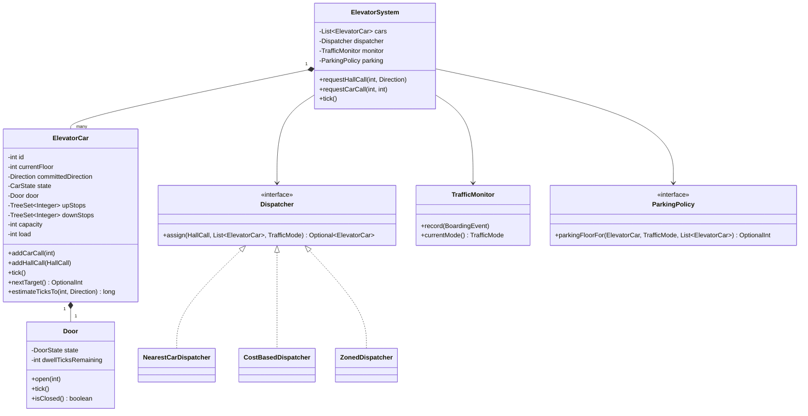

# LLD Q2 — Design an Elevator System (Java)

> **Interview framing:** The classic trap here is to jump straight to "I'll use a priority queue" and start coding. The signal the interviewer wants is: *do you model the domain correctly first* (hall call vs. car call is the single biggest tell), *do you know the real algorithms by name* (LOOK / collective control / destination dispatch), and *do you separate the per-car algorithm from the multi-car dispatcher*.

---

## Table of Contents

1. [The Problem in One Paragraph](#1-the-problem-in-one-paragraph)
2. [Clarifying Questions to Ask First](#2-clarifying-questions-to-ask-first)
3. [Requirements](#3-requirements)
4. [Domain Vocabulary (get this right first)](#4-domain-vocabulary-get-this-right-first)
5. [System Modeling](#5-system-modeling)
6. [Scheduling Algorithms](#6-scheduling-algorithms)
7. [Request Processing & Peak Periods](#7-request-processing--peak-periods)
8. [The Code](#8-the-code)
9. [End-to-End Walkthroughs](#9-end-to-end-walkthroughs)
10. [Extensibility](#10-extensibility)
11. [Failure & Safety Scenarios](#11-failure--safety-scenarios)
12. [Testing Strategy](#12-testing-strategy)
13. [Interview Cheat Sheet](#13-interview-cheat-sheet)

---

## 1. The Problem in One Paragraph

A building has `F` floors and `N` elevator cars. People press **hall buttons** (up/down, in the lobby of each floor) and **car buttons** (destination floor, inside the car). The system must decide (a) *which car* serves each hall call — the **dispatch** problem — and (b) *in what order* a given car serves the stops it owns — the **scheduling** problem. It must minimise waiting time and travel time, never violate safety constraints (doors, capacity, overtravel), and behave sensibly during rush hours when traffic is heavily directional.

Two distinct problems, two distinct components. Candidates who conflate them end up with one 400-line `ElevatorSystem` god class.

| Sub-problem | Owner in my design | Classic algorithm |
|---|---|---|
| Which car takes this hall call? | `Dispatcher` (system-wide) | Cost/ETA-based dispatch, zoning, destination dispatch |
| What order does this car stop? | `ElevatorCar` (per car) | **LOOK** (the "elevator algorithm") |

---

## 2. Clarifying Questions to Ask First

1. **"How many cars and how many floors?"** — 1 car changes everything (no dispatcher needed); 4 cars / 20 floors is the interesting default. *(Assume N cars, F floors, basements allowed → floors can be negative.)*
2. **"Do all cars serve all floors?"** — express cars, service floors, restricted floors (badge access). *(Assume a per-car `servesFloor(f)` predicate — cheap to add, shows foresight.)*
3. **"Conventional buttons or destination dispatch?"** — i.e. does the passenger enter their destination in the hall? *(Assume conventional up/down, discuss destination dispatch as an extension — it's the modern answer and worth 5 minutes.)*
4. **"Do we simulate physics or is it discrete-time?"** — *(Assume a discrete tick simulation: one tick = one floor of travel or one door phase. Keeps the code testable.)*
5. **"Do we need capacity / load sensors?"** — *(Assume yes: a full car must not accept new hall calls. This is a real constraint that improves the design.)*
6. **"Single process or distributed?"** — *(Assume single controller process; mention that real systems have a group controller + per-car controllers on a field bus.)*

---

## 3. Requirements

### 3.1 Functional

| # | Requirement |
|---|---|
| F1 | Accept **hall calls**: `(floor, UP\|DOWN)`. |
| F2 | Accept **car calls**: `(carId, destinationFloor)`. |
| F3 | Assign each hall call to exactly one car, minimising expected wait. |
| F4 | Each car serves its stops in **LOOK** order (sweep in one direction, reverse at the last stop). |
| F5 | Open/close doors with dwell time; re-open on obstruction or door-open button. |
| F6 | Refuse boarding when at capacity; skip hall calls the car cannot serve. |
| F7 | Support emergency stop, fire-service mode, and maintenance (out-of-service) mode. |
| F8 | Adapt behaviour to traffic pattern: up-peak, down-peak, lunch, off-peak. |
| F9 | Park idle cars at strategic floors based on the traffic mode. |

### 3.2 Non-Functional

| # | Requirement | How the design meets it |
|---|---|---|
| N1 | **Minimise average wait time (AWT)** | Cost-based dispatch, not nearest-car |
| N2 | **Bounded worst-case wait (no starvation)** | Age term in the cost function + LOOK guarantees a sweep completes |
| N3 | **Safety is non-negotiable** | Car cannot move with doors open — enforced in the state machine, not by convention |
| N4 | **Deterministic & testable** | Discrete tick loop, injected `Clock`, no `Thread.sleep` in domain code |
| N5 | **Extensible dispatch policy** | `Dispatcher` is an interface; swap nearest-car ↔ cost-based ↔ zoned ↔ destination |
| N6 | **Thread-safe** | One command queue per system; car state mutated only on the control thread |

### 3.3 Out of Scope

Motor control / VFD ramps, exact kinematics (accel/jerk), building fire code specifics, elevator group networking protocols, machine-room hardware.

---

## 4. Domain Vocabulary (get this right first)

**Say these terms out loud. They immediately signal you've thought about elevators rather than about queues.**

| Term | Meaning | Why it matters |
|---|---|---|
| **Hall call** | Button *outside* the car: `(floor, direction)`. The passenger states a **direction**, not a destination. | Owned by the **system** — any car can serve it. This is what the dispatcher assigns. |
| **Car call** | Button *inside* the car: `(destination floor)`. | Owned by **one specific car** — it cannot be reassigned. |
| **Collective control** | The car answers all calls in its current direction of travel, in floor order. | This is what "the elevator algorithm" actually is in the industry. |
| **Full collective** | Both hall directions and car calls are collected. | The standard for most modern buildings. |
| **Sweep / run** | One pass from lowest to highest stop (or reverse). | LOOK = sweep, reverse at the last *requested* floor. |
| **Dwell time** | How long doors stay open. | ~3s for a car call, longer for a hall call (people walking to the car). |
| **Up-peak / down-peak** | Morning arrival / evening departure traffic. | The two peak modes that need special handling. |
| **Handling capacity** | % of building population moved in 5 minutes. | The metric a real elevator consultant optimises. |
| **AWT / ATT** | Average Waiting Time / Average Transit Time. | The two numbers your dispatcher trades off. |
| **Parking / homing** | Sending idle cars to strategic floors. | Cheap win for up-peak. |

> **The single biggest modelling mistake:** treating a hall call as `(floor)` with no direction. A person on floor 7 pressing **DOWN** should *not* be picked up by a car sweeping upward to floor 12 — it would carry them the wrong way. Direction is part of the call's identity.

---

## 5. System Modeling

### 5.1 Entity model

```
Building
 ├── floors: [minFloor .. maxFloor]           (may include basements: -2, -1, 0, 1, ...)
 ├── hallPanels: Map<Floor, HallPanel>        (button lamps — a call stays lit until served)
 └── ElevatorGroup  ("group controller")
      ├── cars: List<ElevatorCar>
      ├── dispatcher: Dispatcher              (strategy — which car gets a hall call)
      ├── trafficMonitor: TrafficMonitor      (detects UP_PEAK / DOWN_PEAK / ...)
      └── parkingPolicy: ParkingPolicy        (where do idle cars wait)

ElevatorCar   ("car controller")
 ├── id, currentFloor, committedDirection, state
 ├── door: Door(state, dwellTicksRemaining)
 ├── upStops:   TreeSet<Integer>              ← stops to serve while travelling UP
 ├── downStops: TreeSet<Integer>              ← stops to serve while travelling DOWN
 ├── capacity, currentLoad
 └── servesFloor(f): boolean
```

### 5.2 Why **two** `TreeSet`s and not one priority queue

This is the core data-structure insight and it's worth stating explicitly.

A single `PriorityQueue<Integer>` ordered by distance gives you **SSTF**, which starves far floors and produces jerky, unnatural service. What you actually want is: *"while going up, stop at every requested floor above me, in increasing order."* That is exactly `upStops.ceiling(currentFloor)` on a `TreeSet` — **O(log n)**, and reversal is `downStops.last()`.

| Operation | Structure | Cost |
|---|---|---|
| Add a stop | `TreeSet.add` | O(log k) |
| Next stop while going up | `upStops.ceiling(cur)` | O(log k) |
| Reversal point | `upStops.last()` / `downStops.first()` | O(log k) |
| Is floor already requested? | `contains` | O(log k) |
| De-duplication (two people press the same button) | `Set` semantics | free |

`k` = number of pending stops for that car, bounded by the number of floors, so in practice ≤ 100. Everything is effectively O(log F).

### 5.3 Elevator state machine

```
                    ┌──────────────┐
       no stops     │     IDLE     │◄────────────── doors closed & no stops
    ┌──────────────►└──────┬───────┘
    │                      │ stop assigned
    │                      ▼
    │               ┌──────────────┐
    │               │    MOVING    │  (one floor per tick, toward target)
    │               └──────┬───────┘
    │                      │ arrived at a requested floor
    │                      ▼
    │               ┌──────────────┐
    │               │ DOORS_OPENING│
    │               └──────┬───────┘
    │                      ▼
    │               ┌──────────────┐   obstruction / open button
    │               │  DOORS_OPEN  │◄──────────┐  (reset dwell timer)
    │               └──────┬───────┘           │
    │                      │ dwell expired     │
    │                      ▼                   │
    │               ┌──────────────┐───────────┘
    └───────────────│ DOORS_CLOSING│
                    └──────────────┘

  Any state ──emergency stop──► EMERGENCY_STOP ──reset──► IDLE
  IDLE      ──service──────────► MAINTENANCE     ──release─► IDLE
  Any state ──fire alarm───────► FIRE_SERVICE (recall to designated floor, doors open, stay)
```

**Safety invariant, enforced in code, not in comments:**

```java
// MOVING is unreachable unless door == CLOSED. There is no code path that moves
// a car with the doors open, because moveOneFloor() asserts it.
```

### 5.4 Request model

```java
sealed interface Request
    ├── HallCall(int floor, Direction direction, Instant placedAt)   // system-owned
    └── CarCall(int carId, int floor, Instant placedAt)              // car-owned
```

Modelling these as a **sealed interface** means the handler switch is exhaustive — you cannot add a third request type (e.g. `PriorityCall` for a firefighter key) without the compiler forcing you to handle it.

### 5.5 Class diagram



---

## 6. Scheduling Algorithms

### 6.1 The per-car algorithm — know the family, pick LOOK

These are literally the disk-scheduling algorithms; say so, it lands well.

| Algorithm | Rule | Verdict for elevators |
|---|---|---|
| **FCFS** | Serve in arrival order | ❌ Terrible. Car yo-yos: 1 → 10 → 2 → 9. Passengers on floor 2 watch it pass twice. |
| **SSTF** (nearest stop first) | Always go to the closest pending stop | ❌ **Starvation.** A busy lobby keeps the car near the bottom; floor 20 waits forever. |
| **SCAN** ("elevator algorithm") | Sweep to the *physical end* of the shaft, reverse | ⚠️ Correct but wasteful — travels to floor 20 even if the highest request is floor 12. |
| **LOOK** | Sweep only to the *highest/lowest requested* floor, then reverse | ✅ **This is the answer.** SCAN without the wasted travel. |
| **C-SCAN / C-LOOK** | Always sweep in one direction, jump back to the start | ⚠️ Gives *uniform* wait times (good for disks, fair) but the empty return trip is unacceptable for people. |

**LOOK, in one sentence:** *keep going in the current direction, stopping at every requested floor on the way; when there are no more requests ahead, reverse.*

Why it's the right answer:

- **No starvation** — a sweep is guaranteed to reach every requested floor in that direction.
- **Passenger-intuitive** — matches what people expect a lift to do.
- **Directionally correct** — a DOWN hall call is only served by a car in (or entering) its DOWN phase, so nobody gets carried the wrong way.
- **Cheap** — O(log k) per decision with two `TreeSet`s.

```
LOOK trace, car at floor 3 moving UP, stops {5, 9} up and {7, 2} down:

 3 ──► 5 (up call served)  ──► 9 (up call served, no more up stops)
   reverse at 9
 9 ──► 7 (down call served) ──► 2 (down call served) ──► IDLE

SCAN would have continued 9 → 20 (top of shaft) before reversing. Wasted travel.
SSTF from 3 would go 3 → 2 → 5 → 7 → 9 — and if new low calls keep arriving,
floor 9 never gets served.
```

### 6.2 The multi-car problem — dispatch

Now: **which** car gets the hall call? Three levels of answer, give all three.

#### Level 1 — Nearest car (baseline, name its flaw)

```java
argmin over cars of |car.currentFloor - call.floor|
```

Simple, and **wrong often enough to matter**: it ignores direction and existing load. A car 1 floor away but travelling the opposite direction with 8 stops queued is worse than an idle car 4 floors away. Present this as the baseline you're about to improve.

#### Level 2 — Cost / ETA-based dispatch ✅ (the answer to give)

Score every eligible car with an estimated time-to-arrival plus penalties, take the min. This is what real group controllers do (Otis calls it "relative system response", Mitsubishi/KONE use variations).

```
cost(car, call) =
      estimatedTicksToReach(car, call.floor, call.direction)   // travel + intermediate stops
    + α × car.pendingStopCount                                 // load balancing
    + β × car.load / car.capacity                              // crowding penalty
    + γ × directionMismatchPenalty(car, call)                  // wrong-way penalty
    − δ × callAge                                              // anti-starvation
    + ∞  if !car.canServe(call)                                // eligibility gate
```

The ETA function is the interesting part — it must respect LOOK:

```
Case A: car is IDLE
        eta = |cur - f| × TRAVEL_TICKS

Case B: car is moving in the SAME direction as the call and the call floor is AHEAD
        eta = |cur - f| × TRAVEL_TICKS + stopsBetween(cur, f) × STOP_TICKS
        ← the "free ride" case; this is what makes collective control efficient

Case C: car is moving in the same direction but the call floor is BEHIND
        eta = distance to its reversal point, then back down to f  (two legs)

Case D: car is moving in the OPPOSITE direction
        eta = distance to reversal, reverse, then to f            (two legs)
```

**Case B is the whole point.** A car already sweeping up past floor 7 should absorb a new UP call at floor 9 for almost zero marginal cost. Nearest-car scoring misses this; ETA scoring captures it.

#### Level 3 — Destination dispatch (the modern answer, worth mentioning)

Passengers enter their **destination floor** in the lobby (keypad/turnstile) rather than just a direction. The controller then groups passengers with common destinations into the same car.

| | Conventional | Destination dispatch |
|---|---|---|
| Hall input | direction only | exact destination |
| Grouping | none | passengers batched by destination |
| Stops per trip | high | much lower |
| Handling capacity | baseline | **+20–30%** typical |
| Downside | — | needs kiosks; confusing for visitors; harder with luggage/crowds |

Say: *"If we control the hall interface, destination dispatch is strictly better for up-peak because it lets us bin passengers by destination and cut stops per round trip. It's the standard in new high-rises."*

#### Level 4 — Zoning (for tall buildings)

Split floors into zones (1–10, 11–20, 21–30) and dedicate cars per zone; or use **sky lobbies** with express cars. Reduces round-trip time drastically above ~25 floors. Mention it as the answer to *"what if it's a 60-storey tower?"*

### 6.3 Algorithm summary table

| Layer | Problem | Algorithm | Complexity |
|---|---|---|---|
| Per car | Stop ordering | **LOOK** with two `TreeSet`s | O(log k) per decision |
| Group | Hall-call assignment | **Cost/ETA-based** with penalties | O(N log k) per call |
| Group | Tall buildings | **Zoning** / sky lobbies | O(1) zone lookup + O(N_zone log k) |
| Group | Modern hall interface | **Destination dispatch** (bin packing by destination) | greedy O(N × k) |
| Group | Idle behaviour | **Parking / homing** by traffic mode | O(N) |

---

## 7. Request Processing & Peak Periods

### 7.1 Processing a hall call

```
requestHallCall(floor, dir)
   1. Deduplicate  → if this (floor, dir) is already assigned & lit, ignore.
                     Two people pressing UP is ONE call, not two.
   2. Eligibility  → filter cars: servesFloor, not MAINTENANCE / FIRE_SERVICE, not full.
   3. Score        → cost(car, call) for each eligible car.
   4. Assign       → min cost; tie-break by lowest id for determinism.
   5. Enqueue      → dir == UP  ? car.upStops.add(floor)
                                : car.downStops.add(floor)
   6. Light lamp   → hallPanel.light(floor, dir); cleared when a car opens doors
                     there while committed to that direction.
   7. If no car eligible → park in a pending queue, retried every tick
                            (a car may free up).
```

### 7.2 Processing a car call

Much simpler — **no dispatch decision exists**, the passenger is already inside:

```
requestCarCall(carId, floor)
   1. Validate      → car.servesFloor(floor); reject with a beep otherwise.
   2. Route by side → floor > current ? upStops.add : (floor < current ? downStops.add : openDoors())
   3. Light the in-car button.
```

> **Subtlety worth calling out:** a car call *below* a car that is currently committed UP goes into `downStops`, and will be served on the reverse sweep. That's correct LOOK behaviour and matches what real lifts do.

### 7.3 The tick loop (one car)

```
tick():
  if state == MAINTENANCE | FIRE_SERVICE | EMERGENCY_STOP → do nothing
  if door is not CLOSED       → door.tick(); return          ← SAFETY: never move
  target = nextTarget()                                       ← LOOK decision
  if target is empty          → state = IDLE; maybeMoveToParkingFloor(); return
  if target == currentFloor   → serveFloor(); return          ← removes stop, opens door
  currentFloor += signum(target - currentFloor)               ← one floor per tick
  committedDirection = signum(...)
  state = MOVING
```

Every branch is one line, which is exactly the point: the complexity lives in `nextTarget()` (LOOK) and in the dispatcher (cost), not in the loop.

### 7.4 Peak periods — the part most candidates skip

Traffic is not uniform. Four canonical patterns:

| Mode | When | Traffic shape | Strategy |
|---|---|---|---|
| **UP_PEAK** | 08:00–09:30 | Everyone enters at the lobby, goes up | **Park idle cars at the lobby.** Return empties to the lobby immediately (don't wait for a call). Consider "sectoring": each car serves a contiguous band of upper floors so it makes fewer stops per trip. |
| **DOWN_PEAK** | 17:00–18:30 | Everyone descends to the lobby | **Distribute idle cars across upper floors**, not the lobby. A car arriving at the lobby should immediately head back up. Bias the cost function toward DOWN calls. |
| **LUNCH / two-way** | 12:00–14:00 | Heavy both directions, lobby-centric | Hardest case. Split the fleet: some cars home to the lobby, some to mid-building. Avoid all cars converging. |
| **OFF_PEAK / interfloor** | rest of day | Sparse, random | Park cars **spread evenly** across the shaft to minimise expected distance to a random call. For N cars and F floors: park at `F × (2i + 1) / (2N)`. |

#### How to detect the mode

Do **not** hard-code clock times — buildings differ, and interviewers will ask "what about a hospital?". Detect it from observed traffic over a sliding window:

```
lobbyBoardings   = passengers boarding at the main floor  (last 5 min)
lobbyAlightings  = passengers exiting at the main floor   (last 5 min)
total            = all boardings

if lobbyBoardings  / total > 0.60  → UP_PEAK
if lobbyAlightings / total > 0.60  → DOWN_PEAK
if both > 0.30                     → LUNCH
else                               → OFF_PEAK / NORMAL
```

Use hysteresis (require the condition to hold for ~2 consecutive windows) so the system doesn't flap between modes.

#### Other peak-period levers

- **Sectoring during up-peak:** assign each car a contiguous band of floors so a full car makes 3 stops instead of 8. Round-trip time drops sharply.
- **Load-based departure:** during up-peak, dispatch a car from the lobby when it hits ~80% load *or* a dwell timeout, rather than on a fixed timer.
- **Skip full cars:** a car at capacity must stop accepting hall calls (its car calls still stand). Otherwise it stops, nobody can board, and everyone loses.
- **Anti-nuisance:** if a car's load is low but many car calls are registered (kids pressing every button), cancel car calls on an empty-car detection.
- **Bunching:** cars naturally clump together (the same reason buses bunch). Counter it with a dispersion term in the cost function — penalise assigning a call to a car that's near another car.

---

## 8. The Code

> Java 17+. Discrete-tick simulation: **1 tick = 1 floor of travel**, doors take a few ticks. No `Thread.sleep` anywhere in the domain — that's what makes it unit-testable.

### 8.1 Enums and value objects

```java
// Direction.java
package com.building.elevator;

public enum Direction {
    UP(1), DOWN(-1), IDLE(0);

    private final int step;

    Direction(int step) { this.step = step; }

    public int step() { return step; }

    public Direction opposite() {
        return switch (this) {
            case UP -> DOWN;
            case DOWN -> UP;
            case IDLE -> IDLE;
        };
    }

    public static Direction of(int delta) {
        return delta > 0 ? UP : delta < 0 ? DOWN : IDLE;
    }
}
```

```java
// CarState.java
package com.building.elevator;

public enum CarState {
    IDLE,            // doors closed, no pending stops
    MOVING,          // between floors
    STOPPED,         // at a floor, doors cycling
    MAINTENANCE,     // taken out of the group by a technician
    FIRE_SERVICE,    // recalled to the designated floor, group control suspended
    EMERGENCY_STOP;  // e-stop pulled

    /** A car in one of these states must be excluded from dispatch. */
    public boolean isAvailableForDispatch() {
        return this == IDLE || this == MOVING || this == STOPPED;
    }
}
```

```java
// DoorState.java
package com.building.elevator;

public enum DoorState { CLOSED, OPENING, OPEN, CLOSING }
```

```java
// Door.java
package com.building.elevator;

/**
 * Doors are a separate object with their own timing because the SAFETY INVARIANT
 * "the car must not move unless door.isClosed()" needs a single, unambiguous
 * source of truth. Inlining a boolean into ElevatorCar is how you get bugs that
 * kill people.
 */
public final class Door {

    private static final int TRANSITION_TICKS = 1;

    private DoorState state = DoorState.CLOSED;
    private int ticksRemaining = 0;
    private int dwellTicks = 0;

    /** Begin an open/dwell/close cycle. */
    public void openFor(int dwell) {
        this.dwellTicks = dwell;
        this.state = DoorState.OPENING;
        this.ticksRemaining = TRANSITION_TICKS;
    }

    /** Photo-eye / door-open button: restart the dwell, never slam on a passenger. */
    public void reopen() {
        if (state == DoorState.CLOSING || state == DoorState.OPEN) {
            state = DoorState.OPEN;
            ticksRemaining = dwellTicks;
        }
    }

    public void tick() {
        if (ticksRemaining > 0) {
            ticksRemaining--;
            return;
        }
        state = switch (state) {
            case OPENING -> { ticksRemaining = dwellTicks; yield DoorState.OPEN; }
            case OPEN    -> { ticksRemaining = TRANSITION_TICKS; yield DoorState.CLOSING; }
            case CLOSING -> DoorState.CLOSED;
            case CLOSED  -> DoorState.CLOSED;
        };
    }

    public boolean isClosed() { return state == DoorState.CLOSED; }
    public DoorState state()  { return state; }
}
```

```java
// Request.java
package com.building.elevator;

import java.time.Instant;

/**
 * Sealed: a new request type (e.g. a firefighter priority call) becomes a compile
 * error everywhere it must be handled, instead of a silently-ignored case.
 */
public sealed interface Request {

    Instant placedAt();

    /**
     * Pressed OUTSIDE the car. Carries a DIRECTION, not a destination — this is the
     * modelling detail that most candidates get wrong. Any car may serve it.
     */
    record HallCall(int floor, Direction direction, Instant placedAt) implements Request {
        public HallCall {
            if (direction == Direction.IDLE) {
                throw new IllegalArgumentException("a hall call must be UP or DOWN");
            }
        }
        /** Identity ignores time: two people pressing UP on floor 7 is ONE call. */
        public String key() { return floor + ":" + direction; }
    }

    /** Pressed INSIDE the car. Bound to that car forever — never reassigned. */
    record CarCall(int carId, int floor, Instant placedAt) implements Request {}
}
```

### 8.2 `ElevatorCar` — the LOOK algorithm lives here

```java
// ElevatorCar.java
package com.building.elevator;

import java.util.HashSet;
import java.util.Objects;
import java.util.OptionalInt;
import java.util.Set;
import java.util.TreeSet;

public final class ElevatorCar {

    // --- tunables (a real system derives these from the drive's kinematics) ---
    public static final int TRAVEL_TICKS_PER_FLOOR = 1;
    public static final int STOP_PENALTY_TICKS     = 3;   // decel + doors + accel
    public static final int REVERSAL_PENALTY_TICKS = 2;
    public static final int DWELL_CAR_CALL_TICKS   = 3;
    public static final int DWELL_HALL_CALL_TICKS  = 5;   // people walk to the car

    private final int id;
    private final int minFloor;
    private final int maxFloor;
    private final int capacity;
    private final Set<Integer> unservedFloors;   // express cars / restricted floors

    private int currentFloor;
    private Direction committedDirection = Direction.IDLE;
    private CarState state = CarState.IDLE;
    private int load;

    private final Door door = new Door();

    /**
     * THE core data structure. Two ordered sets instead of one priority queue:
     *   - upStops:   floors to stop at while travelling UP
     *   - downStops: floors to stop at while travelling DOWN
     * This makes "next stop in my current direction" a single O(log k) ceiling()/floor()
     * call, and de-duplicates repeated presses for free.
     */
    private final TreeSet<Integer> upStops   = new TreeSet<>();
    private final TreeSet<Integer> downStops = new TreeSet<>();

    /** Soft target for idle parking. Always yields to a real call. */
    private Integer parkingTarget;

    public ElevatorCar(int id, int minFloor, int maxFloor, int capacity) {
        this(id, minFloor, maxFloor, capacity, Set.of());
    }

    public ElevatorCar(int id, int minFloor, int maxFloor, int capacity,
                       Set<Integer> unservedFloors) {
        this.id = id;
        this.minFloor = minFloor;
        this.maxFloor = maxFloor;
        this.capacity = capacity;
        this.unservedFloors = new HashSet<>(unservedFloors);
        this.currentFloor = minFloor;
    }

    // =====================================================================
    //  ACCEPTING WORK
    // =====================================================================

    /** Car call: the passenger is already inside, so there is no dispatch decision. */
    public void addCarCall(int floor) {
        requireServable(floor);
        if (floor > currentFloor)      upStops.add(floor);
        else if (floor < currentFloor) downStops.add(floor);
        else                           door.openFor(DWELL_CAR_CALL_TICKS);   // already here
        parkingTarget = null;   // a real call always beats parking
    }

    /**
     * Hall call, already assigned to this car by the Dispatcher. The call's DIRECTION
     * decides which sweep serves it — that is what stops a DOWN passenger from being
     * scooped up by an upward-bound car.
     */
    public void addHallCall(Request.HallCall call) {
        requireServable(call.floor());
        if (call.direction() == Direction.UP) upStops.add(call.floor());
        else                                  downStops.add(call.floor());
        parkingTarget = null;
    }

    public void setParkingTarget(Integer floor) {
        if (hasPendingStops()) return;          // never park while work is pending
        this.parkingTarget = floor;
    }

    private void requireServable(int floor) {
        if (!servesFloor(floor)) {
            throw new IllegalArgumentException(
                    "car %d does not serve floor %d".formatted(id, floor));
        }
    }

    // =====================================================================
    //  THE LOOK ALGORITHM
    // =====================================================================

    /**
     * LOOK: continue in the committed direction to the furthest *requested* floor,
     * then reverse. (SCAN would continue to the physical end of the shaft; C-LOOK
     * would jump back to the start. Both waste travel for humans.)
     */
    public OptionalInt nextTarget() {
        switch (committedDirection) {
            case UP -> {
                Integer ahead = upStops.ceiling(currentFloor);
                if (ahead != null) return OptionalInt.of(ahead);
                // No up-stops ahead. Continue up to the highest DOWN call (we will
                // reverse there), otherwise reverse now.
                if (!downStops.isEmpty()) return OptionalInt.of(downStops.last());
                if (!upStops.isEmpty())   return OptionalInt.of(upStops.first());
            }
            case DOWN -> {
                Integer below = downStops.floor(currentFloor);
                if (below != null) return OptionalInt.of(below);
                if (!upStops.isEmpty())   return OptionalInt.of(upStops.first());
                if (!downStops.isEmpty()) return OptionalInt.of(downStops.last());
            }
            case IDLE -> {
                OptionalInt nearest = nearestPendingStop();
                if (nearest.isPresent()) return nearest;
            }
        }
        return parkingTarget != null ? OptionalInt.of(parkingTarget) : OptionalInt.empty();
    }

    private OptionalInt nearestPendingStop() {
        Integer best = null;
        for (Integer f : upStops)   best = closer(best, f);
        for (Integer f : downStops) best = closer(best, f);
        return best == null ? OptionalInt.empty() : OptionalInt.of(best);
    }

    private Integer closer(Integer best, Integer candidate) {
        if (best == null) return candidate;
        return Math.abs(candidate - currentFloor) < Math.abs(best - currentFloor)
                ? candidate : best;
    }

    // =====================================================================
    //  THE TICK LOOP
    // =====================================================================

    public void tick() {
        if (!state.isAvailableForDispatch()) {
            return;                              // MAINTENANCE / FIRE_SERVICE / E-STOP
        }

        // ---- SAFETY INVARIANT: never move with the doors not closed. -------
        if (!door.isClosed()) {
            door.tick();
            if (door.isClosed() && !hasPendingStops()) {
                state = CarState.IDLE;
            }
            return;
        }

        OptionalInt target = nextTarget();
        if (target.isEmpty()) {
            committedDirection = Direction.IDLE;
            state = CarState.IDLE;
            return;
        }

        int t = target.getAsInt();
        if (t == currentFloor) {
            arriveAtCurrentFloor();
            return;
        }

        int step = Integer.signum(t - currentFloor);
        committedDirection = Direction.of(step);
        currentFloor += step;
        state = CarState.MOVING;

        // Arriving exactly on a requested floor is handled on the NEXT tick by the
        // branch above, which keeps this method single-purpose.
    }

    private void arriveAtCurrentFloor() {
        // Parking arrival: nothing to serve, no doors.
        if (parkingTarget != null && parkingTarget == currentFloor && !hasPendingStops()) {
            parkingTarget = null;
            committedDirection = Direction.IDLE;
            state = CarState.IDLE;
            return;
        }

        boolean served = false;
        if (committedDirection == Direction.UP)        served = upStops.remove(currentFloor);
        else if (committedDirection == Direction.DOWN) served = downStops.remove(currentFloor);

        if (!served) {
            // We are at a reversal point (or were idle): serve whichever call is here
            // and adopt that direction for the next sweep.
            if (upStops.remove(currentFloor)) {
                committedDirection = Direction.UP;
                served = true;
            } else if (downStops.remove(currentFloor)) {
                committedDirection = Direction.DOWN;
                served = true;
            }
        }

        if (served) {
            state = CarState.STOPPED;
            door.openFor(DWELL_HALL_CALL_TICKS);
        }
    }

    // =====================================================================
    //  ETA ESTIMATION  (used by the cost-based dispatcher)
    // =====================================================================

    /**
     * Approximate ticks until this car could open its doors at {@code floor} while
     * committed to {@code callDirection}. Deliberately an approximation: an exact
     * simulation would have to replay future calls we haven't seen yet.
     */
    public long estimateTicksTo(int floor, Direction callDirection) {
        if (!servesFloor(floor)) return Long.MAX_VALUE;

        // Case A — idle: straight line.
        if (committedDirection == Direction.IDLE) {
            return (long) Math.abs(currentFloor - floor) * TRAVEL_TICKS_PER_FLOOR;
        }

        boolean sameDirection = committedDirection == callDirection;
        boolean ahead = (committedDirection == Direction.UP   && floor >= currentFloor)
                     || (committedDirection == Direction.DOWN && floor <= currentFloor);

        // Case B — the "free ride": already sweeping toward the call, same direction.
        // This is what makes collective control efficient and what nearest-car misses.
        if (sameDirection && ahead) {
            return (long) Math.abs(currentFloor - floor) * TRAVEL_TICKS_PER_FLOOR
                 + (long) stopsBetween(currentFloor, floor) * STOP_PENALTY_TICKS;
        }

        // Cases C & D — a reversal is required: run to the sweep end, then to the call.
        int reversalFloor = (committedDirection == Direction.UP) ? highestPendingStop()
                                                                 : lowestPendingStop();
        long leg1 = (long) Math.abs(currentFloor - reversalFloor) * TRAVEL_TICKS_PER_FLOOR
                  + (long) stopsBetween(currentFloor, reversalFloor) * STOP_PENALTY_TICKS;
        long leg2 = (long) Math.abs(reversalFloor - floor) * TRAVEL_TICKS_PER_FLOOR;
        return leg1 + leg2 + REVERSAL_PENALTY_TICKS;
    }

    private int stopsBetween(int from, int to) {
        int lo = Math.min(from, to), hi = Math.max(from, to);
        int count = 0;
        for (int f : upStops)   if (f > lo && f < hi) count++;
        for (int f : downStops) if (f > lo && f < hi) count++;
        return count;
    }

    private int highestPendingStop() {
        int best = currentFloor;
        if (!upStops.isEmpty())   best = Math.max(best, upStops.last());
        if (!downStops.isEmpty()) best = Math.max(best, downStops.last());
        return best;
    }

    private int lowestPendingStop() {
        int best = currentFloor;
        if (!upStops.isEmpty())   best = Math.min(best, upStops.first());
        if (!downStops.isEmpty()) best = Math.min(best, downStops.first());
        return best;
    }

    // =====================================================================
    //  BOARDING / SAFETY / MODES
    // =====================================================================

    public void board(int people) {
        if (load + people > capacity) {
            throw new IllegalStateException("car %d over capacity".formatted(id));
        }
        load += people;
    }

    public void alight(int people) { load = Math.max(0, load - people); }

    public boolean isFull() { return load >= capacity; }

    public boolean canAcceptHallCall(int floor) {
        return state.isAvailableForDispatch() && servesFloor(floor) && !isFull();
    }

    public boolean servesFloor(int floor) {
        return floor >= minFloor && floor <= maxFloor && !unservedFloors.contains(floor);
    }

    public void emergencyStop() {
        state = CarState.EMERGENCY_STOP;
        committedDirection = Direction.IDLE;
    }

    /** Fire recall: drop every pending call, run to the designated floor, park open. */
    public void enterFireService(int designatedFloor) {
        upStops.clear();
        downStops.clear();
        parkingTarget = null;
        state = CarState.FIRE_SERVICE;
        currentFloor = designatedFloor;   // a real system drives there under fire control
        door.openFor(Integer.MAX_VALUE);
    }

    public void enterMaintenance() {
        state = CarState.MAINTENANCE;
    }

    /** Returns pending stops so the group controller can REASSIGN them. */
    public Set<Integer> releaseAllStops() {
        Set<Integer> released = new HashSet<>();
        released.addAll(upStops);
        released.addAll(downStops);
        upStops.clear();
        downStops.clear();
        return released;
    }

    public void returnToService() {
        if (state == CarState.MAINTENANCE || state == CarState.EMERGENCY_STOP
                || state == CarState.FIRE_SERVICE) {
            state = CarState.IDLE;
        }
    }

    // =====================================================================
    //  QUERIES
    // =====================================================================

    public boolean hasPendingStops()      { return !upStops.isEmpty() || !downStops.isEmpty(); }
    public int pendingStopCount()         { return upStops.size() + downStops.size(); }
    public int id()                       { return id; }
    public int currentFloor()             { return currentFloor; }
    public Direction committedDirection() { return committedDirection; }
    public CarState state()               { return state; }
    public int load()                     { return load; }
    public int capacity()                 { return capacity; }
    public Door door()                    { return door; }
    public Set<Integer> upStops()         { return Set.copyOf(upStops); }
    public Set<Integer> downStops()       { return Set.copyOf(downStops); }

    @Override public boolean equals(Object o) {
        return (o instanceof ElevatorCar c) && c.id == this.id;
    }
    @Override public int hashCode() { return Objects.hash(id); }
    @Override public String toString() {
        return "Car%d[f=%d %s %s load=%d/%d up=%s down=%s]"
                .formatted(id, currentFloor, committedDirection, state, load, capacity,
                           upStops, downStops);
    }
}
```

### 8.3 Traffic detection

```java
// TrafficMode.java
package com.building.elevator;

public enum TrafficMode { NORMAL, UP_PEAK, DOWN_PEAK, LUNCH, OFF_PEAK }
```

```java
// TrafficMonitor.java
package com.building.elevator;

import java.time.Clock;
import java.time.Duration;
import java.time.Instant;
import java.util.ArrayDeque;
import java.util.Deque;

/**
 * Detects the traffic mode from OBSERVED boardings/alightings rather than from the
 * wall clock. Hard-coding "up-peak is 08:00-09:30" breaks in a hospital, a hotel,
 * or any building on a different shift pattern — say this when asked.
 *
 * Hysteresis (requiring N consecutive windows) prevents mode flapping.
 */
public final class TrafficMonitor {

    private record Event(int floor, boolean boarding, int people, Instant at) {}

    private final int lobbyFloor;
    private final Duration window;
    private final Clock clock;
    private final Deque<Event> events = new ArrayDeque<>();

    private TrafficMode currentMode = TrafficMode.NORMAL;
    private TrafficMode candidateMode = TrafficMode.NORMAL;
    private int candidateStreak = 0;
    private static final int HYSTERESIS_WINDOWS = 2;

    public TrafficMonitor(int lobbyFloor, Duration window, Clock clock) {
        this.lobbyFloor = lobbyFloor;
        this.window = window;
        this.clock = clock;
    }

    public void recordBoarding(int floor, int people)  { record(floor, true, people); }
    public void recordAlighting(int floor, int people) { record(floor, false, people); }

    private void record(int floor, boolean boarding, int people) {
        events.addLast(new Event(floor, boarding, people, clock.instant()));
        evictOld();
    }

    private void evictOld() {
        Instant cutoff = clock.instant().minus(window);
        while (!events.isEmpty() && events.peekFirst().at().isBefore(cutoff)) {
            events.removeFirst();
        }
    }

    public TrafficMode currentMode() {
        evictOld();
        int total = 0, lobbyBoardings = 0, lobbyAlightings = 0;
        for (Event e : events) {
            total += e.people();
            if (e.floor() == lobbyFloor) {
                if (e.boarding()) lobbyBoardings += e.people();
                else              lobbyAlightings += e.people();
            }
        }
        if (total < 10) return applyHysteresis(TrafficMode.OFF_PEAK);   // too little data

        double up   = lobbyBoardings  / (double) total;
        double down = lobbyAlightings / (double) total;

        TrafficMode observed;
        if (up > 0.30 && down > 0.30)      observed = TrafficMode.LUNCH;
        else if (up   > 0.60)              observed = TrafficMode.UP_PEAK;
        else if (down > 0.60)              observed = TrafficMode.DOWN_PEAK;
        else                               observed = TrafficMode.NORMAL;

        return applyHysteresis(observed);
    }

    private TrafficMode applyHysteresis(TrafficMode observed) {
        if (observed == currentMode) { candidateStreak = 0; return currentMode; }
        if (observed == candidateMode) {
            if (++candidateStreak >= HYSTERESIS_WINDOWS) {
                currentMode = observed;
                candidateStreak = 0;
            }
        } else {
            candidateMode = observed;
            candidateStreak = 1;
        }
        return currentMode;
    }
}
```

### 8.4 Dispatch strategies

```java
// Dispatcher.java
package com.building.elevator;

import java.util.List;
import java.util.Optional;

@FunctionalInterface
public interface Dispatcher {
    /** Empty means "no car can take it right now" — the caller re-queues the call. */
    Optional<ElevatorCar> assign(Request.HallCall call, List<ElevatorCar> cars, TrafficMode mode);
}
```

```java
// NearestCarDispatcher.java
package com.building.elevator;

import java.util.Comparator;
import java.util.List;
import java.util.Optional;

/**
 * BASELINE ONLY — present this, then explain why you're replacing it.
 * It ignores direction, load and queue depth, so it happily hands a call to a car
 * one floor away that is travelling the opposite way with eight stops queued.
 */
public final class NearestCarDispatcher implements Dispatcher {
    @Override
    public Optional<ElevatorCar> assign(Request.HallCall call, List<ElevatorCar> cars,
                                        TrafficMode mode) {
        return cars.stream()
                .filter(c -> c.canAcceptHallCall(call.floor()))
                .min(Comparator
                        .comparingInt((ElevatorCar c) -> Math.abs(c.currentFloor() - call.floor()))
                        .thenComparingInt(ElevatorCar::id));   // deterministic tie-break
    }
}
```

```java
// CostBasedDispatcher.java
package com.building.elevator;

import java.time.Clock;
import java.time.Duration;
import java.util.List;
import java.util.Optional;

/**
 * The answer to give. Scores every eligible car and takes the minimum:
 *
 *   cost = eta
 *        + α × pendingStops        (spread work across the group)
 *        + β × loadRatio           (don't send a nearly-full car)
 *        + γ × directionMismatch   (wrong-way penalty)
 *        + δ × modeBias            (up-peak / down-peak shaping)
 *        − ε × callAgeSeconds      (anti-starvation: old calls outbid new ones)
 *        + ζ × proximityToOtherCar (anti-bunching)
 */
public final class CostBasedDispatcher implements Dispatcher {

    private final Clock clock;
    private final double alphaPendingStops   = 2.0;
    private final double betaLoad            = 8.0;
    private final double gammaWrongDirection = 5.0;
    private final double deltaModeBias       = 4.0;
    private final double epsilonAge          = 3.0;
    private final double zetaBunching        = 1.5;

    public CostBasedDispatcher(Clock clock) { this.clock = clock; }

    @Override
    public Optional<ElevatorCar> assign(Request.HallCall call, List<ElevatorCar> cars,
                                        TrafficMode mode) {
        ElevatorCar best = null;
        double bestCost = Double.MAX_VALUE;

        for (ElevatorCar car : cars) {
            if (!car.canAcceptHallCall(call.floor())) continue;   // eligibility gate

            double cost = cost(car, call, cars, mode);
            // Strict < gives a deterministic tie-break by iteration (id) order.
            if (cost < bestCost) {
                bestCost = cost;
                best = car;
            }
        }
        return Optional.ofNullable(best);
    }

    private double cost(ElevatorCar car, Request.HallCall call,
                        List<ElevatorCar> allCars, TrafficMode mode) {

        long eta = car.estimateTicksTo(call.floor(), call.direction());
        if (eta == Long.MAX_VALUE) return Double.MAX_VALUE;

        double cost = eta;
        cost += alphaPendingStops * car.pendingStopCount();
        cost += betaLoad * (car.load() / (double) car.capacity());

        boolean wrongWay = car.committedDirection() != Direction.IDLE
                        && car.committedDirection() != call.direction();
        if (wrongWay) cost += gammaWrongDirection;

        cost += deltaModeBias * modeBias(car, call, mode);
        cost += zetaBunching * bunchingPenalty(car, allCars);

        long ageSeconds = Duration.between(call.placedAt(), clock.instant()).toSeconds();
        cost -= epsilonAge * ageSeconds;        // the older the call, the cheaper it looks

        return cost;
    }

    /** Shapes the fleet's behaviour for the current traffic pattern. */
    private double modeBias(ElevatorCar car, Request.HallCall call, TrafficMode mode) {
        return switch (mode) {
            // Up-peak: strongly prefer cars that are already low / idle for lobby UP calls.
            case UP_PEAK   -> call.direction() == Direction.UP
                              ? car.currentFloor() * 0.1
                              : 0.0;
            // Down-peak: prefer cars that are already high for upper-floor DOWN calls.
            case DOWN_PEAK -> call.direction() == Direction.DOWN
                              ? -car.currentFloor() * 0.1
                              : 0.0;
            case LUNCH, NORMAL, OFF_PEAK -> 0.0;
        };
    }

    /** Two cars sitting on top of each other serve the building badly — spread them. */
    private double bunchingPenalty(ElevatorCar car, List<ElevatorCar> allCars) {
        int nearest = Integer.MAX_VALUE;
        for (ElevatorCar other : allCars) {
            if (other.id() == car.id()) continue;
            nearest = Math.min(nearest, Math.abs(other.currentFloor() - car.currentFloor()));
        }
        return nearest == Integer.MAX_VALUE ? 0.0 : Math.max(0, 3 - nearest);
    }
}
```

```java
// ZonedDispatcher.java
package com.building.elevator;

import java.util.List;
import java.util.Map;
import java.util.Optional;

/**
 * For tall buildings: cars own contiguous bands of floors, which slashes round-trip
 * time. Falls back to the delegate when no in-zone car is eligible, so a zone outage
 * degrades service instead of breaking it.
 */
public final class ZonedDispatcher implements Dispatcher {

    private final Map<Integer, List<Integer>> zoneToCarIds;   // zoneIndex -> car ids
    private final int floorsPerZone;
    private final int minFloor;
    private final Dispatcher withinZone;

    public ZonedDispatcher(Map<Integer, List<Integer>> zoneToCarIds, int floorsPerZone,
                           int minFloor, Dispatcher withinZone) {
        this.zoneToCarIds = Map.copyOf(zoneToCarIds);
        this.floorsPerZone = floorsPerZone;
        this.minFloor = minFloor;
        this.withinZone = withinZone;
    }

    @Override
    public Optional<ElevatorCar> assign(Request.HallCall call, List<ElevatorCar> cars,
                                        TrafficMode mode) {
        int zone = (call.floor() - minFloor) / floorsPerZone;
        List<Integer> ids = zoneToCarIds.getOrDefault(zone, List.of());

        List<ElevatorCar> inZone = cars.stream().filter(c -> ids.contains(c.id())).toList();
        Optional<ElevatorCar> chosen = withinZone.assign(call, inZone, mode);

        return chosen.isPresent() ? chosen : withinZone.assign(call, cars, mode);
    }
}
```

### 8.5 Parking policy

```java
// ParkingPolicy.java
package com.building.elevator;

import java.util.List;
import java.util.OptionalInt;

@FunctionalInterface
public interface ParkingPolicy {
    OptionalInt parkingFloorFor(ElevatorCar car, List<ElevatorCar> allCars, TrafficMode mode);
}
```

```java
// TrafficAwareParkingPolicy.java
package com.building.elevator;

import java.util.List;
import java.util.OptionalInt;

/**
 * Where idle cars wait. Cheap to implement, disproportionately large effect on
 * average waiting time — this is the answer to "how do you handle peak periods"
 * that most candidates never reach.
 */
public final class TrafficAwareParkingPolicy implements ParkingPolicy {

    private final int lobbyFloor;
    private final int minFloor;
    private final int maxFloor;

    public TrafficAwareParkingPolicy(int lobbyFloor, int minFloor, int maxFloor) {
        this.lobbyFloor = lobbyFloor;
        this.minFloor = minFloor;
        this.maxFloor = maxFloor;
    }

    @Override
    public OptionalInt parkingFloorFor(ElevatorCar car, List<ElevatorCar> allCars,
                                       TrafficMode mode) {
        if (car.hasPendingStops() || !car.state().isAvailableForDispatch()) {
            return OptionalInt.empty();
        }

        List<ElevatorCar> idle = allCars.stream()
                .filter(c -> !c.hasPendingStops() && c.state().isAvailableForDispatch())
                .sorted((a, b) -> Integer.compare(a.id(), b.id()))
                .toList();
        int index = idle.indexOf(car);
        int n = Math.max(1, idle.size());
        if (index < 0) return OptionalInt.empty();

        return switch (mode) {
            // Everyone is arriving: keep the fleet at the lobby, but leave one car
            // upstairs so interfloor traffic isn't stranded.
            case UP_PEAK -> OptionalInt.of(
                    index == 0 ? lobbyFloor
                               : (index == idle.size() - 1 ? midFloor() : lobbyFloor));

            // Everyone is leaving: pre-position HIGH, so a DOWN call is met immediately.
            case DOWN_PEAK -> OptionalInt.of(spread(index, n, midFloor(), maxFloor));

            // Two-way lobby traffic: half at the lobby, half spread above.
            case LUNCH -> OptionalInt.of(
                    index % 2 == 0 ? lobbyFloor : spread(index, n, lobbyFloor, maxFloor));

            // Random interfloor traffic: minimise expected distance to a uniform call
            // by spreading cars evenly:  floor_i = min + (2i + 1)(max - min) / 2n
            case NORMAL, OFF_PEAK -> OptionalInt.of(
                    minFloor + ((2 * index + 1) * (maxFloor - minFloor)) / (2 * n));
        };
    }

    private int midFloor() { return minFloor + (maxFloor - minFloor) / 2; }

    private int spread(int index, int n, int lo, int hi) {
        return lo + ((2 * index + 1) * (hi - lo)) / (2 * n);
    }
}
```

### 8.6 `ElevatorSystem` — the group controller

```java
// ElevatorSystem.java
package com.building.elevator;

import java.time.Clock;
import java.util.ArrayDeque;
import java.util.ArrayList;
import java.util.Deque;
import java.util.HashSet;
import java.util.List;
import java.util.Optional;
import java.util.OptionalInt;
import java.util.Set;

/**
 * The "group controller". Owns dispatch (which car), traffic mode, and parking.
 * It deliberately does NOT know about LOOK — stop ordering belongs to ElevatorCar.
 * That single boundary is what stops this class from becoming a god object.
 */
public final class ElevatorSystem {

    private final List<ElevatorCar> cars;
    private final Dispatcher dispatcher;
    private final TrafficMonitor trafficMonitor;
    private final ParkingPolicy parkingPolicy;
    private final Clock clock;

    /** De-duplication: two people pressing UP on floor 7 is ONE call. */
    private final Set<String> activeHallCalls = new HashSet<>();

    /** Calls no car could take yet (all full / out of service). Retried every tick. */
    private final Deque<Request.HallCall> unassigned = new ArrayDeque<>();

    public ElevatorSystem(List<ElevatorCar> cars, Dispatcher dispatcher,
                          TrafficMonitor trafficMonitor, ParkingPolicy parkingPolicy,
                          Clock clock) {
        this.cars = List.copyOf(cars);
        this.dispatcher = dispatcher;
        this.trafficMonitor = trafficMonitor;
        this.parkingPolicy = parkingPolicy;
        this.clock = clock;
    }

    // =====================================================================
    //  REQUEST INTAKE
    // =====================================================================

    /** Someone pressed UP or DOWN in a lift lobby. */
    public void requestHallCall(int floor, Direction direction) {
        Request.HallCall call = new Request.HallCall(floor, direction, clock.instant());

        if (!activeHallCalls.add(call.key())) {
            return;                       // already lit and assigned — ignore
        }
        if (!tryAssign(call)) {
            unassigned.addLast(call);     // retried on every tick
        }
    }

    /** Someone pressed a destination button inside car {@code carId}. */
    public void requestCarCall(int carId, int floor) {
        ElevatorCar car = carById(carId);
        if (!car.servesFloor(floor)) {
            return;                       // invalid button — beep, don't register
        }
        car.addCarCall(floor);            // NO dispatch decision: the rider is inside
    }

    private boolean tryAssign(Request.HallCall call) {
        TrafficMode mode = trafficMonitor.currentMode();
        Optional<ElevatorCar> chosen = dispatcher.assign(call, cars, mode);
        chosen.ifPresent(car -> car.addHallCall(call));
        return chosen.isPresent();
    }

    // =====================================================================
    //  THE MAIN LOOP
    // =====================================================================

    public void tick() {
        retryUnassignedCalls();
        cars.forEach(ElevatorCar::tick);
        clearServedHallCalls();
        applyParking();
    }

    private void retryUnassignedCalls() {
        int pending = unassigned.size();
        for (int i = 0; i < pending; i++) {
            Request.HallCall call = unassigned.removeFirst();
            if (!tryAssign(call)) unassigned.addLast(call);
        }
    }

    /**
     * A hall lamp goes out when a car is stopped with its doors open at that floor
     * AND is committed to that call's direction. The direction check is what stops
     * an upward car from "clearing" a DOWN lamp it isn't actually serving.
     */
    private void clearServedHallCalls() {
        for (ElevatorCar car : cars) {
            if (car.state() != CarState.STOPPED || car.door().isClosed()) continue;
            activeHallCalls.remove(car.currentFloor() + ":" + car.committedDirection());
        }
    }

    private void applyParking() {
        TrafficMode mode = trafficMonitor.currentMode();
        for (ElevatorCar car : cars) {
            OptionalInt target = parkingPolicy.parkingFloorFor(car, cars, mode);
            // Avoid the `cond ? intValue : null` ternary — it silently boxes and is a
            // classic NPE footgun. Be explicit instead.
            if (target.isPresent()) car.setParkingTarget(target.getAsInt());
            else                    car.setParkingTarget(null);
        }
    }

    // =====================================================================
    //  BOARDING (feeds the traffic monitor)
    // =====================================================================

    public void board(int carId, int people) {
        ElevatorCar car = carById(carId);
        car.board(people);
        trafficMonitor.recordBoarding(car.currentFloor(), people);
    }

    public void alight(int carId, int people) {
        ElevatorCar car = carById(carId);
        car.alight(people);
        trafficMonitor.recordAlighting(car.currentFloor(), people);
    }

    // =====================================================================
    //  SERVICE MODES
    // =====================================================================

    /** Taking a car out of the group must NOT lose its hall calls — reassign them. */
    public void takeOutOfService(int carId) {
        ElevatorCar car = carById(carId);
        Set<Integer> orphaned = car.releaseAllStops();
        car.enterMaintenance();
        for (int floor : orphaned) {
            // Direction is unknown for orphaned stops, so re-raise both and let
            // de-duplication + the dispatcher sort it out.
            requestHallCall(floor, Direction.UP);
            requestHallCall(floor, Direction.DOWN);
        }
    }

    /** Fire alarm: every car abandons its calls and recalls to the designated floor. */
    public void fireAlarm(int designatedFloor) {
        activeHallCalls.clear();
        unassigned.clear();
        cars.forEach(c -> c.enterFireService(designatedFloor));
    }

    public List<ElevatorCar> cars() { return cars; }

    public TrafficMode trafficMode() { return trafficMonitor.currentMode(); }

    private ElevatorCar carById(int id) {
        for (ElevatorCar c : cars) if (c.id() == id) return c;
        throw new IllegalArgumentException("no such car: " + id);
    }

    // =====================================================================
    //  BOOTSTRAP
    // =====================================================================

    public static ElevatorSystem defaultBuilding(int cars, int minFloor, int maxFloor,
                                                 int capacity, Clock clock) {
        List<ElevatorCar> fleet = new ArrayList<>();
        for (int i = 0; i < cars; i++) {
            fleet.add(new ElevatorCar(i, minFloor, maxFloor, capacity));
        }
        return new ElevatorSystem(
                fleet,
                new CostBasedDispatcher(clock),
                new TrafficMonitor(0, java.time.Duration.ofMinutes(5), clock),
                new TrafficAwareParkingPolicy(0, minFloor, maxFloor),
                clock);
    }
}
```

---

## 9. End-to-End Walkthroughs

### 9.1 LOOK on a single car

Car 0 at floor **3**, committed **UP**. Pending: `upStops = {5, 9}`, `downStops = {7, 2}`.

| Tick | Floor | Direction | `nextTarget()` reasoning | Action |
|---|---|---|---|---|
| 1 | 3→4 | UP | `upStops.ceiling(3) = 5` | move |
| 2 | 4→5 | UP | target 5 | move |
| 3 | 5 | UP | target == current | **serve 5**, remove from `upStops`, doors open |
| 4–6 | 5 | UP | doors cycling | — |
| 7–10 | 5→9 | UP | `upStops.ceiling(5) = 9` | move ×4 |
| 11 | 9 | UP | target == current | **serve 9**, `upStops` now empty |
| 12 | 9 | UP→**DOWN** | `upStops.ceiling` = null → `downStops.last() = 7` < 9 → reverse | direction flips |
| 13–14 | 9→7 | DOWN | target 7 | move ×2 |
| 15 | 7 | DOWN | `downStops.floor(7) = 7` | **serve 7** |
| 16–20 | 7→2 | DOWN | `downStops.floor(...) = 2` | move ×5 |
| 21 | 2 | DOWN | target == current | **serve 2**, all sets empty |
| 22 | 2 | IDLE | `nextTarget()` empty → parking target | park per traffic mode |

Compare: **SCAN** would have run 9 → 20 (top of shaft) before reversing — 22 wasted floors. **SSTF** from floor 3 would go 3→2→5→7→9, and if new low calls kept arriving, floor 9 would starve.

### 9.2 Dispatch — why cost beats nearest

Hall call: **floor 8, DOWN**.

| Car | Floor | Direction | Pending | Load | Nearest-car distance | ETA reasoning | Cost |
|---|---|---|---|---|---|---|---|
| A | 7 | UP | {12, 15} | 8/10 | **1** ✅ nearest | must run 7→15, reverse, 15→8 = 8 + 7 + 2 ≈ **17** | 17 + 2·2 + 8·0.8 + 5 = **32.4** |
| B | 12 | DOWN | {10} | 2/10 | 4 | already sweeping down past 8: 4 travel + 1 stop ≈ **7** | 7 + 2·1 + 8·0.2 + 0 = **10.6** ✅ |
| C | 2 | IDLE | {} | 0/10 | 6 | idle straight-line = **6** | 6 + 0 + 0 + 0 = **6.0** ✅✅ |

- **Nearest-car picks A** — the worst possible choice. A is one floor away but heading the wrong way with a nearly-full car; the passenger waits ~17 ticks and A's existing riders get a detour.
- **Cost-based picks C**, and would pick B if C didn't exist. Both are far better.

This table is the single most persuasive thing you can put on a whiteboard for this question.

### 9.3 Up-peak morning

```
08:15 — TrafficMonitor sees 82% of boardings at the lobby → UP_PEAK (after hysteresis)

Effects:
  • ParkingPolicy sends idle cars to floor 0 (one held at mid-building for interfloor).
  • modeBias makes low/idle cars cheap for lobby UP calls.
  • A car that empties out at floor 14 has no stops → parks → returns to the lobby
    WITHOUT waiting for a call. This is the big win: an empty car sitting at 14
    during up-peak is a wasted asset.
  • Cars at capacity are filtered out by canAcceptHallCall(), so a full car doesn't
    stop at floor 3 for people who cannot board.
```

### 9.4 Down-peak evening

```
17:40 — 71% of alightings at the lobby → DOWN_PEAK

Effects:
  • Parking spreads idle cars across the UPPER half (floors 10, 14, 18 for 3 cars),
    so an upper-floor DOWN press is answered in 1–2 ticks instead of 15.
  • modeBias subtracts currentFloor × 0.1 for DOWN calls → high cars win.
  • A car arriving at the lobby unloads and immediately gets a parking target upstairs.
```

### 9.5 Anti-starvation in action

```
t=0    Call (18, DOWN) placed. All cars busy low in the building → cost is high, C wins
       other calls repeatedly.
t=30s  ageSeconds = 30 → cost -= 3 × 30 = 90.
       The call now outbids every fresh call and is assigned on the next evaluation.
```

Without the age term, a busy lobby can indefinitely outbid a lone passenger on floor 18. **LOOK guarantees no starvation *within* a car; the age term guarantees no starvation *across* cars.** Say both halves — they're different guarantees.

---

## 10. Extensibility

| Want | How | Files touched |
|---|---|---|
| **Destination dispatch** | New `DestinationDispatcher implements Dispatcher` that bins passengers by destination; hall panel sends `(floor, destination)` | +1 class |
| **Express / sky-lobby cars** | Construct with `unservedFloors` — `servesFloor()` already gates it | 0 |
| **Zoning for a 60-storey tower** | `ZonedDispatcher` wrapping `CostBasedDispatcher` | 0 |
| **VIP / priority calls** | Add a `PriorityCall` case to the sealed `Request` — the compiler lists every place to handle it | compiler-guided |
| **Different jitter of parking** | Swap `ParkingPolicy` implementation | 0 |
| **Real kinematics** | Replace `TRAVEL_TICKS_PER_FLOOR` with a `TravelTimeModel` interface (accel/decel curves) | +1 interface |
| **ML-based dispatch** | `CostBasedDispatcher` already returns a score — replace the linear cost with a learned model behind the same `Dispatcher` interface | +1 class |
| **Multiple buildings / remote monitoring** | `ElevatorSystem` publishes state events; add an adapter | +1 class |
| **Badge-restricted floors** | Extend `servesFloor(floor)` into `servesFloor(floor, credential)` | 1 method |

> **The point to make out loud:** *"Every one of these is a new class implementing an existing interface. The `ElevatorCar` tick loop and the LOOK algorithm never change, because 'which car' and 'what order' are genuinely separate concerns."*

---

## 11. Failure & Safety Scenarios

Safety questions separate a good answer from a great one here. Elevators are life-safety equipment.

| # | Scenario | Handling |
|---|---|---|
| 1 | **Doors obstructed** | Photo-eye calls `door.reopen()`, dwell restarts. After N reopens, sound a buzzer and close on reduced force (nudging). |
| 2 | **Car ordered to move with doors open** | Impossible by construction: `tick()` returns early unless `door.isClosed()`. The invariant is enforced in one place. |
| 3 | **Car goes out of service mid-run** | `releaseAllStops()` returns orphaned floors; the group **re-raises them as hall calls** so waiting passengers are not stranded. Car calls from riders inside are lost — which is why a real car finishes its current run before going out of service. |
| 4 | **Overload sensor trips** | `isFull()` → excluded from dispatch by `canAcceptHallCall()`; doors stay open, buzzer sounds, last passenger exits. |
| 5 | **Fire alarm** | `fireAlarm(floor)` — every car drops all calls, recalls to the designated floor, doors open, group control suspended. Phase II (firefighter in-car key) bypasses the group entirely. |
| 6 | **Power failure** | Emergency power runs cars *one at a time* to the nearest floor and opens doors. Model as a `PowerMode` that shrinks the eligible-car set to one. |
| 7 | **Passenger trapped between floors** | E-stop state; alarm/intercom; the car is removed from dispatch. `EMERGENCY_STOP` is deliberately not `isAvailableForDispatch()`. |
| 8 | **Position sensor drift** | Real systems re-sync at terminal limit switches each sweep. In the model: a `resyncAtTerminal()` hook on reaching min/max floor. |
| 9 | **All cars busy / full** | Hall call goes to the `unassigned` deque and is retried every tick — never dropped silently. |
| 10 | **Nuisance car calls** (all buttons pressed) | Detect load ≈ 0 with many car calls → cancel all car calls. Real feature, real product name ("anti-nuisance"). |
| 11 | **Car bunching** | Dispersion term in the cost function + parking spread. |
| 12 | **Starvation of a far floor** | LOOK within a car + call-age term across cars. |
| 13 | **Controller crash** | Hall calls are latched in hardware (the lamp is lit); on restart the controller re-reads latched buttons. State is derivable, not lost. |
| 14 | **Concurrent button presses** | All requests funnel through a single-threaded command queue; car state is only mutated on the control thread. No locks needed in the domain. |
| 15 | **Floor requested that the car can't serve** | `requireServable()` throws for car calls (programming error) and `servesFloor()` filters hall calls at dispatch (normal). |

---

## 12. Testing Strategy

Everything is deterministic because time is discrete and the clock is injected.

| Layer | Test | How |
|---|---|---|
| `ElevatorCar.nextTarget()` | LOOK ordering, reversal at the last *requested* floor | Table-driven: seed `upStops`/`downStops`, assert the exact target sequence |
| `ElevatorCar` safety | Car never moves while `!door.isClosed()` | Property test: tick 10 000 times with random calls, assert `floor` unchanged whenever the door is open |
| `ElevatorCar` | Directional correctness | A DOWN call at floor 7 is never served by an UP-committed sweep passing 7 |
| `Door` | Full OPENING→OPEN→CLOSING→CLOSED cycle; `reopen()` resets dwell | Tick counting |
| `estimateTicksTo` | Case B (free ride) is cheaper than Cases C/D | Parameterised over all four cases |
| `CostBasedDispatcher` | The §9.2 scenario picks C, not A | Golden test — this *is* the algorithm's contract |
| `TrafficMonitor` | Mode detection + hysteresis (no flapping on a single noisy window) | Feed synthetic boarding streams with a fixed `Clock` |
| `ParkingPolicy` | Even spread in OFF_PEAK; lobby in UP_PEAK; high in DOWN_PEAK | Assert exact floors for 3 cars / 20 floors |
| `ElevatorSystem` | Hall-call de-duplication; unassigned calls are retried, never dropped | Fill all cars, place a call, free a car, assert assignment |
| **Simulation** | AWT under each traffic mode | Run 10 000 ticks with a Poisson arrival generator; assert AWT for cost-based < AWT for nearest-car |

The last row is the most valuable test you can build and a great thing to mention: **"I'd validate the dispatcher with a simulation harness measuring average waiting time, not just unit tests — that's the metric the design actually optimises."**

---

## 13. Interview Cheat Sheet

### 13.1 The 60-second opener

> "There are two separate problems here, and I'll model them separately. First, **which car serves a hall call** — that's the group controller / dispatcher, and I'd use a cost function over estimated time-to-arrival with penalties for load, queue depth and wrong-direction, plus an age term for anti-starvation. Second, **what order one car serves its stops** — that's the LOOK algorithm, and I model it with two `TreeSet`s, one for stops to serve going up and one going down, so 'next stop ahead of me' is an O(log n) `ceiling()` call. The key domain distinction is hall calls versus car calls: a hall call carries a *direction* and belongs to the system, a car call carries a *destination* and belongs to one car. For peak periods I detect the traffic mode from observed boardings rather than the clock, and change the parking policy — lobby during up-peak, spread high during down-peak."

### 13.2 Lines that earn points

- "A hall call has a direction; a car call has a destination. They're different types."
- "LOOK, not SCAN — SCAN wastes travel to the end of the shaft."
- "SSTF starves the top floors. That's why I'm not using a nearest-first priority queue."
- "Case B in the ETA — the free ride — is what nearest-car dispatch misses."
- "Two `TreeSet`s, not one `PriorityQueue`. `ceiling()` and `floor()` *are* the algorithm."
- "The car can't move unless the doors are closed, and that's enforced in one place, not by convention."
- "LOOK prevents starvation within a car; the call-age term prevents it across cars."
- "I detect up-peak from boarding data, not the wall clock — otherwise it breaks in a hospital."
- "Idle cars aren't free: parking policy is the cheapest win in peak handling."

### 13.3 Common traps

| Trap | Wrong answer | Right answer |
|---|---|---|
| "How do you store pending stops?" | One `PriorityQueue` by distance | That's SSTF and it starves. Two `TreeSet`s = LOOK. |
| "Which elevator do you send?" | The closest one | Closest ignores direction and load. Cost/ETA function. |
| "How do you handle a down request?" | Same as up | Direction is part of the call's identity, or you carry people the wrong way. |
| "How do you handle rush hour?" | "Add more elevators" | Traffic-mode detection + parking policy + sectoring + capacity-aware dispatch. |
| "What if two people press up?" | Two requests | One call. `Set` semantics on `(floor, direction)`. |
| "How does the car stop moving?" | `while(true)` + `sleep` | Discrete tick loop; no sleeping in the domain, so it's testable. |
| "What about the doors?" | An `isOpen` boolean | A `Door` object with its own state machine — the movement safety invariant depends on it. |

### 13.4 If they push further

- **60 floors:** zoning + sky lobbies + express cars. Round-trip time is the metric.
- **Modern hall interface:** destination dispatch, +20–30% handling capacity.
- **Provable optimality:** optimal multi-car dispatch is NP-hard (it's a dynamic vehicle-routing problem), so real controllers are heuristic — greedy cost functions, sometimes genetic algorithms or neural dispatchers (Mitsubishi/Fujitec have shipped both).
- **The metric:** average waiting time and 5-minute handling capacity, validated by simulation, not by intuition.

### 13.5 Complexity

| Operation | Cost |
|---|---|
| Add a call to a car | O(log k), k = pending stops ≤ F |
| `nextTarget()` (LOOK decision) | O(log k) |
| Dispatch a hall call | O(N · k) worst case for `stopsBetween`; O(N log k) with cached stop counts |
| One system tick | O(N log k) |
| Memory | O(N · F) worst case — bounded by floors, so trivially small |

---

*End of Q2.*
