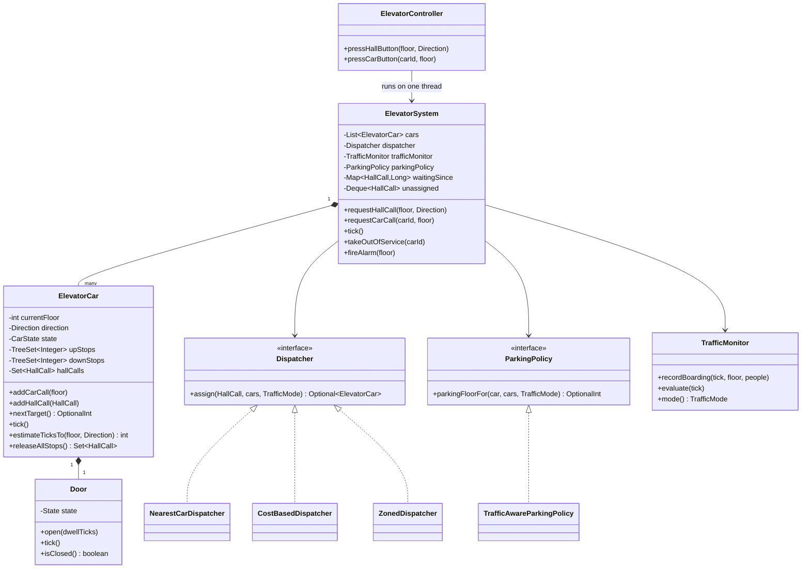
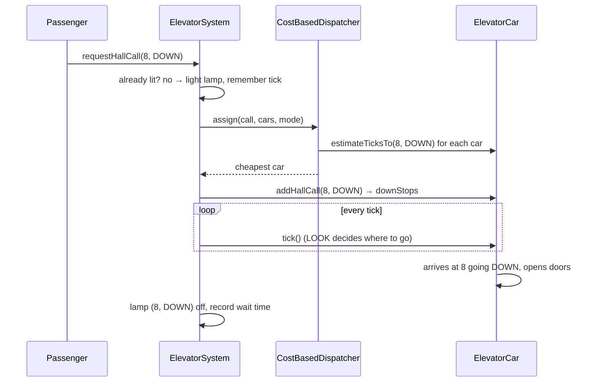

# LLD Q2 — Design an Elevator System (Java)

> **What the interviewer is really checking:**
> 1. Do you model the domain first? The biggest tell is knowing that a **hall call** (button outside) and a **car call** (button inside) are different things.
> 2. Do you know the real algorithms by name? **LOOK** for one car, **cost/ETA-based dispatch** for many cars.
> 3. Do you keep "which car?" and "in what order?" as two separate pieces of code?
>
> The common mistake is saying "I'll use a priority queue" and starting to code straight away.

---

## Table of Contents

0. [The Whole Design in 60 Seconds](#0-the-whole-design-in-60-seconds)
1. [The Problem](#1-the-problem)
2. [Clarifying Questions to Ask First](#2-clarifying-questions-to-ask-first)
3. [Requirements](#3-requirements)
4. [Vocabulary](#4-vocabulary)
5. [Modelling the System](#5-modelling-the-system)
6. [Algorithms](#6-algorithms)
7. [How Requests Flow & Peak Periods](#7-how-requests-flow--peak-periods)
8. [The Code](#8-the-code)
9. [Walkthroughs (real output)](#9-walkthroughs-real-output)
10. [Extensibility](#10-extensibility)
11. [Failure & Safety Scenarios](#11-failure--safety-scenarios)
12. [Testing Strategy](#12-testing-strategy)
13. [Interview Cheat Sheet](#13-interview-cheat-sheet)
14. [What Changed From the Previous Version](#14-what-changed-from-the-previous-version)

---

## 0. The Whole Design in 60 Seconds

If you remember nothing else, remember these six points:

1. **Two kinds of button.** A *hall call* = `(floor, UP/DOWN)`, pressed outside. Any car can answer it. A *car call* = `(floor)`, pressed inside. Only that car can answer it.
2. **Two problems, two classes.** `Dispatcher` decides **which car** gets a hall call. `ElevatorCar` decides **in what order** it visits its stops.
3. **One car uses LOOK.** Keep going in your current direction, stopping at every requested floor. When nothing is left ahead, turn around.
4. **LOOK uses two sorted sets**: `upStops` and `downStops` (`TreeSet`). "Next stop above me" is just `upStops.ceiling(currentFloor)`.
5. **Many cars use a cost function.** Estimate how long each car would take to reach the caller (its ETA), add small penalties for busy or crowded cars, and pick the lowest score.
6. **Rush hours.** Work out the traffic mode (up-peak, down-peak, …) from what passengers actually do, then park idle cars where the next call is likely to come from.

Plus one safety rule that sits above everything: **the car never moves unless the door is closed**, and one line of code enforces it.

---

## 1. The Problem

A building has `F` floors and `N` elevator cars. People press:

- **hall buttons** (UP / DOWN) in the lift lobby on each floor, and
- **car buttons** (a floor number) inside the car.

The system has to answer two questions:

| Question | Name | Who answers it in this design | Algorithm |
|---|---|---|---|
| Which car should go to this hall call? | **Dispatch** | `Dispatcher` (one for the whole building) | Cost / ETA-based |
| In what order should this car visit its stops? | **Scheduling** | `ElevatorCar` (each car) | **LOOK** |

Goals: short waiting times, no one waiting forever, never break a safety rule (doors, capacity), and handle rush hours sensibly.

> If you mix the two questions into one class, you get a 400-line `ElevatorSystem` god class. Keeping them apart is the main design decision.

---

## 2. Clarifying Questions to Ask First

Ask these, and say what you'll assume if the interviewer says "your choice":

| # | Question | Why it matters | Assumption |
|---|---|---|---|
| 1 | How many cars and floors? | 1 car = no dispatcher needed | N cars, F floors, basements allowed (floors can be negative) |
| 2 | Do all cars serve all floors? | Express cars, restricted floors | Each car has a `servesFloor(f)` check |
| 3 | Up/down buttons or destination keypads in the lobby? | Changes the whole dispatch model | Up/down buttons; discuss destination dispatch as an extension |
| 4 | Real time or simulated? | Testability | Discrete ticks: **1 tick = time to travel one floor** |
| 5 | Do cars have load sensors? | A full car shouldn't take more pickups | Yes |
| 6 | One process or distributed? | Concurrency model | One controller process, one control thread |

---

## 3. Requirements

### 3.1 Functional

| # | Requirement |
|---|---|
| F1 | Accept hall calls `(floor, UP/DOWN)`. |
| F2 | Accept car calls `(carId, floor)`. |
| F3 | Give every hall call to exactly one car, aiming for the shortest wait. |
| F4 | Each car visits its stops in LOOK order. |
| F5 | Open doors, wait (dwell), close. Re-open if something blocks the door. |
| F6 | A full car takes no new hall calls. An overloaded car won't close its doors. |
| F7 | Support emergency stop, maintenance mode and fire recall. When a car stops working, its hall calls go to other cars. |
| F8 | Detect the traffic pattern: up-peak, down-peak, lunch, normal, off-peak. |
| F9 | Park idle cars at useful floors depending on the traffic pattern. |

### 3.2 Non-Functional

| # | Requirement | How the design meets it |
|---|---|---|
| N1 | Short average wait | Cost-based dispatch (in simulation: **26.8 vs 35.4 ticks** for nearest-car, see §9.4) |
| N2 | Nobody waits forever | LOOK bounds the wait inside a car. Every call is assigned right away (or queued, oldest first). See §6.5. |
| N3 | Safety | "Don't move with the door open" is checked in code in one place |
| N4 | Testable | Time is a tick counter. No `Thread.sleep`, no wall clock in domain code |
| N5 | Easy to change policies | `Dispatcher` and `ParkingPolicy` are interfaces (Strategy pattern) |
| N6 | Thread-safe | Every button press and tick runs on one control thread (§8.8), so the domain code needs no locks |

### 3.3 Out of Scope

Motor control, acceleration curves, fire-code specifics, hardware protocols.

---

## 4. Vocabulary

Using these words in the interview shows you've thought about elevators, not just queues.

| Term | Meaning | Why it matters |
|---|---|---|
| **Hall call** | Button *outside* the car. Says a **direction**, not a destination. | Belongs to the building. The dispatcher chooses a car for it. |
| **Car call** | Button *inside* the car. Says a **destination floor**. | Belongs to that one car. Never moved to another car. |
| **Collective control** | A car picks up every call in its direction of travel, in floor order. | This is what people mean by "the elevator algorithm". |
| **Sweep** | One trip in one direction (e.g. from the lowest stop to the highest). | LOOK = sweep, then turn around at the last *requested* floor. |
| **Dwell time** | How long the doors stay open. | Real systems use a longer dwell for hall calls, because people have to walk over. |
| **Hall lantern** | The arrow above the lift door showing which way the car will go. | Tells waiting passengers whether to get in. |
| **Up-peak / down-peak** | Morning arrivals / evening departures. | The two rush-hour patterns. |
| **AWT** | Average Waiting Time (button press → doors open). | The number the dispatcher tries to minimise. |
| **Parking / homing** | Sending idle cars to chosen floors. | Cheap, big improvement at rush hour. |

> **The #1 modelling mistake:** storing a hall call as just a floor. Someone on floor 7 who pressed **DOWN** must *not* be picked up by a car going **up** to floor 12. It would take them the wrong way. The direction is part of what the call *is*.

---

## 5. Modelling the System

### 5.1 The pieces

```
Building                 min floor, max floor, lobby floor

ElevatorSystem           "group controller" - one per building
 ├── cars              : List<ElevatorCar>
 ├── dispatcher        : Dispatcher          which car gets a hall call   (Strategy)
 ├── trafficMonitor    : TrafficMonitor      which rush-hour mode are we in
 ├── parkingPolicy     : ParkingPolicy       where idle cars wait         (Strategy)
 ├── waitingSince      : Map<HallCall, tick> lit hall buttons (also de-duplicates presses)
 └── unassigned        : Queue<HallCall>     calls no car could take yet

ElevatorCar              "car controller" - one per car
 ├── currentFloor, direction, state, load, capacity
 ├── door              : Door                its own small state machine
 ├── upStops           : TreeSet<Integer>    stops to make while going UP
 ├── downStops         : TreeSet<Integer>    stops to make while going DOWN
 ├── hallCalls         : Set<HallCall>       which stops came from hall buttons
 └── parkingFloor      : Integer             where to wait when idle (optional)
```

Why does the car remember `hallCalls` separately? If the car breaks down, the system has to give its hall calls to other cars **with their directions**. The stop lists only contain floor numbers, so they can't tell you that.

### 5.2 Hall call vs car call in code

```java
record HallCall(int floor, Direction direction) { }   // a type of its own - direction is part of it
void addCarCall(int floor)                            // just a floor, sent straight to one car
```

A `record` compares by value, so two people pressing UP on floor 7 create **equal** `HallCall` objects. Putting them in a `Map` or `Set` removes duplicates for free.

### 5.3 Why two `TreeSet`s and not one priority queue

This is the key data-structure idea. Explain it clearly in the interview.

**The wrong idea:** one `PriorityQueue` sorted by distance from the car. That always goes to the *closest* stop, which is the algorithm called **SSTF**. If people keep pressing buttons near the lobby, the car stays near the lobby and floor 20 waits forever.

**What we actually want:** *"While going up, stop at every requested floor above me, lowest first. Then come back down, stopping at every requested floor, highest first."*

A `TreeSet` keeps its numbers sorted and gives us exactly the queries we need:

| Question the car asks | Code | Cost |
|---|---|---|
| Next stop above me (going up)? | `upStops.ceiling(currentFloor)` → smallest value ≥ current | O(log k) |
| Next stop below me (going down)? | `downStops.floor(currentFloor)` → largest value ≤ current | O(log k) |
| Where does the next down-sweep start? | `downStops.last()` → highest value | O(log k) |
| Add a stop | `add(floor)` | O(log k) |
| Same button pressed twice? | It's a `Set` - duplicates are ignored | free |

`k` = number of pending stops, which can never be more than the number of floors.

**Example.** The car is at floor 3, going up. `upStops = {5, 9}`, `downStops = {2, 7}`.

```
upStops.ceiling(3)  = 5    -> go to 5
upStops.ceiling(5)  = 9    -> go to 9
upStops.ceiling(9)  = null -> no more up stops, so turn around
downStops.last()    = 7    -> start the down sweep at 7
downStops.floor(7)  = 2    -> go to 2
```

Notice that the car passes floor 7 on the way up **without stopping**, because the person at 7 wants to go *down*.

**Why two sets and not one?** Because of direction. A person at floor 7 going UP and a person at floor 7 going DOWN are two different stops, served on two different sweeps.

### 5.4 Car state machine

```
                         ┌──────────┐
         ┌──────────────►│   IDLE   │◄───────── doors closed, no stops left
         │               └────┬─────┘
         │                    │ got a stop (or a parking floor)
         │                    ▼
         │               ┌──────────┐
         │               │  MOVING  │  one floor per tick
         │               └────┬─────┘
         │                    │ reached a floor it must stop at
         │                    ▼
         │               ┌──────────┐
         └───────────────│ STOPPED  │  doors open → dwell → close
          no stops left  └────┬─────┘
                              │ doors closed, more stops
                              └──────────► MOVING

Special states (the car leaves normal dispatch):
  any ──technician──► MAINTENANCE     ──release──► IDLE   (its hall calls go to other cars)
  any ──e-stop──────► EMERGENCY_STOP  ──reset────► IDLE   (its hall calls go to other cars)
  any ──fire alarm──► FIRE_SERVICE    drives to the fire floor, opens doors, stays there
```

### 5.5 Door state machine

The door is its own small object with its own states:

```
 CLOSED ──open()──► OPENING ──1 tick──► OPEN ──dwell ticks──► CLOSING ──1 tick──► CLOSED
                                         ▲                        │
                                         └──── open() again ──────┘
                                       (photo-eye, door-open button, overload)
```

With a 1-tick open, a 3-tick dwell and a 1-tick close, **one stop costs 5 ticks**. The dispatcher uses that number (`STOP_TICKS`) in its ETA estimate.

**The safety rule:** `ElevatorCar.tick()` checks `door.isClosed()` first. While the door is not closed, the only thing that can happen is the door moving. As a second layer of defence, `moveOneFloorToward()` throws an exception if it's ever called with the door open.

### 5.6 Class diagram


```mermaid
classDiagram
    class ElevatorSystem {
        -List~ElevatorCar~ cars
        -Dispatcher dispatcher
        -TrafficMonitor trafficMonitor
        -ParkingPolicy parkingPolicy
        -Map~HallCall,Long~ waitingSince
        -Deque~HallCall~ unassigned
        +requestHallCall(floor, Direction)
        +requestCarCall(carId, floor)
        +tick()
        +takeOutOfService(carId)
        +fireAlarm(floor)
    }
    class ElevatorCar {
        -int currentFloor
        -Direction direction
        -CarState state
        -TreeSet~Integer~ upStops
        -TreeSet~Integer~ downStops
        -Set~HallCall~ hallCalls
        +addCarCall(floor)
        +addHallCall(HallCall)
        +nextTarget() OptionalInt
        +tick()
        +estimateTicksTo(floor, Direction) int
        +releaseAllStops() Set~HallCall~
    }
    class Door {
        -State state
        +open(dwellTicks)
        +tick()
        +isClosed() boolean
    }
    class Dispatcher {
        <<interface>>
        +assign(HallCall, cars, TrafficMode) Optional~ElevatorCar~
    }
    class ParkingPolicy {
        <<interface>>
        +parkingFloorFor(car, cars, TrafficMode) OptionalInt
    }
    class TrafficMonitor {
        +recordBoarding(tick, floor, people)
        +evaluate(tick)
        +mode() TrafficMode
    }
    class ElevatorController {
        +pressHallButton(floor, Direction)
        +pressCarButton(carId, floor)
    }

    ElevatorController --> ElevatorSystem : runs on one thread
    ElevatorSystem "1" *-- "many" ElevatorCar
    ElevatorSystem --> Dispatcher
    ElevatorSystem --> ParkingPolicy
    ElevatorSystem --> TrafficMonitor
    ElevatorCar "1" *-- "1" Door
    Dispatcher <|.. NearestCarDispatcher
    Dispatcher <|.. CostBasedDispatcher
    Dispatcher <|.. ZonedDispatcher
    ParkingPolicy <|.. TrafficAwareParkingPolicy
```

### 5.7 Design patterns used (interviewers often ask)

| Pattern | Where | Why |
|---|---|---|
| **Strategy** | `Dispatcher`, `ParkingPolicy` | Swap nearest-car ↔ cost-based ↔ zoned without touching the rest |
| **Decorator** | `ZonedDispatcher` wraps another `Dispatcher` | Adds zoning on top of any dispatch strategy |
| **State machine** | `CarState`, `Door.State` | Makes illegal moves (moving with the door open) impossible |
| **Command queue / single-writer** | `ElevatorController` | All changes happen on one thread, so no locks are needed |
| **Value object** | `HallCall`, `Building` records | Compared by value, so de-duplication is free |

SOLID in one line each: the car only schedules and the dispatcher only assigns (**S**); new dispatchers need no changes to existing code (**O**); the system depends on the `Dispatcher` interface, not on a concrete class (**D**).

---

## 6. Algorithms

### 6.1 One car: know the family, pick LOOK

These are the classic disk-scheduling algorithms. Saying so goes down well.

| Algorithm | Rule | Good for elevators? |
|---|---|---|
| **FCFS** | Serve in the order buttons were pressed | ❌ Car bounces around: 1 → 10 → 2 → 9 |
| **SSTF** | Always go to the closest stop | ❌ **Starvation**: a busy lobby keeps the car low, floor 20 waits forever |
| **SCAN** | Sweep to the *end of the shaft*, then turn around | ⚠️ Works, but wasteful: goes to floor 20 even if the highest request is 12 |
| **LOOK** | Sweep to the *last requested floor*, then turn around | ✅ **The answer.** SCAN without the wasted travel |
| **C-LOOK** | Always sweep up, then jump empty back to the bottom | ⚠️ Fair for disks, but an empty ride down is silly for people |

**LOOK in one sentence:** *keep going in the current direction, stopping at every requested floor; when there's nothing left ahead, turn around.*

### 6.2 LOOK as three rules (this is exactly what the code does)

When the car is going **UP**:

1. Is there an UP stop at or above me? → go to the nearest one. *(normal case)*
2. No? Are there any DOWN stops? → go to the **highest** one. That's where the down sweep starts. It may be above me (I keep climbing) or below me (I turn around now).
3. No DOWN stops either? Then only UP stops below me are left → go to the **lowest** one and start a new up sweep.

Going **DOWN** is the mirror image. A car that was **IDLE** just goes to its nearest stop.

When the car arrives at a floor, it serves the stop that **matches its direction** first. If there's no match, it's at a turnaround point, so it serves the other direction and flips. The arrow it leaves with is shown on the hall lantern.

Why LOOK is the right answer:

- **No starvation.** Every sweep is at most one shaft long, so every stop is reached within about one round trip.
- **Feels natural.** It's what passengers expect a lift to do.
- **Never goes the wrong way.** A DOWN call is only served while the car is heading down.
- **Cheap.** Each decision is O(log k).

### 6.3 Many cars: which car gets the hall call?

Explain this as levels.

#### Level 1 — Nearest car (the baseline, and why it's not enough)

"Send the car that is physically closest." Simple, but it **ignores direction and how busy the car is**. A car one floor away that's heading the other way with a full queue is worse than an idle car four floors away. Present it, then improve on it.

#### Level 2 — Cost / ETA-based ✅ (the answer to give)

Score every car that is *allowed* to take the call, and pick the lowest score:

```
cost(car) =  ETA(car → caller)              how many ticks until it can open its doors there
          +  2 × car.pendingStopCount       spread work across the fleet
          +  8 × car.loadRatio              prefer emptier cars (load / capacity, 0.0 to 1.0)
          +  peak-hour rule                 up-peak: don't pull an idle car away from the lobby

Not allowed at all (skipped):  out of service, full, or doesn't serve that floor
```

There's no separate "wrong direction" penalty, because the ETA already includes the detour a wrong-way car has to make. Adding a penalty on top would count it twice.

Real group controllers work like this (Otis calls it "relative system response"). The weights 2 and 8 are tuning knobs. In real life you tune them with a simulation (§9.4).

#### Level 3 — Zoning (tall buildings)

Split the floors into bands (1–15, 16–30, …) and give each band its own cars. Each car makes fewer stops per trip, so round trips get much shorter. `ZonedDispatcher` wraps the cost-based dispatcher: it only narrows down the list of cars. If every car in a zone is busy or broken, it falls back to any car. Very tall buildings add **sky lobbies** with express cars.

#### Level 4 — Destination dispatch (the modern answer, worth 2 minutes)

Passengers type their **destination** on a keypad in the lobby, instead of pressing UP or DOWN. The system groups people going to similar floors into the same car.

| | Up/down buttons | Destination dispatch |
|---|---|---|
| What the hall button tells us | direction only | the exact destination |
| Stops per trip | many | far fewer (passengers are grouped) |
| Handling capacity | baseline | typically +20–30% |
| Downsides | — | needs keypads; confuses visitors |

Line to say: *"If we control the lobby hardware, destination dispatch is better, especially in up-peak, because we can group passengers by destination. New tall buildings use it."*

### 6.4 The ETA estimate: four cases

This is the heart of cost-based dispatch. The ETA has to follow LOOK, because that's how the car will really move.

```
Case A — car is IDLE
         ETA = distance × 1 tick

Case B — car is heading TOWARD the caller, in the SAME direction the caller wants   ← the "free ride"
         ETA = distance + (stops on the way × 5 ticks)

         floor 9  ● caller wants UP
         floor 7  ○ existing stop           ETA = 6 floors + 1 stop × 5 = 11
         floor 3  ▲ car going UP

Cases C & D — car must finish its sweep and turn around first
         (caller is behind it, or wants the other direction)
         ETA = (distance to turnaround + stops on the way + 1 stop at the turnaround)
             + distance from turnaround back to the caller

         floor 15 ○ car's last stop (turnaround)
         floor 12 ○ stop
         floor 8  ● caller wants DOWN       ETA = (8 + 5 + 5) + 7 = 25
         floor 7  ▲ car going UP
```

**Case B is the whole point.** A car already travelling up past floor 7 can pick up an UP caller at floor 9 almost for free. Nearest-car dispatch can't see this; ETA-based dispatch can.

It's only an **estimate**: it ignores calls that haven't been pressed yet, and the time left on doors that are currently open. That's fine. It only has to rank cars correctly.

### 6.5 Can anyone wait forever? (starvation)

A common answer is "subtract the call's age from the cost so old calls win". **That does nothing in this design**, for two reasons:

1. When the dispatcher scores cars for *one* call, that call's age is the same for every car. Subtracting the same number from every score doesn't change which car wins.
2. Calls are assigned the moment they're pressed, so their age is about 0 anyway.

What actually prevents starvation:

| Risk | What handles it |
|---|---|
| A stop never reached by its car | **LOOK.** A sweep is at most one shaft long, so a stop is reached within about one round trip (≈ 2 × floors × travel + stops × 5 ticks). |
| A call nobody picks up | **Every call is assigned immediately.** If no car can take it (all full or broken), it goes into the `unassigned` queue and is retried every tick, oldest first. It's never dropped. |
| A car breaks after taking a call | `takeOutOfService` / `emergencyStop` hand its hall calls to other cars. The lamp stays lit and the wait time keeps counting. |
| The assigned car gets slow (doors held, fills up) | **Re-dispatch (extension).** Every few seconds, re-score calls that have been waiting longer than some threshold. If another car is now much better, move the call. *This* is where call age really belongs: as the trigger for re-checking, not as a term in the cost. |

Interview line: **"LOOK guarantees no starvation inside one car. Immediate assignment plus re-dispatch guarantees it across cars."**

### 6.6 Summary

| Layer | Problem | Algorithm | Cost |
|---|---|---|---|
| One car | Stop order | LOOK with two `TreeSet`s | O(log k) per decision |
| Group | Which car | Cost/ETA-based | O(N · k) per call |
| Group | Tall buildings | Zoning (wraps cost-based) | + O(zones) |
| Group | Modern lobby | Destination dispatch | greedy grouping |
| Group | Idle cars | Parking by traffic mode | O(N log N) per tick |

---

## 7. How Requests Flow & Peak Periods

### 7.1 A hall call, step by step

```
requestHallCall(floor, direction)
  1. Validate      - floor exists; no UP button on the top floor, no DOWN on the bottom.
  2. De-duplicate  - lamp already lit for (floor, direction)? Ignore. Two presses = one call.
  3. Light lamp    - waitingSince[(floor, direction)] = now
  4. Dispatch      - dispatcher.assign(call, cars, mode)
  5a. Got a car    - car.addHallCall(call): UP → upStops, DOWN → downStops
  5b. No car       - add to the unassigned queue; retried every tick
  ...later...
  6. Lamp off      - a car has its doors open at this floor AND is going this direction.
                     Record the wait time (now - waitingSince) for the stats.
```


```mermaid
sequenceDiagram
    participant P as Passenger
    participant S as ElevatorSystem
    participant D as CostBasedDispatcher
    participant C as ElevatorCar
    P->>S: requestHallCall(8, DOWN)
    S->>S: already lit? no → light lamp, remember tick
    S->>D: assign(call, cars, mode)
    D->>C: estimateTicksTo(8, DOWN) for each car
    D-->>S: cheapest car
    S->>C: addHallCall(8, DOWN) → downStops
    loop every tick
        S->>C: tick()  (LOOK decides where to go)
    end
    C->>C: arrives at 8 going DOWN, opens doors
    S->>S: lamp (8, DOWN) off, record wait time
```

### 7.2 A car call

Much simpler, because **there's no dispatch decision**. The passenger is already inside.

```
requestCarCall(carId, floor)
  1. Car out of service, or doesn't serve that floor? → beep and ignore.
  2. floor above the car → upStops;  floor below → downStops;  same floor → just open the doors.
```

> **Subtle point:** a car going UP gets a car call for a floor *below* it. That goes into `downStops` and is served on the way back down. That's correct LOOK behaviour, and it's what real lifts do.

### 7.3 One tick of one car

```
tick():
  MAINTENANCE / EMERGENCY_STOP        → do nothing
  FIRE_SERVICE                        → drive to the fire floor, open doors, stay
  door not closed                     → only move the door        ← SAFETY RULE
                                        (overloaded? keep it open)
  no target (no stops, no parking)    → IDLE
  target is another floor             → move one floor toward it
  now on the target floor             → serve the stop, open the doors
```

Each branch is short on purpose. The hard thinking lives in `nextTarget()` (LOOK) and in the dispatcher (cost), not in the loop.

### 7.4 One tick of the whole system

```
ElevatorSystem.tick():
  1. now++
  2. retry unassigned hall calls
  3. tick every car
  4. switch off lamps for calls that were just answered
  5. every 300 ticks: trafficMonitor.evaluate()
  6. update parking floors for idle cars
```

### 7.5 Peak periods (the part most candidates skip)

Traffic is not the same all day. There are five patterns:

| Mode | Typical time | What's happening | Strategy |
|---|---|---|---|
| **UP_PEAK** | morning | Everyone comes in at the lobby and goes up | **Park idle cars at the lobby**, keep one mid-building. Make it costly to pull a lobby car away for other calls. |
| **DOWN_PEAK** | evening | Everyone goes down to the lobby | **Spread idle cars over the upper half**, so a DOWN press upstairs is answered fast. |
| **LUNCH** | midday | Heavy traffic both to and from the lobby | Half the cars wait at the lobby, the other half spread above it. |
| **NORMAL** | rest of the day | Busy, but random floor-to-floor | Spread cars evenly over the building. |
| **OFF_PEAK** | night / weekend | Very little traffic | Same as NORMAL (spread evenly). |

**Spreading evenly:** cut the floor range into N equal bands and park each car in the middle of its band. For 3 cars on floors 0–20, that's floors **3, 10, 16**. Any random call is then close to some car.

#### How to detect the mode

**Don't hard-code clock times.** Buildings are different; a hospital or a hotel doesn't follow office hours. Look at what passengers actually do over the last 5 minutes:

```
startAtLobby = people who BOARDED at the lobby   / all people who boarded
endAtLobby   = people who GOT OFF at the lobby   / all people who got off

fewer than 10 boardings               → OFF_PEAK
startAtLobby > 60%                    → UP_PEAK
endAtLobby   > 60%                    → DOWN_PEAK
both > 30%                            → LUNCH
otherwise                             → NORMAL
```

> ⚠️ Compare boardings with boardings, and drop-offs with drop-offs. If you divide lobby boardings by *all events* (boardings + drop-offs), every trip is counted twice. The share can then never go above 50%, and up-peak is never detected. The previous version of these notes had exactly this bug.

**Hysteresis:** only switch mode after the *same* new result shows up in **2 checks in a row**. The monitor checks once per window, not every time someone reads the mode, so one noisy window can't flip the whole building.

#### Other rush-hour tools

- **Skip full cars.** A full car takes no new hall calls. Otherwise it stops at floor 3 where nobody can get in.
- **Overload.** If the load sensor reads over capacity, the doors won't close (buzzer) until someone steps out.
- **Sectoring in up-peak.** Give each car a band of upper floors, so a full car makes 3 stops instead of 8.
- **Load-based departure.** In up-peak, send the lobby car off when it's ~80% full or a timer runs out.
- **Anti-nuisance.** Load is almost zero but 10 car calls are registered (someone pressed every button)? Cancel them.
- **Bunching.** Cars tend to clump together, like buses. Spreading parked cars helps. You can also add a small penalty for picking a car that's right next to another car.

---

## 8. The Code

> Java 17+. **1 tick = time to travel one floor.** Time is a simple counter, so there's no `Thread.sleep` and no wall clock in the domain code, and every test is deterministic.
>
> All of this code has been compiled and run. The walkthroughs in §9 show its real output.

### 8.0 Reading order

| # | File | What it is | Read it for |
|---|---|---|---|
| 1 | `Direction`, `CarState`, `TrafficMode`, `Building`, `HallCall` | Small types | Vocabulary |
| 2 | `Door` | Door state machine | The safety rule |
| 3 | `ElevatorCar` | One car | **LOOK** + ETA (the most important file) |
| 4 | `Dispatcher` + 3 implementations | Which car | **Cost function** |
| 5 | `TrafficMonitor` | Rush-hour detection | Peak handling |
| 6 | `TrafficAwareParkingPolicy` | Where idle cars wait | Peak handling |
| 7 | `ElevatorSystem` | The group controller | How everything connects |
| 8 | `ElevatorController` | Threading | Concurrency |

All classes live in `package com.building.elevator;`. The package and import lines are left out below unless they matter.

### 8.1 Small types

```java
// Direction.java
public enum Direction {
    UP, DOWN, IDLE;

    /** +3 -> UP, -2 -> DOWN, 0 -> IDLE */
    public static Direction of(int delta) {
        if (delta > 0) return UP;
        if (delta < 0) return DOWN;
        return IDLE;
    }
}
```

```java
// CarState.java
public enum CarState {
    IDLE,            // doors closed, nothing to do
    MOVING,          // travelling between floors
    STOPPED,         // at a floor, doors opening / open / closing
    MAINTENANCE,     // taken out of service by a technician
    EMERGENCY_STOP,  // e-stop pressed / fault detected
    FIRE_SERVICE;    // fire alarm: recalled to the fire floor

    /** Only these states take part in normal dispatch. */
    public boolean isInService() {
        return this == IDLE || this == MOVING || this == STOPPED;
    }
}
```

```java
// TrafficMode.java
public enum TrafficMode {
    OFF_PEAK,   // very little traffic (nights, weekends)
    NORMAL,     // busy, but no dominant pattern
    UP_PEAK,    // morning: most trips START at the lobby
    DOWN_PEAK,  // evening: most trips END at the lobby
    LUNCH       // heavy traffic both to and from the lobby
}
```

```java
// Building.java
/** Floors can be negative (basements). The lobby is usually 0 but doesn't have to be. */
public record Building(int minFloor, int maxFloor, int lobbyFloor) {

    public Building {
        if (minFloor >= maxFloor) throw new IllegalArgumentException("need at least 2 floors");
        if (!(lobbyFloor >= minFloor && lobbyFloor <= maxFloor)) {
            throw new IllegalArgumentException("lobby must be inside the building");
        }
    }

    public boolean hasFloor(int floor) { return floor >= minFloor && floor <= maxFloor; }

    public int middleFloor() { return minFloor + (maxFloor - minFloor) / 2; }
}
```

```java
// HallCall.java
/**
 * A button pressed OUTSIDE the car, in the lift lobby of a floor.
 *
 * It carries a DIRECTION, not a destination. That is the key modelling detail.
 * Two people pressing UP on floor 7 create the SAME HallCall (records compare by value),
 * so de-duplication is free.
 */
public record HallCall(int floor, Direction direction) {
    public HallCall {
        if (direction == Direction.IDLE) {
            throw new IllegalArgumentException("a hall call is either UP or DOWN");
        }
    }
}
```

### 8.2 `Door`

```java
// Door.java
/**
 * The door is its own small state machine:  CLOSED -> OPENING -> OPEN -> CLOSING -> CLOSED
 *
 * It is a separate class because the most important safety rule in the system
 * ("the car never moves unless the door is CLOSED") needs ONE clear source of truth.
 */
public final class Door {

    public enum State { CLOSED, OPENING, OPEN, CLOSING }

    private static final int OPEN_CLOSE_TICKS = 1;   // time for the panels to slide

    private State state = State.CLOSED;
    private int ticksLeftInState = 0;
    private int dwellTicks = 0;         // how long to stay OPEN
    private boolean heldOpen = false;   // fire service: stay open until released

    /**
     * Open the door (or keep it open longer if it's already open / closing).
     * The photo-eye, the "door open" button and a new arrival all call this.
     */
    public void open(int dwellTicks) {
        this.dwellTicks = dwellTicks;
        switch (state) {
            case CLOSED -> { state = State.OPENING; ticksLeftInState = OPEN_CLOSE_TICKS; }
            case OPENING -> { /* already on its way */ }
            case OPEN, CLOSING -> { state = State.OPEN; ticksLeftInState = dwellTicks; }
        }
    }

    /** Fire service: open and stay open. */
    public void holdOpen() {
        state = State.OPEN;
        heldOpen = true;
    }

    public void tick() {
        if (heldOpen || state == State.CLOSED) return;

        ticksLeftInState--;
        if (ticksLeftInState > 0) return;          // still busy in the current state

        switch (state) {
            case OPENING -> { state = State.OPEN;    ticksLeftInState = dwellTicks; }
            case OPEN    -> { state = State.CLOSING; ticksLeftInState = OPEN_CLOSE_TICKS; }
            case CLOSING -> state = State.CLOSED;
            case CLOSED  -> { }
        }
    }

    public boolean isClosed()   { return state == State.CLOSED; }
    public boolean isHeldOpen() { return heldOpen; }
    public State state()        { return state; }
}
```

### 8.3 `ElevatorCar` — LOOK lives here

This is the most important class, so it's shown in parts with an explanation before each one. Put together, it's a single file.

**Part 0 — fields.** Look at the two `TreeSet`s and the `hallCalls` set. Those are the car's whole "to-do list".

```java
// ElevatorCar.java  (part 0 of 5)
public final class ElevatorCar {

    // ---- timing, in ticks (1 tick = time to travel one floor) ----------------
    public static final int TICKS_PER_FLOOR = 1;
    public static final int DWELL_TICKS     = 3;   // how long doors stay fully open
    public static final int STOP_TICKS      = 5;   // one full stop: open(1) + dwell(3) + close(1)

    // ---- fixed facts about this car ------------------------------------------
    private final int id;
    private final Building building;
    private final int capacity;
    private final Set<Integer> skippedFloors;   // express cars / restricted floors

    // ---- live state ----------------------------------------------------------
    private int currentFloor;
    private Direction direction = Direction.IDLE;
    private CarState state = CarState.IDLE;
    private int load = 0;
    private final Door door = new Door();

    // ---- the work queue: WHERE this car must stop ----------------------------
    private final TreeSet<Integer> upStops   = new TreeSet<>();  // serve while going UP
    private final TreeSet<Integer> downStops = new TreeSet<>();  // serve while going DOWN

    /** Which of those stops came from hall buttons (so we can hand them back if we break down). */
    private final Set<HallCall> hallCalls = new HashSet<>();

    /** Where to wait when there is no work. Any real call overrides it. */
    private Integer parkingFloor = null;

    /** Fire service: the floor this car is recalled to. */
    private int fireRecallFloor;

    public ElevatorCar(int id, Building building, int capacity) {
        this(id, building, capacity, Set.of());
    }

    public ElevatorCar(int id, Building building, int capacity, Set<Integer> skippedFloors) {
        this.id = id;
        this.building = building;
        this.capacity = capacity;
        this.skippedFloors = Set.copyOf(skippedFloors);
        this.currentFloor = building.lobbyFloor();
    }
```

**Part 1 — accepting work.** A car call is placed by which side of the car it's on. A hall call is placed by its **direction**. That difference is the key modelling point from §4.

```java
// ElevatorCar.java  (part 1 of 5)
    // =========================================================================
    //  1. ACCEPTING WORK
    // =========================================================================

    /** Button pressed INSIDE the car. No dispatch decision: the rider is already here. */
    public void addCarCall(int floor) {
        requireServes(floor);
        if (floor == currentFloor) {
            if (state != CarState.MOVING) door.open(DWELL_TICKS);  // "open here" - just open
            return;
        }
        // Put the stop on the side of the car it's on. LOOK will reach it in order.
        if (floor > currentFloor) upStops.add(floor);
        else                      downStops.add(floor);
        parkingFloor = null;
    }

    /**
     * Hall call that the Dispatcher gave to THIS car.
     * The call's DIRECTION decides the list - so a DOWN passenger is only picked up
     * when the car is heading DOWN, never carried the wrong way.
     */
    public void addHallCall(HallCall call) {
        requireServes(call.floor());
        if (call.direction() == Direction.UP) upStops.add(call.floor());
        else                                  downStops.add(call.floor());
        hallCalls.add(call);
        parkingFloor = null;
    }

    private void requireServes(int floor) {
        if (!servesFloor(floor)) {
            throw new IllegalArgumentException("car " + id + " does not serve floor " + floor);
        }
    }
```

**Part 2 — LOOK.** These are the three rules from §6.2, written as code. Read `nextStopGoingUp()` next to the rules.

```java
// ElevatorCar.java  (part 2 of 5)
    // =========================================================================
    //  2. THE LOOK ALGORITHM - "which floor do I head to next?"
    // =========================================================================

    public OptionalInt nextTarget() {
        if (!hasPendingStops()) {
            return parkingFloor == null ? OptionalInt.empty() : OptionalInt.of(parkingFloor);
        }
        int target = switch (direction) {
            case UP   -> nextStopGoingUp();
            case DOWN -> nextStopGoingDown();
            case IDLE -> nearestStop();          // just woke up: go to the closest stop
        };
        return OptionalInt.of(target);
    }

    private int nextStopGoingUp() {
        // 1. Any UP stop at or above me? Keep going up - this is the normal case.
        Integer upAhead = upStops.ceiling(currentFloor);
        if (upAhead != null) return upAhead;

        // 2. No more UP stops above. The next sweep is DOWN, and it must start from
        //    the HIGHEST down stop (which may be above me - then I keep climbing to it).
        if (!downStops.isEmpty()) return downStops.last();

        // 3. Only UP stops below me remain: go down to the lowest one and start a new up sweep.
        return upStops.first();
    }

    private int nextStopGoingDown() {
        // Mirror image of nextStopGoingUp().
        Integer downAhead = downStops.floor(currentFloor);
        if (downAhead != null) return downAhead;

        if (!upStops.isEmpty()) return upStops.first();

        return downStops.last();
    }

    private int nearestStop() {
        int best = Integer.MAX_VALUE;
        for (int floor : allStops()) {
            if (best == Integer.MAX_VALUE
                    || Math.abs(floor - currentFloor) < Math.abs(best - currentFloor)) {
                best = floor;
            }
        }
        return best;
    }
```

**Part 3 — the tick.** The first real check is the safety rule. After that there are only two things the car can do: move one floor, or stop and open the doors. When it stops, it prefers the stop that matches its current direction; if there isn't one, it's at a turnaround point.

```java
// ElevatorCar.java  (part 3 of 5)
    // =========================================================================
    //  3. THE TICK - one step of time
    // =========================================================================

    public void tick() {
        switch (state) {
            case MAINTENANCE, EMERGENCY_STOP -> { return; }            // frozen
            case FIRE_SERVICE -> { runFireRecall(); return; }
            default -> { }                                             // normal operation
        }

        // SAFETY RULE: while the door is not closed, the ONLY thing that happens is the door.
        if (!door.isClosed()) {
            if (isOverloaded()) door.open(DWELL_TICKS);   // buzzer: won't close until someone exits
            door.tick();
            if (door.isClosed() && !hasPendingStops()) goIdle();
            return;
        }

        OptionalInt next = nextTarget();
        if (next.isEmpty()) {
            goIdle();
            return;
        }

        int target = next.getAsInt();
        if (target != currentFloor) {
            moveOneFloorToward(target);
            state = CarState.MOVING;
        }
        if (target == currentFloor) stopHere();
    }

    private void moveOneFloorToward(int target) {
        if (!door.isClosed()) {                       // defence in depth - should be unreachable
            throw new IllegalStateException("car " + id + " tried to move with the door open");
        }
        int step = Integer.signum(target - currentFloor);
        direction = Direction.of(step);
        currentFloor += step;
    }

    /** We've reached our target floor: serve whatever is here and open the doors. */
    private void stopHere() {
        Direction leavingDirection = serveStopsAtCurrentFloor();

        if (leavingDirection == null) {   // nothing to serve: we just reached our parking spot
            parkingFloor = null;
            goIdle();
            return;
        }
        direction = leavingDirection;     // the hall lantern shows this arrow
        state = CarState.STOPPED;
        door.open(DWELL_TICKS);
    }

    /**
     * Removes the stop this visit satisfies and returns the direction we'll leave in.
     * Prefer the stop that matches the way we're already going; otherwise we're at a
     * turnaround point, so serve the other direction.
     */
    private Direction serveStopsAtCurrentFloor() {
        if (direction != Direction.DOWN && upStops.remove(currentFloor))   return servedHere(Direction.UP);
        if (direction != Direction.UP   && downStops.remove(currentFloor)) return servedHere(Direction.DOWN);
        if (upStops.remove(currentFloor))   return servedHere(Direction.UP);     // turnaround
        if (downStops.remove(currentFloor)) return servedHere(Direction.DOWN);   // turnaround
        return null;
    }

    private Direction servedHere(Direction d) {
        hallCalls.remove(new HallCall(currentFloor, d));
        return d;
    }

    private void goIdle() {
        state = CarState.IDLE;
        direction = Direction.IDLE;
    }

    private void runFireRecall() {
        if (door.isHeldOpen()) return;                  // parked at the fire floor, waiting
        if (!door.isClosed()) { door.tick(); return; }  // let the doors finish closing first
        if (currentFloor != fireRecallFloor) {
            moveOneFloorToward(fireRecallFloor);        // no stops on the way
            return;
        }
        door.holdOpen();
    }
```

**Part 4 — ETA.** These are the four cases from §6.4. The dispatcher calls this for every car.

```java
// ElevatorCar.java  (part 4 of 5)
    // =========================================================================
    //  4. ETA - "how many ticks until I could pick someone up at `floor`?"
    //     Used by the CostBasedDispatcher. An estimate, not a simulation.
    // =========================================================================

    public int estimateTicksTo(int floor, Direction callDirection) {
        int straightLine = Math.abs(currentFloor - floor) * TICKS_PER_FLOOR;

        // Case A - idle: just drive there.
        if (direction == Direction.IDLE) return straightLine;

        boolean callIsAhead = (direction == Direction.UP) ? floor >= currentFloor
                                                          : floor <= currentFloor;

        // Case B - "free ride": already heading that way, in the same direction.
        //          Cost = travel + the stops I'll make on the way.
        if (direction == callDirection && callIsAhead) {
            return straightLine + stopsBefore(floor) * STOP_TICKS;
        }

        // Cases C & D - I must finish my sweep, turn around, then come back.
        int turnaround = (direction == Direction.UP) ? highestStop() : lowestStop();
        int firstLeg  = Math.abs(currentFloor - turnaround) * TICKS_PER_FLOOR
                      + stopsBefore(turnaround) * STOP_TICKS
                      + STOP_TICKS;                                     // the stop at the turnaround
        int secondLeg = Math.abs(turnaround - floor) * TICKS_PER_FLOOR;
        return firstLeg + secondLeg;
    }

    /** Stops in my current direction strictly between here and `floor`. */
    private int stopsBefore(int floor) {
        if (direction == Direction.UP && floor > currentFloor) {
            return upStops.subSet(currentFloor, false, floor, false).size();
        }
        if (direction == Direction.DOWN && floor < currentFloor) {
            return downStops.subSet(floor, false, currentFloor, false).size();
        }
        return 0;
    }

    private int highestStop() {
        int highest = currentFloor;
        for (int f : allStops()) highest = Math.max(highest, f);
        return highest;
    }

    private int lowestStop() {
        int lowest = currentFloor;
        for (int f : allStops()) lowest = Math.min(lowest, f);
        return lowest;
    }
```

**Part 5 — passengers, parking, special modes.** Notice that `board()` doesn't throw an error when the car is over capacity. A load sensor just *reports* the weight; the car's reaction is to keep its doors open (see `tick()`). `releaseAllStops()` hands back hall calls **with their directions**, so another car can take them correctly.

```java
// ElevatorCar.java  (part 5 of 5)
    // =========================================================================
    //  5. PASSENGERS, PARKING AND SPECIAL MODES
    // =========================================================================

    /** Load-sensor reading. Only possible while the doors are open. */
    public void board(int people) {
        if (door.isClosed()) throw new IllegalStateException("doors are closed");
        load += people;                        // may exceed capacity -> car refuses to close
    }

    public void alight(int people) {
        if (door.isClosed()) throw new IllegalStateException("doors are closed");
        load = Math.max(0, load - people);
    }

    public boolean isFull()       { return load >= capacity; }
    public boolean isOverloaded() { return load > capacity; }

    public boolean servesFloor(int floor) {
        return building.hasFloor(floor) && !skippedFloors.contains(floor);
    }

    /** Can the dispatcher give this car a new hall call? */
    public boolean canAcceptHallCall(int floor) {
        return state.isInService() && servesFloor(floor) && !isFull();
    }

    /** In service and has nothing to do - a candidate for parking. */
    public boolean isFreeToPark() {
        return state.isInService() && !hasPendingStops();
    }

    public void parkAt(int floor) {
        if (hasPendingStops()) return;                           // real work always wins
        parkingFloor = (floor == currentFloor) ? null : floor;   // already there: nothing to do
    }

    public void clearParking() { parkingFloor = null; }

    public void enterMaintenance() { state = CarState.MAINTENANCE; direction = Direction.IDLE; }
    public void emergencyStop()    { state = CarState.EMERGENCY_STOP; direction = Direction.IDLE; }

    public void enterFireService(int recallFloor) {
        releaseAllStops();
        parkingFloor = null;
        fireRecallFloor = recallFloor;
        state = CarState.FIRE_SERVICE;
    }

    public void returnToService() {
        if (!state.isInService()) goIdle();
    }

    /**
     * Clears every stop and returns the HALL calls, so the group controller can give them
     * to another car. Car calls are dropped (the riders are asked to leave / re-press).
     */
    public Set<HallCall> releaseAllStops() {
        Set<HallCall> released = new HashSet<>(hallCalls);
        upStops.clear();
        downStops.clear();
        hallCalls.clear();
        return released;
    }

    // =========================================================================
    //  QUERIES
    // =========================================================================

    private Set<Integer> allStops() {
        Set<Integer> all = new HashSet<>(upStops);
        all.addAll(downStops);
        return all;
    }

    public boolean hasPendingStops() { return !upStops.isEmpty() || !downStops.isEmpty(); }
    public int pendingStopCount()    { return upStops.size() + downStops.size(); }
    public double loadRatio()        { return load / (double) capacity; }

    public int id()                 { return id; }
    public int currentFloor()       { return currentFloor; }
    public Direction direction()    { return direction; }
    public CarState state()         { return state; }
    public int load()               { return load; }
    public Door door()              { return door; }
    public Set<Integer> upStops()   { return Set.copyOf(upStops); }
    public Set<Integer> downStops() { return Set.copyOf(downStops); }

    @Override public String toString() {
        return "Car%d[floor=%d %s %s door=%s load=%d/%d up=%s down=%s]".formatted(
                id, currentFloor, direction, state, door.state(), load, capacity, upStops, downStops);
    }
}
```

### 8.4 Dispatchers — which car?

```java
// Dispatcher.java
/** Strategy: decides WHICH car answers a hall call. */
public interface Dispatcher {
    /** Empty = no car can take it right now; the system will retry next tick. */
    Optional<ElevatorCar> assign(HallCall call, List<ElevatorCar> cars, TrafficMode mode);
}
```

The baseline. Show it first, then explain its flaw.

```java
// NearestCarDispatcher.java
/**
 * BASELINE. Show it, then explain why it's not good enough:
 * it ignores direction and how busy the car already is.
 */
public final class NearestCarDispatcher implements Dispatcher {

    @Override
    public Optional<ElevatorCar> assign(HallCall call, List<ElevatorCar> cars, TrafficMode mode) {
        return cars.stream()
                .filter(car -> car.canAcceptHallCall(call.floor()))
                .min(Comparator.comparingInt((ElevatorCar car) -> distance(car, call))
                               .thenComparingInt(ElevatorCar::id));    // deterministic tie-break
    }

    private int distance(ElevatorCar car, HallCall call) {
        return Math.abs(car.currentFloor() - call.floor());
    }
}
```

The one to give as your answer:

```java
// CostBasedDispatcher.java
/**
 * THE ANSWER TO GIVE. Score every eligible car, pick the cheapest.
 *
 *   cost = ETA                               how long until this car can reach the caller
 *        + BUSY_WEIGHT     x pendingStops    spread work across the fleet
 *        + CROWDED_WEIGHT  x loadRatio       prefer emptier cars
 *        + peak-hour rule                    (see modePenalty)
 *
 * Wrong-direction cars need no extra penalty - their ETA already includes the detour.
 */
public final class CostBasedDispatcher implements Dispatcher {

    private static final double BUSY_WEIGHT          = 2.0;
    private static final double CROWDED_WEIGHT       = 8.0;
    private static final double LOBBY_RESERVE_WEIGHT = 10.0;

    private final Building building;

    public CostBasedDispatcher(Building building) {
        this.building = building;
    }

    @Override
    public Optional<ElevatorCar> assign(HallCall call, List<ElevatorCar> cars, TrafficMode mode) {
        ElevatorCar best = null;
        double bestCost = Double.MAX_VALUE;

        for (ElevatorCar car : cars) {                        // cars are in id order
            if (!car.canAcceptHallCall(call.floor())) continue;

            double cost = cost(car, call, mode);
            if (cost < bestCost) {                            // strict "<" = lowest id wins ties
                best = car;
                bestCost = cost;
            }
        }
        return Optional.ofNullable(best);
    }

    double cost(ElevatorCar car, HallCall call, TrafficMode mode) {
        return car.estimateTicksTo(call.floor(), call.direction())
             + BUSY_WEIGHT    * car.pendingStopCount()
             + CROWDED_WEIGHT * car.loadRatio()
             + modePenalty(car, call, mode);
    }

    /**
     * Up-peak: an idle car waiting at the lobby is precious (the crowd is there).
     * Make it expensive to pull that car away for a call somewhere else.
     * Other modes are handled by the parking policy, not here.
     */
    private double modePenalty(ElevatorCar car, HallCall call, TrafficMode mode) {
        boolean idleAtLobby = car.direction() == Direction.IDLE
                           && car.currentFloor() == building.lobbyFloor();
        boolean callIsElsewhere = call.floor() != building.lobbyFloor();

        if (mode == TrafficMode.UP_PEAK && idleAtLobby && callIsElsewhere) {
            return LOBBY_RESERVE_WEIGHT;
        }
        return 0.0;
    }
}
```

For tall buildings. It wraps any other dispatcher:

```java
// ZonedDispatcher.java
/**
 * Tall buildings: each group of cars "owns" a band of floors.
 * Wraps another dispatcher (usually CostBasedDispatcher) and only narrows the car list.
 */
public final class ZonedDispatcher implements Dispatcher {

    public record Zone(int lowestFloor, int highestFloor, Set<Integer> carIds) {
        boolean contains(int floor) { return floor >= lowestFloor && floor <= highestFloor; }
    }

    private final List<Zone> zones;
    private final Dispatcher inner;

    public ZonedDispatcher(List<Zone> zones, Dispatcher inner) {
        this.zones = List.copyOf(zones);
        this.inner = inner;
    }

    @Override
    public Optional<ElevatorCar> assign(HallCall call, List<ElevatorCar> cars, TrafficMode mode) {
        for (Zone zone : zones) {
            if (!zone.contains(call.floor())) continue;

            List<ElevatorCar> zoneCars = cars.stream()
                    .filter(car -> zone.carIds().contains(car.id()))
                    .toList();
            Optional<ElevatorCar> chosen = inner.assign(call, zoneCars, mode);
            if (chosen.isPresent()) return chosen;
        }
        // No zone car available (all busy / broken): degrade gracefully, use any car.
        return inner.assign(call, cars, mode);
    }
}
```

> **A real-world note on zoning:** with up/down buttons, a lobby UP call doesn't tell you which zone the person is going to. That's why zoned buildings have separate lift banks at the lobby ("floors 1–15" / "floors 16–30"), or use destination dispatch.

### 8.5 `TrafficMonitor` — which rush-hour mode?

```java
// TrafficMonitor.java
/**
 * Works out the traffic mode from what passengers actually DO, not from the clock.
 * (Hard-coding "up-peak = 8 to 9:30" breaks in a hospital, a hotel, or on a holiday.)
 */
public final class TrafficMonitor {

    private static final double PEAK_SHARE   = 0.60;  // >60% of trips start (or end) at the lobby
    private static final double LUNCH_SHARE  = 0.30;  // >30% both ways
    private static final int MIN_TRIPS       = 10;    // below this, the building is quiet
    private static final int CONFIRMATIONS   = 2;     // same answer twice in a row before switching

    private record Movement(long tick, int floor, boolean boarding, int people) {}

    private final int lobbyFloor;
    private final int windowTicks;
    private final Deque<Movement> recent = new ArrayDeque<>();

    private TrafficMode mode = TrafficMode.OFF_PEAK;
    private TrafficMode candidate = TrafficMode.OFF_PEAK;
    private int timesSeen = 0;

    public TrafficMonitor(int lobbyFloor, int windowTicks) {
        this.lobbyFloor = lobbyFloor;
        this.windowTicks = windowTicks;
    }

    public void recordBoarding(long tick, int floor, int people) {
        recent.addLast(new Movement(tick, floor, true, people));
    }

    public void recordAlighting(long tick, int floor, int people) {
        recent.addLast(new Movement(tick, floor, false, people));
    }

    /** Called by the system ONCE per window - not on every read - so hysteresis means something. */
    public void evaluate(long now) {
        while (!recent.isEmpty() && recent.peekFirst().tick() < now - windowTicks) {
            recent.removeFirst();
        }

        TrafficMode observed = classify();

        // Hysteresis: only switch after seeing the same new mode CONFIRMATIONS times in a row.
        if (observed == mode) {
            timesSeen = 0;
            return;
        }
        if (observed != candidate) {
            candidate = observed;
            timesSeen = 0;
        }
        timesSeen++;
        if (timesSeen >= CONFIRMATIONS) {
            mode = observed;
            timesSeen = 0;
        }
    }

    private TrafficMode classify() {
        int boardings = 0, alightings = 0, boardedAtLobby = 0, leftAtLobby = 0;

        for (Movement m : recent) {
            if (m.boarding()) {
                boardings += m.people();
                if (m.floor() == lobbyFloor) boardedAtLobby += m.people();
            } else {
                alightings += m.people();
                if (m.floor() == lobbyFloor) leftAtLobby += m.people();
            }
        }
        if (boardings < MIN_TRIPS) return TrafficMode.OFF_PEAK;

        // Compare boardings with boardings and alightings with alightings.
        // (Mixing them halves both shares - every trip is one boarding AND one alighting.)
        double startAtLobby = boardedAtLobby / (double) boardings;
        double endAtLobby   = alightings == 0 ? 0 : leftAtLobby / (double) alightings;

        if (startAtLobby > PEAK_SHARE)                          return TrafficMode.UP_PEAK;
        if (endAtLobby   > PEAK_SHARE)                          return TrafficMode.DOWN_PEAK;
        if (startAtLobby > LUNCH_SHARE && endAtLobby > LUNCH_SHARE) return TrafficMode.LUNCH;
        return TrafficMode.NORMAL;
    }

    public TrafficMode mode() { return mode; }
}
```

### 8.6 Parking — where do idle cars wait?

```java
// ParkingPolicy.java
/** Strategy: where should a car with nothing to do wait? */
public interface ParkingPolicy {
    OptionalInt parkingFloorFor(ElevatorCar car, List<ElevatorCar> allCars, TrafficMode mode);
}
```

```java
// TrafficAwareParkingPolicy.java
/**
 * Put idle cars where the NEXT call is most likely to come from.
 * Cheap to build, big effect on average waiting time.
 */
public final class TrafficAwareParkingPolicy implements ParkingPolicy {

    private final Building building;

    public TrafficAwareParkingPolicy(Building building) {
        this.building = building;
    }

    @Override
    public OptionalInt parkingFloorFor(ElevatorCar car, List<ElevatorCar> allCars, TrafficMode mode) {
        List<ElevatorCar> freeCars = allCars.stream()
                .filter(ElevatorCar::isFreeToPark)
                .sorted(Comparator.comparingInt(ElevatorCar::id))
                .toList();

        int i = freeCars.indexOf(car);         // this car's slot among the free cars
        if (i < 0) return OptionalInt.empty(); // busy or out of service
        int n = freeCars.size();

        int lobby  = building.lobbyFloor();
        int bottom = building.minFloor();
        int middle = building.middleFloor();
        int top    = building.maxFloor();

        int floor = switch (mode) {
            // Morning: everyone arrives at the lobby. Wait there - but keep one car
            // mid-building so people moving between floors aren't stranded.
            case UP_PEAK -> (n > 1 && i == n - 1) ? middle : lobby;

            // Evening: calls come from upper floors. Spread cars over the upper half.
            case DOWN_PEAK -> spreadEvenly(i, n, middle, top);

            // Lunch: half the cars at the lobby, the other half spread above it.
            case LUNCH -> (i % 2 == 0) ? lobby : spreadEvenly(i / 2, n / 2, lobby, top);

            // Random traffic: spread evenly so any floor is close to some car.
            case NORMAL, OFF_PEAK -> spreadEvenly(i, n, bottom, top);
        };
        return OptionalInt.of(floor);
    }

    /**
     * Cut [low, high] into n equal bands and return the middle of band i.
     * Example: 3 cars, floors 0..20 -> 3, 10, 16.
     */
    static int spreadEvenly(int i, int n, int low, int high) {
        return low + (2 * i + 1) * (high - low) / (2 * n);
    }
}
```

### 8.7 `ElevatorSystem` — the group controller

This class connects everything. Notice what it does **not** do: it never decides the order of a car's stops. That's the car's job.

```java
// ElevatorSystem.java
/**
 * The GROUP CONTROLLER. Decides which car gets each hall call, tracks traffic,
 * parks idle cars. It knows nothing about LOOK - stop ordering is the car's job.
 */
public final class ElevatorSystem {

    private static final int MODE_CHECK_EVERY_TICKS = 300;   // re-evaluate traffic mode (~5 min)

    private final Building building;
    private final List<ElevatorCar> cars;
    private final Dispatcher dispatcher;
    private final TrafficMonitor trafficMonitor;
    private final ParkingPolicy parkingPolicy;

    private long now = 0;   // current tick

    /** Lit hall buttons -> tick when first pressed. Also our de-duplication set. */
    private final Map<HallCall, Long> waitingSince = new LinkedHashMap<>();

    /** Hall calls no car could take yet (all full / out of service). Oldest first. */
    private final Deque<HallCall> unassigned = new ArrayDeque<>();

    // Stats for the simulation harness.
    private long totalWaitTicks = 0;
    private int answeredCalls = 0;

    public ElevatorSystem(Building building, List<ElevatorCar> cars, Dispatcher dispatcher,
                          TrafficMonitor trafficMonitor, ParkingPolicy parkingPolicy) {
        this.building = building;
        this.cars = List.copyOf(cars);
        this.dispatcher = dispatcher;
        this.trafficMonitor = trafficMonitor;
        this.parkingPolicy = parkingPolicy;
    }

    /** Sensible defaults: cost-based dispatch + traffic-aware parking. */
    public static ElevatorSystem create(Building building, int numberOfCars, int capacity) {
        List<ElevatorCar> cars = new ArrayList<>();
        for (int id = 0; id < numberOfCars; id++) {
            cars.add(new ElevatorCar(id, building, capacity));
        }
        return new ElevatorSystem(
                building,
                cars,
                new CostBasedDispatcher(building),
                new TrafficMonitor(building.lobbyFloor(), MODE_CHECK_EVERY_TICKS),
                new TrafficAwareParkingPolicy(building));
    }

    // =========================================================================
    //  BUTTON PRESSES
    // =========================================================================

    /** Someone pressed UP or DOWN in a lift lobby. */
    public void requestHallCall(int floor, Direction direction) {
        validateHallButton(floor, direction);
        HallCall call = new HallCall(floor, direction);

        if (waitingSince.containsKey(call)) return;   // already lit: 2 presses = 1 call
        waitingSince.put(call, now);
        assignOrQueue(call);
    }

    /** Someone pressed a floor button inside a car. */
    public void requestCarCall(int carId, int floor) {
        ElevatorCar car = car(carId);
        if (!car.state().isInService() || !car.servesFloor(floor)) return;  // beep, ignore
        car.addCarCall(floor);                        // no dispatch: the rider is already inside
    }

    private void validateHallButton(int floor, Direction direction) {
        if (!building.hasFloor(floor)) {
            throw new IllegalArgumentException("no floor " + floor);
        }
        if (floor == building.maxFloor() && direction == Direction.UP
                || floor == building.minFloor() && direction == Direction.DOWN) {
            throw new IllegalArgumentException("no " + direction + " button on floor " + floor);
        }
    }

    private void assignOrQueue(HallCall call) {
        Optional<ElevatorCar> chosen = dispatcher.assign(call, cars, trafficMonitor.mode());
        if (chosen.isPresent()) chosen.get().addHallCall(call);
        else                    unassigned.addLast(call);
    }

    // =========================================================================
    //  THE MAIN LOOP - one call = one tick of time
    // =========================================================================

    public void tick() {
        now++;
        retryUnassignedCalls();
        cars.forEach(ElevatorCar::tick);
        turnOffAnsweredHallLamps();
        if (now % MODE_CHECK_EVERY_TICKS == 0) trafficMonitor.evaluate(now);
        updateParking();
    }

    private void retryUnassignedCalls() {
        int count = unassigned.size();
        for (int i = 0; i < count; i++) {
            assignOrQueue(unassigned.removeFirst());   // goes back to the end if it fails again
        }
    }

    /**
     * A hall lamp goes out when a car has its doors open at that floor AND is going in
     * that call's direction. The direction check stops a car going UP from switching off
     * the DOWN lamp for people it isn't taking.
     */
    private void turnOffAnsweredHallLamps() {
        for (ElevatorCar car : cars) {
            if (car.state() != CarState.STOPPED || car.door().isClosed()) continue;

            HallCall answered = new HallCall(car.currentFloor(), car.direction());
            Long pressedAt = waitingSince.remove(answered);
            if (pressedAt != null) {
                totalWaitTicks += now - pressedAt;
                answeredCalls++;
            }
        }
    }

    private void updateParking() {
        TrafficMode mode = trafficMonitor.mode();
        for (ElevatorCar car : cars) {
            OptionalInt floor = parkingPolicy.parkingFloorFor(car, cars, mode);
            if (floor.isPresent()) car.parkAt(floor.getAsInt());
            else                   car.clearParking();
        }
    }

    // =========================================================================
    //  PASSENGERS (the load sensor also feeds the traffic monitor)
    // =========================================================================

    public void board(int carId, int people) {
        ElevatorCar car = car(carId);
        car.board(people);
        trafficMonitor.recordBoarding(now, car.currentFloor(), people);
    }

    public void alight(int carId, int people) {
        ElevatorCar car = car(carId);
        car.alight(people);
        trafficMonitor.recordAlighting(now, car.currentFloor(), people);
    }

    // =========================================================================
    //  FAILURES AND SPECIAL MODES
    // =========================================================================

    /** Technician takes a car out. Its hall calls must go to other cars, not vanish. */
    public void takeOutOfService(int carId) {
        ElevatorCar car = car(carId);
        car.enterMaintenance();
        car.releaseAllStops().forEach(this::assignOrQueue);   // lamps stay lit, wait time keeps counting
    }

    /** E-stop / fault: same idea - the stuck car's hall calls are re-dispatched. */
    public void emergencyStop(int carId) {
        ElevatorCar car = car(carId);
        car.emergencyStop();
        car.releaseAllStops().forEach(this::assignOrQueue);
    }

    public void returnToService(int carId) {
        car(carId).returnToService();
    }

    /** Fire alarm: all hall calls cancelled, every car recalled to the fire floor. */
    public void fireAlarm(int recallFloor) {
        waitingSince.clear();
        unassigned.clear();
        cars.forEach(car -> car.enterFireService(recallFloor));
    }

    // =========================================================================
    //  QUERIES
    // =========================================================================

    public ElevatorCar car(int id) {
        for (ElevatorCar car : cars) {
            if (car.id() == id) return car;
        }
        throw new IllegalArgumentException("no car " + id);
    }

    public List<ElevatorCar> cars()               { return cars; }
    public long now()                             { return now; }
    public TrafficMode trafficMode()              { return trafficMonitor.mode(); }
    public boolean isLit(int floor, Direction d)  { return waitingSince.containsKey(new HallCall(floor, d)); }
    public int unassignedCount()                  { return unassigned.size(); }

    public double averageWaitTicks() {
        return answeredCalls == 0 ? 0 : totalWaitTicks / (double) answeredCalls;
    }
}
```

### 8.8 `ElevatorController` — thread safety

Buttons are pressed from many threads at once, but `ElevatorSystem` is deliberately **not** thread-safe. Instead of adding locks everywhere, we send every button press and every tick to **one** thread. It's the same idea as an actor or an event loop. The domain code stays simple, and races are impossible.

```java
// ElevatorController.java
/**
 * The thread-safety layer. Buttons are pressed from many threads (one per panel / API call),
 * but ElevatorSystem is NOT thread-safe - on purpose.
 *
 * Every button press and every tick is pushed onto ONE thread, so the domain code never
 * needs a lock. This is also where real time enters: one tick every 500 ms.
 */
public final class ElevatorController {

    private final ElevatorSystem system;
    private final ScheduledExecutorService controlThread = Executors.newSingleThreadScheduledExecutor();

    public ElevatorController(ElevatorSystem system) {
        this.system = system;
    }

    public void start() {
        controlThread.scheduleAtFixedRate(this::safeTick, 0, 500, TimeUnit.MILLISECONDS);
    }

    public void pressHallButton(int floor, Direction direction) {
        controlThread.execute(() -> system.requestHallCall(floor, direction));
    }

    public void pressCarButton(int carId, int floor) {
        controlThread.execute(() -> system.requestCarCall(carId, floor));
    }

    public void stop() {
        controlThread.shutdown();
    }

    private void safeTick() {
        try {
            system.tick();
        } catch (RuntimeException e) {
            // An uncaught exception would silently cancel the schedule and freeze every car.
            System.err.println("tick failed: " + e);
        }
    }
}
```

Why a single thread and not `synchronized` methods? Because every button press can touch several cars (the dispatcher reads all of them), so you'd end up locking the whole system anyway. A single thread gives the same safety with less code, and events are handled in a clear order.

---

## 9. Walkthroughs (real output)

All numbers below come from running the code in §8, not from hand calculation. Building: floors 0–20, lobby 0.

### 9.1 LOOK on one car

The car is at floor **3**, going **UP**. `upStops = {5, 9}` (car calls), `downStops = {2, 7}` (DOWN hall calls).

| Tick | Floor | Dir | What happens | Why |
|---|---|---|---|---|
| 1 | 4 | UP | move | `upStops.ceiling(3) = 5` |
| 2 | 5 | UP | **stop**, doors start opening | reached 5, removed from `upStops` |
| 3–7 | 5 | UP | doors open → dwell → close | 5 ticks per stop |
| 8–10 | 6 → 8 | UP | move, **passes 7 without stopping** | 7 is a DOWN call and we're going UP |
| 11 | 9 | UP | **stop** | `upStops` is now empty |
| 12–16 | 9 | UP | doors | |
| 17 | 8 | **DOWN** | turned around, moving | rule 2: `downStops.last() = 7` |
| 18 | 7 | DOWN | **stop** | `downStops.floor(8) = 7` |
| 19–23 | 7 | DOWN | doors | |
| 24–27 | 6 → 3 | DOWN | move | `downStops.floor(...) = 2` |
| 28 | 2 | DOWN | **stop** | last stop |
| 29–32 | 2 | DOWN | doors | |
| 33 | 2 | IDLE | nothing left → idle (then parking kicks in) | |

Stop order: **5 ↑, 9 ↑, 7 ↓, 2 ↓**.

Compare: **SCAN** would have gone on to floor 20 before turning around (22 extra floors of travel). **SSTF** from floor 3 would go 2 → 5 → 7 → 9, taking the person at 7 *up* first, the wrong way. And if new low calls kept coming, floor 9 might never be served.

### 9.2 Dispatch: why cost beats nearest

Hall call: **floor 8, DOWN**. Capacity 10.

| Car | Where | Stops | Load | Distance | ETA (from code) | Cost = ETA + 2×stops + 8×load |
|---|---|---|---|---|---|---|
| 0 | floor 7, going UP | ↑{12, 15} | 8/10 | **1** ← nearest | must go 7→12→15, turn, 15→8: 8 + 5 + 5 + 7 = **25** | 25 + 4 + 6.4 = **35.4** |
| 1 | floor 12, going DOWN | ↓{10} | 2/10 | 4 | free ride: 4 floors + 1 stop = **9** | 9 + 2 + 1.6 = **12.6** |
| 2 | floor 2, IDLE | — | 0/10 | 6 | straight line = **6** | 6 + 0 + 0 = **6.0** ✅ |

- **Nearest-car picks car 0**, the worst choice: it's heading the wrong way, it's nearly full, and the passenger waits ~25 ticks.
- **Cost-based picks car 2.** Without car 2 it would pick car 1 (the free ride).

This table is the most convincing thing you can draw on the whiteboard for this question.

### 9.3 A car breaks down

```
2 cars. Someone presses (15, DOWN) → assigned to car X.
Technician takes car X out of service.
  → car X hands back {(15, DOWN)}, direction included
  → the system dispatches it to car Y. The lamp stays lit, the wait time keeps counting.
Car Y reaches 15 going down → lamp off. Measured wait: 15 ticks.
```

In the previous version this call was **lost**: the system tried to re-raise it through `requestHallCall`, which saw the lamp was still lit and ignored it as a duplicate.

### 9.4 Simulation: nearest vs cost

4 cars, floors 0–20, random hall calls and car calls, 50,000 ticks, same random seed for both:

| Dispatcher | Average wait (AWT) |
|---|---|
| Nearest car | 35.4 ticks |
| **Cost-based** | **26.8 ticks** (≈ 24% less) |

This is how you should justify a dispatcher: **measure average wait in a simulation**, don't just argue.

### 9.5 Rush hours: where 3 idle cars park (floors 0–20)

| Mode | Parking floors | Reasoning |
|---|---|---|
| UP_PEAK | **0, 0, 10** | Crowd is at the lobby; keep one car mid-building for floor-to-floor trips |
| DOWN_PEAK | **11, 15, 18** | Calls come from upstairs; spread over the upper half |
| LUNCH | **0, 10, 0** | Every other car at the lobby, the rest above |
| NORMAL / OFF_PEAK | **3, 10, 16** | Evenly spread, so every floor is close to some car |

**Morning, step by step:** the monitor sees more than 60% of boardings at the lobby in two checks in a row → UP_PEAK. A car that drops its last passenger at floor 14 now has no stops, gets parking floor 0, and **comes back to the lobby without waiting for a call**. An empty car sitting at floor 14 in the morning is wasted. Meanwhile, full cars are skipped by the dispatcher, so they don't stop at floors where nobody can get in.

**Evening:** more than 60% of drop-offs are at the lobby → DOWN_PEAK. A car that empties at the lobby immediately gets a parking floor upstairs.

### 9.6 Fire alarm

```
Car 0 on its way to 12, car 1 on its way to 18. fireAlarm(0):
  → all hall lamps off, all stops cleared
  → each car finishes closing its doors (if open), drives to floor 0 without stopping,
    opens its doors and holds them open
Result: both cars at floor 0, state FIRE_SERVICE, doors held open.
```

---

## 10. Extensibility

| Want | How | Change |
|---|---|---|
| **Destination dispatch** | New `DestinationDispatcher`; the hall panel sends `(floor, destination)`; group people by destination | +1 class, +1 request type |
| **Express / sky-lobby cars** | Create the car with `skippedFloors`; `servesFloor()` already handles it | none |
| **Zoning for a 60-floor tower** | `new ZonedDispatcher(zones, new CostBasedDispatcher(building))` | none |
| **Re-dispatch slow calls** | Every N ticks, re-score calls waiting longer than a threshold; move them if another car is much better | +1 method in `ElevatorSystem` |
| **VIP / priority calls** | Add a priority field or a new request type; give it a big negative cost | small |
| **Different parking rules** | New `ParkingPolicy` | +1 class |
| **Real motion physics** | Replace `TICKS_PER_FLOOR` with a `TravelTimeModel` interface (acceleration, top speed) | +1 interface |
| **ML-based dispatch** | Same `Dispatcher` interface, learned cost instead of the formula | +1 class |
| **Badge-restricted floors** | `servesFloor(floor)` → `servesFloor(floor, badge)` | 1 method |
| **Monitoring dashboard** | `ElevatorSystem` publishes events (car moved, call answered); add a listener | +1 interface |

> **The point to say out loud:** *"Almost every extension is a new class behind an existing interface. The LOOK code in `ElevatorCar` never changes, because 'which car' and 'what order' are separate concerns."*

---

## 11. Failure & Safety Scenarios

Elevators are life-safety equipment. Safety questions separate a good answer from a great one.

| # | Scenario | Handling |
|---|---|---|
| 1 | **Something blocks the door** | Photo-eye calls `door.open()` again, which restarts the dwell. After many re-opens, a real system sounds a buzzer and closes slowly ("nudging"). |
| 2 | **Car told to move with the door open** | Can't happen: `tick()` returns early unless the door is closed, and `moveOneFloorToward()` throws as a second line of defence. A random 20,000-tick test confirms it. |
| 3 | **Car taken out of service** | `releaseAllStops()` returns its hall calls **with directions**; the system gives them to other cars. Car calls are dropped, which is why a real car finishes its current trip first. |
| 4 | **Emergency stop / car stuck** | Same as #3: the stuck car's hall calls go to other cars. The car is out of dispatch until reset. |
| 5 | **Overloaded** | The load sensor reads more than capacity → doors stay open (buzzer) until someone steps out. |
| 6 | **Full (but not over)** | `canAcceptHallCall()` is false, so it takes no new pickups. Its existing stops still stand. |
| 7 | **Fire alarm** | All lamps off, all stops cleared, every car drives to the fire floor and holds its doors open. "Phase II" (a firefighter with a key inside the car) takes over manually. |
| 8 | **Power failure** | Emergency power moves cars **one at a time** to the nearest floor and opens the doors. You could model it as a mode that allows only one car to move. |
| 9 | **All cars busy or broken** | The call goes into the `unassigned` queue and is retried every tick, oldest first. Never dropped. |
| 10 | **Someone pressed every button** | Anti-nuisance: load ≈ 0 with many car calls → cancel the car calls. |
| 11 | **Controller crashes** | Hall buttons are latched in hardware (the lamp stays lit). On restart, the controller re-reads them. |
| 12 | **Buttons pressed at the same time** | Everything goes through the single control thread (§8.8). No locks in the domain. |
| 13 | **Invalid button** (floor 25 in a 20-floor building, UP on the top floor) | Hall: rejected with an exception (real panels don't have that button). Car: ignored with a beep. |
| 14 | **Car drifts from its real position** | Real systems re-sync at the top and bottom limit switches on every sweep. |
| 15 | **A different car answers a hall call** | E.g. car 1 stops at 8 going DOWN for its own reasons, but the call (8, DOWN) belonged to car 2. The lamp goes off correctly (people get into car 1), but car 2 still goes to 8. **Known simplification.** Fix: when a lamp goes off, also remove that call from its owner car. |

---

## 12. Testing Strategy

Every test is deterministic, because time is a tick counter.

| What | Test | How |
|---|---|---|
| LOOK order | Stops in the right order; turns around at the last *requested* floor | Set up stops, tick, compare the list of stops |
| Direction | A DOWN call is never served by a car going UP past it | Same as above (floor 7 in §9.1) |
| Safety | Car never moves while the door is open | Random property test: 20,000 ticks of random presses |
| Door | CLOSED → OPENING → OPEN → CLOSING → CLOSED; `open()` again restarts the dwell | Count ticks |
| ETA | The free ride (case B) is cheaper than a turnaround (cases C/D) | One test per case |
| Dispatcher | The §9.2 scenario picks car 2, not car 0 | Golden test: this *is* the dispatcher's contract |
| De-duplication | Two presses = one stop | Count pending stops |
| Breakdown | Hall calls move to another car; lamp stays lit | §9.3 |
| Unassigned queue | Call queued when no car is available, assigned once one comes back | Take all cars out, press, return one, tick |
| Traffic monitor | Up-peak detected after 2 windows, not after 1 | Feed made-up boarding data |
| Parking | Exact floors per mode | §9.5 table |
| **Simulation** | Cost-based AWT < nearest-car AWT | §9.4, the most valuable test of all |

Example tests (JUnit 5, run against the code above):

```java
// ElevatorTest.java
class ElevatorTest {

    private final Building building = new Building(0, 20, 0);

    /** Tick until the car stops somewhere; return "floor+direction" of each stop. */
    private List<String> stopsMadeBy(ElevatorCar car) {
        List<String> stops = new ArrayList<>();
        CarState before = car.state();
        for (int i = 0; i < 200 && (car.hasPendingStops() || !car.door().isClosed()); i++) {
            car.tick();
            if (car.state() == CarState.STOPPED && before != CarState.STOPPED) {
                stops.add(car.currentFloor() + " " + car.direction());
            }
            before = car.state();
        }
        return stops;
    }

    @Test
    void lookFinishesTheUpSweepBeforeTurningAround() {
        ElevatorCar car = new ElevatorCar(0, building, 10);
        car.addCarCall(5);
        car.addCarCall(9);
        car.tick(); car.tick(); car.tick();                       // now at floor 3, going UP
        car.addHallCall(new HallCall(7, Direction.DOWN));
        car.addHallCall(new HallCall(2, Direction.DOWN));

        assertEquals(List.of("5 UP", "9 UP", "7 DOWN", "2 DOWN"), stopsMadeBy(car));
    }

    @Test
    void carNeverMovesWithDoorsOpen() {
        ElevatorSystem system = ElevatorSystem.create(building, 3, 8);
        Random random = new Random(42);

        for (int t = 0; t < 20_000; t++) {
            if (random.nextInt(4) == 0) {
                system.requestHallCall(1 + random.nextInt(19),
                        random.nextBoolean() ? Direction.UP : Direction.DOWN);
            }
            if (random.nextInt(4) == 0) {
                system.requestCarCall(random.nextInt(3), random.nextInt(21));
            }

            List<Integer> openCarFloors = new ArrayList<>();
            for (ElevatorCar car : system.cars()) {
                openCarFloors.add(car.door().isClosed() ? null : car.currentFloor());
            }
            system.tick();
            for (ElevatorCar car : system.cars()) {
                Integer floorWhileOpen = openCarFloors.get(car.id());
                if (floorWhileOpen != null) {
                    assertEquals(floorWhileOpen.intValue(), car.currentFloor());
                }
            }
        }
    }

    @Test
    void hallCallsOfABrokenCarGoToAnotherCar() {
        ElevatorSystem system = ElevatorSystem.create(building, 2, 10);
        system.requestHallCall(15, Direction.DOWN);
        int owner  = system.car(0).downStops().contains(15) ? 0 : 1;
        int backup = 1 - owner;

        system.takeOutOfService(owner);

        assertTrue(system.car(backup).downStops().contains(15), "re-dispatched");
        assertTrue(system.isLit(15, Direction.DOWN), "lamp still lit");
    }

    @Test
    void twoPressesAreOneCall() {
        ElevatorSystem system = ElevatorSystem.create(building, 2, 10);
        system.requestHallCall(7, Direction.UP);
        system.requestHallCall(7, Direction.UP);

        int totalStops = system.cars().stream().mapToInt(ElevatorCar::pendingStopCount).sum();
        assertEquals(1, totalStops);
    }
}
```

> **Line to say:** *"I'd validate the dispatcher with a simulation that measures average waiting time, not just unit tests. That's the number the design is trying to improve."*

---

## 13. Interview Cheat Sheet

### 13.1 The 60-second opener

> "There are two separate problems, and I'll model them separately. First, **which car answers a hall call**. That's the dispatcher. I'd score each car by its estimated time to reach the caller, plus small penalties for busy and crowded cars, and pick the lowest. Second, **in what order one car visits its stops**. That's the LOOK algorithm. I'd use two `TreeSet`s, one for stops going up and one for stops going down, so 'next stop ahead of me' is a single `ceiling()` call. The key domain point is that a hall call has a *direction* and belongs to the building, while a car call has a *destination* and belongs to one car. For rush hours, I'd detect the traffic pattern from boarding data rather than the clock, and change where idle cars park: at the lobby in the morning, spread upstairs in the evening. And the car can never move with its doors open. That's enforced in one place in the code."

### 13.2 Lines that earn points

- "A hall call has a direction; a car call has a destination. They're different types."
- "LOOK, not SCAN. SCAN wastes travel going to the end of the shaft."
- "SSTF starves the top floors. That's why I'm not using a closest-first priority queue."
- "Two `TreeSet`s. `ceiling()` and `floor()` basically *are* the algorithm."
- "The free-ride case in the ETA is exactly what nearest-car dispatch misses."
- "No wrong-direction penalty: the ETA already includes the detour."
- "An age term in the cost does nothing when you score one call at a time. Starvation is handled by LOOK plus immediate assignment plus re-dispatch."
- "Detect up-peak from boarding data, not the clock. Otherwise it breaks in a hospital."
- "When a car breaks, its hall calls must go to another car, with their directions."
- "One control thread, so the domain code needs no locks."
- "I'd prove the dispatcher is better with a simulation measuring average wait."

### 13.3 Common traps

| Question | Weak answer | Strong answer |
|---|---|---|
| How do you store pending stops? | One `PriorityQueue` by distance | That's SSTF and it starves. Two `TreeSet`s = LOOK. |
| Which car do you send? | The closest one | Closest ignores direction and load. Use an ETA-based cost. |
| How is a DOWN request different? | It isn't | The direction is part of the call, or you carry people the wrong way. |
| How do you handle rush hour? | "Add more elevators" | Detect the traffic mode, then change parking, skip full cars, use sectoring. |
| Two people press UP? | Two requests | One call. `HallCall` is a record in a `Set`/`Map`. |
| How does time pass? | `while (true)` + `sleep` | A tick loop. The domain has no sleep, so it's testable. Real time only enters in the controller. |
| What about the doors? | An `isOpen` boolean | A `Door` state machine. The movement safety rule depends on it. |
| What if a car breaks? | (not considered) | Hand its hall calls to other cars; keep the lamps lit. |
| Thread safety? | `synchronized` on everything | Single control thread / command queue. |

### 13.4 If they push further

- **60 floors:** zoning, sky lobbies, express cars. Round-trip time is the metric.
- **Modern lobby:** destination dispatch, +20–30% handling capacity.
- **Is the cost function optimal?** No. Optimal multi-car dispatch is NP-hard (it's a dynamic vehicle-routing problem), so real controllers use heuristics: cost functions, sometimes genetic algorithms or neural networks.
- **Metrics:** average wait, longest wait, and 5-minute handling capacity (% of the building's population moved in 5 minutes). Always checked with a simulation.

### 13.5 Complexity

| Operation | Cost |
|---|---|
| Add a stop | O(log k), k = pending stops ≤ floors |
| `nextTarget()` (LOOK decision) | O(log k) |
| Dispatch one hall call | O(N · k): N cars, each ETA walks its stops |
| One system tick | O(N · k) + parking O(N log N) |
| Memory | O(N · F): tiny |

---

## 14. What Changed From the Previous Version

### Bugs fixed

| # | Problem in the old version | Fix |
|---|---|---|
| 1 | **Taking a car out of service lost its hall calls.** It re-raised them via `requestHallCall`, but the lamps were still lit, so de-duplication ignored them. It also re-raised *both* directions, and turned car calls into fake hall calls. | The car remembers `hallCalls` with their directions; `releaseAllStops()` returns them and the system dispatches them directly. |
| 2 | **The call-age term in the cost did nothing.** The same age was subtracted from every car's score, and calls are assigned at age ≈ 0. | Removed. §6.5 explains what really prevents starvation (and where age belongs: re-dispatch). |
| 3 | **Up-peak could never be detected.** Lobby boardings were divided by *all* events (boardings + drop-offs), so the share was capped at 50%, but the threshold was 60%. | Boardings compared with boardings, drop-offs with drop-offs. |
| 4 | **Hysteresis didn't work.** It advanced every time `currentMode()` was *read*, which happens several times per tick. | `evaluate()` runs once per window; `mode()` is a plain getter. |
| 5 | Pseudo-code checked UP_PEAK before LUNCH; the Java code did the opposite. | One order everywhere: peaks first, then lunch. |
| 6 | **Fire service teleported the car** (`currentFloor = designatedFloor`), and the door stayed in OPENING forever. | The car finishes closing, drives there floor by floor, then holds its doors open (`Door.holdOpen()`). |
| 7 | **Overload threw an exception** in `board()`. | Realistic behaviour: the load is recorded, and the car won't close its doors while overloaded. |
| 8 | Emergency stop didn't hand back the stuck car's hall calls. | Same handling as maintenance. |
| 9 | ETA counted stops in *both* directions for the free ride (the car doesn't stop for opposite-direction calls on the way). The "reversal penalty" was an arbitrary number. | Counts only stops in the current direction; the turnaround costs one real stop. |
| 10 | A wrong-direction penalty was added on top of an ETA that already included the detour (counted twice). | Removed. Cost is now ETA + busy + crowded + one up-peak rule. |
| 11 | Parking re-set the target to the car's own floor every tick, and the car "arrived" again and again. The UP_PEAK ternary was confusing. | `parkAt()` ignores the car's own floor; the parking rules are one line per mode. |
| 12 | Walkthrough tick numbers were made up and didn't match the code (a stop takes 5 ticks, not 3). | All walkthroughs now use real output. |
| 13 | A `Clock` was injected but ticks never moved it forward, so every "time" was the same instant. A sealed `Request`/`CarCall` type was defined but never used. | Time is a tick counter everywhere. Unused types removed. |
| 14 | No validation of hall buttons (UP on the top floor, floors that don't exist). | `validateHallButton()`. |

### Gaps filled

- **Thread-safety code** (§8.8). It was listed as a requirement before, but never shown.
- **`Building` record**, which replaces long lists of `int` parameters.
- **Door state machine diagram**, and a clear 5-ticks-per-stop cost.
- **Design patterns + SOLID** (§5.7).
- **Sequence diagram** for a hall call (§7.1).
- **Wait-time measurement** plus a real simulation result (§9.4).
- **Breakdown and fire walkthroughs** (§9.3, §9.6).
- **Runnable JUnit examples** (§12).
- **Starvation explained properly**, including re-dispatch (§6.5).
- **Known simplification** documented: a hall call answered by a car other than its owner (§11 #15).

---

*End of Q2.*
