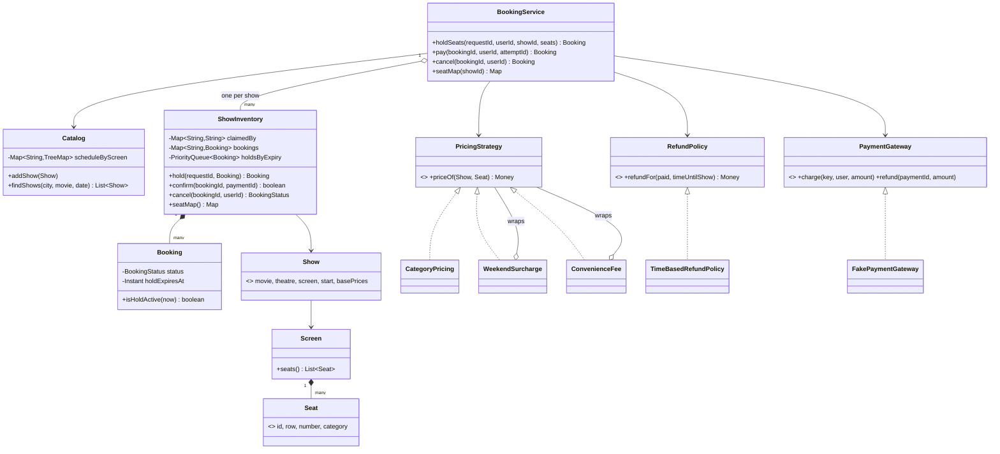
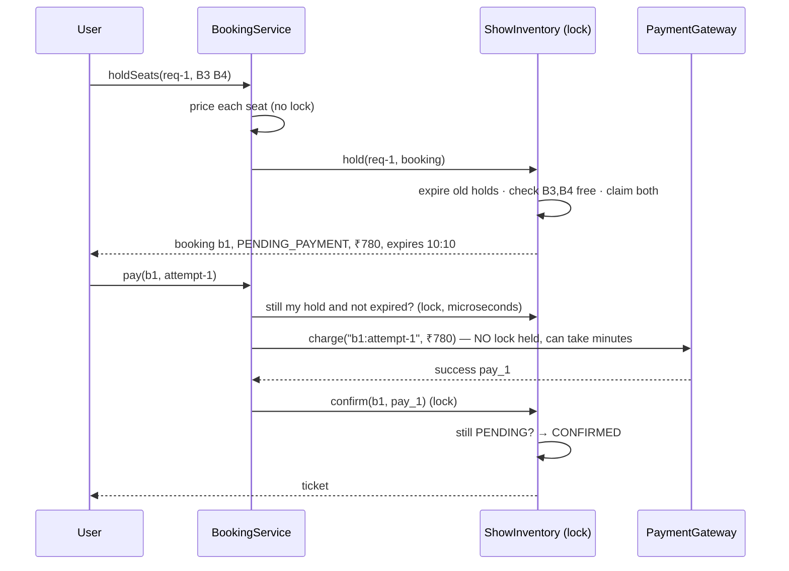

# LLD Q4 — Design BookMyShow (Java)

> **What the interviewer is really checking**
>
> 1. Can you separate the **catalogue** (movies, theatres, shows: read-heavy, rarely changes) from **seat inventory** (write-heavy, must never double-book)?
> 2. Do you know that a `Seat` is physical, but its *status* belongs to a *show*?
> 3. Can you make "hold 3 seats" **all-or-nothing** when 500 people click at once?
> 4. **The real test:** payment is slow and can fail, so you can't lock seats while paying. What happens when the hold expires *while* the user is paying?
>
> Most answers stop at step 3. Step 4 is where you stand out.

These notes use the same 7-step method as the Splitwise notes (Q3). Look for the **Think first** prompts and try each one yourself before reading on.

---

## Table of Contents

0. [What Was Missing From the Previous Version](#0-what-was-missing-from-the-previous-version)
1. [The Method (recap)](#1-the-method-recap)
2. [Step 1: Clarify and Scope](#2-step-1-clarify-and-scope)
3. [Step 2: Find the Core Idea](#3-step-2-find-the-core-idea)
4. [Step 3: Entities and Who Owns What](#4-step-3-entities-and-who-owns-what)
5. [Step 4: What Varies → Patterns](#5-step-4-what-varies--patterns)
6. [Step 5: Data Structures and Algorithms](#6-step-5-data-structures-and-algorithms)
7. [Step 6: API, Diagrams, Flow](#7-step-6-api-diagrams-flow)
8. [Step 7: The Hard Part — Payment Races and Edge Cases](#8-step-7-the-hard-part--payment-races-and-edge-cases)
9. [Decision Log](#9-decision-log)
10. [The Code](#10-the-code)
11. [Walkthrough: A Saturday Show (real output)](#11-walkthrough-a-saturday-show-real-output)
12. [Testing](#12-testing)
13. [Scaling to Many Servers](#13-scaling-to-many-servers)
14. [Extensions](#14-extensions)
15. [Patterns That Transfer](#15-patterns-that-transfer)
16. [Interview Cheat Sheet](#16-interview-cheat-sheet)

---

## 0. What Was Missing From the Previous Version

The previous version got several things right, and they're kept here: all-or-nothing holds, one lock per show, an injectable clock, a repeated confirm being harmless, and the advice not to call payment under the lock. But it was really "seat locking for one show", not BookMyShow:

| # | Gap | Why it matters in an interview |
|---|---|---|
| 1 | No movies, theatres, screens or shows. One hard-coded list of seat ids. | Modelling the domain is half the question. |
| 2 | **Payment was only described, never designed.** No hold → pay → confirm flow, no late-payment handling. | This is the hardest and most-asked part. |
| 3 | Seat state stored as `Map<String, Integer>` where `0` means "free", *plus* a separate status on each hold. | Magic number, and two sources of truth that can disagree. |
| 4 | Expiry scanned **every hold ever made** on every call, and old holds were never removed. | It gets slower forever: O(all holds) per request. |
| 5 | Creating a hold wasn't idempotent (listed as an exercise). | A double-tap or retry holds seats twice. |
| 6 | No cancellation of a *paid* booking, and no refund rules. | A standard follow-up question. |
| 7 | No prices, seat categories or weekend pricing. | This is where Strategy/Decorator naturally appears. |
| 8 | No screen scheduling (two shows overlapping on one screen). | A classic interval-overlap check. |
| 9 | Error messages like `"seat"` and `"request"`; a duplicate seat reported as "seat unavailable". | The UI can't tell the user which seat was taken. |
| 10 | Dense one-line code (`for (…) if (… \|\| … \|\| …) throw`), fully-qualified `java.util.List` in `Main`. | Hard to read, and hard to talk through at a whiteboard. |

Everything below fixes these. The code has been compiled and run: 23 checks and 6 JUnit tests pass, including races with 50 threads.

---

## 1. The Method (recap)

| Step | Ask yourself | For BookMyShow |
|---|---|---|
| 1. Clarify | What must it do? What's out? | Browse → pick seats → hold → pay → ticket; cancel |
| 2. Core idea | What's the one fact? What must always be true? | "Seat S of show X is claimed by booking B"; at most one live claim per seat |
| 3. Entities | Who owns which state? | Catalogue (static) vs `ShowInventory` (hot, locked) |
| 4. What varies | Which rules have versions? | Pricing, refund policy, payment gateway |
| 5. Data structures | What must be fast? | Seat → booking map, expiry heap, per-screen schedule `TreeMap` |
| 6. API & diagrams | What does a caller call? | `holdSeats`, `pay`, `cancel`, `seatMap` |
| 7. Edge cases | Retries, races, undo, slow external calls? | **Payment races** (§8) |

---

## 2. Step 1: Clarify and Scope

**Think first:** list five questions you'd ask before designing this.

| # | Question | Why it matters | Assumption |
|---|---|---|---|
| 1 | What's the user flow? | Defines the API | City → movie → show → seat map → pick seats → pay → ticket |
| 2 | Do we hold seats while the user pays? For how long? | The core mechanism | Yes, **10 minutes** |
| 3 | Payment: our own, or an external gateway? | Slow, unreliable call | External gateway (Razorpay-like) that supports idempotency keys |
| 4 | Seat categories and pricing rules? | Strategy / Decorator | Regular / Premium / Recliner; +20% on weekends; ₹30 fee per ticket |
| 5 | Can users cancel? Refunds? | State machine + policy | Yes: 100% if 24h+ before, 50% if 2–24h, 0 after that |
| 6 | Max seats per booking? | Stops one user grabbing a whole row | 10 |
| 7 | Scale? | Locking strategy | Single server first; §13 covers many servers and flash sales |

### Requirements

| # | Functional |
|---|---|
| F1 | Theatres have screens; screens have a fixed seat layout with categories. |
| F2 | Admins add shows; **a screen can't run two shows at the same time** (including cleaning time). |
| F3 | Users find shows by city, movie and date. |
| F4 | Users see a seat map: AVAILABLE / HELD / BOOKED. |
| F5 | Users **hold** up to 10 seats, all-or-nothing, for 10 minutes. |
| F6 | Users **pay**. A decline keeps the hold so they can try another card. Success → CONFIRMED. |
| F7 | Unpaid holds expire and the seats return to the pool. |
| F8 | Users cancel a hold (free) or a confirmed booking (refund per policy). |

| # | Non-functional | How |
|---|---|---|
| N1 | **Never double-book a seat** | All seat changes for a show go through one lock (§6.1) |
| N2 | **Never lose money** | A charge that can't get seats is always refunded (§8) |
| N3 | **Safe under retries and double clicks** | Idempotency keys for holds and payment attempts |
| N4 | **Other users aren't blocked by a slow payment** | The gateway is called outside the lock |
| N5 | **Pricing and refund rules can change** | Strategy interfaces |

**Out of scope:** search ranking, reviews, food and beverages, offers/coupons (see §14), notifications, authentication.

---

## 3. Step 2: Find the Core Idea

**Think first:** forget classes. When Aman "has" seat B3 for the 6 pm show, what exactly is the fact being recorded?

### The fact: "seat S of show X is claimed by booking B"

```
(show sh1, seat B3) → booking b1
```

Everything else is derived from this fact plus the booking's status:

| What the user sees | Derived from |
|---|---|
| B3 is AVAILABLE | No booking claims it |
| B3 is HELD (grey, "someone's paying") | Claimed by a booking in PENDING_PAYMENT |
| B3 is BOOKED | Claimed by a booking in CONFIRMED |

So seat status is **never stored separately**. The previous version stored it twice (a seat map *and* a hold status), which is how the two end up disagreeing.

### The invariant

> **A seat in a show is claimed by at most one booking that is PENDING_PAYMENT or CONFIRMED.**

That's the one rule that must never break. Every design decision below exists to protect it.

### Why a "hold" exists at all

**Think first:** why not just book the seat when the user pays?

Because between "user picks B3" and "payment succeeds", 30 seconds to several minutes pass. You have two bad options:

1. **Don't reserve.** Two users pay for B3, and one gets refunded after already paying. Terrible experience.
2. **Lock B3 during payment.** Then a slow bank blocks everyone else trying to book that show.

The answer is a **two-phase reservation**:

```
Phase 1 (fast, locked):     claim the seats for 10 minutes          → a HOLD
Phase 2 (slow, unlocked):   charge the card at the payment gateway
Phase 3 (fast, locked):     is my hold still valid? → CONFIRMED
                            no?                     → refund the charge
```

The hold is a **lease**: a claim with an expiry time. It's the same idea as a hotel holding a room until 6 pm, or a lock with a TTL in Redis.

> **How to spot this in other problems:** whenever a slow, unreliable external step (payment, a third-party API, a human approval) sits between "decide" and "commit", you need reserve → external step → commit/compensate. It shows up in ride booking, flash sales, hotel and flight booking, and inventory checkout.

---

## 4. Step 3: Entities and Who Owns What

**Think first:** is "seat B3 is booked" a property of the `Seat`?

No. B3 is booked for the 6 pm show and free for the 9 pm show. The **physical seat** and the **seat-for-a-show** are different things. Confusing them is the most common modelling mistake in this question.

### Two very different halves

| | Catalogue | Inventory |
|---|---|---|
| Contains | Movie, Theatre, Screen, Seat, Show | Which seats are claimed, and bookings |
| Changes | Rarely (admins add shows) | Constantly (every click) |
| Reads vs writes | 99% reads | Heavy writes, heavy contention |
| Consistency needed | Can be a bit stale (cache it) | **Strict**: no double booking |
| Classes | `Catalog`, records | `ShowInventory`, `Booking` |

Keeping them apart lets each half be scaled differently (§13): cache the catalogue everywhere, and keep inventory strictly consistent.

### Classes

| Class | Responsibility | Mutable? |
|---|---|---|
| `Movie`, `Theatre`, `Seat` | Facts about the world | No (records) |
| `Screen` | A fixed seat layout | No |
| `Show` | A movie on a screen at a time, with base prices | No (record) |
| `Catalog` | Stores shows; rejects overlapping shows; search | Yes (admin writes, locked) |
| `Booking` | One user's attempt: seats, amount, status, hold expiry | Status only |
| `ShowInventory` | **The aggregate.** Seat claims + bookings for *one show*, behind one lock | Yes |
| `PricingStrategy` (+ decorators) | Price of a seat for a show | No |
| `RefundPolicy` | Refund when a paid booking is cancelled | No |
| `PaymentGateway` | The outside world | (external) |
| `BookingService` | Entry point: price → hold → pay → confirm; cancel | No own business state |

### Why the lock is per show

A booking only ever touches seats of **one** show. Two different shows never share a seat. So each show is an independent unit of consistency (the **aggregate**), and we lock each one separately. A rush on the 6 pm show doesn't slow down the 9 pm show at all.

Same reasoning as Splitwise, where an expense never crosses groups, so we lock per group.

---

## 5. Step 4: What Varies → Patterns

**Think first:** which rules will the business want to change next month?

| What varies | Pattern | Classes |
|---|---|---|
| **Seat price** (category, weekend, fees, later: demand, offers) | **Strategy + Decorator** | `PricingStrategy`, `CategoryPricing`, `WeekendSurcharge`, `ConvenienceFee` |
| **Refund rules** | **Strategy** | `RefundPolicy`, `TimeBasedRefundPolicy` |
| **Payment provider** | **Interface at the boundary** (adapter) | `PaymentGateway`, `FakePaymentGateway` |
| **Booking lifecycle** | **State machine** | `BookingStatus` + checked transitions in `Booking` |
| Entry point | **Facade** | `BookingService` |
| Consistency boundary | **Aggregate** | `ShowInventory` |

### Why Decorator for pricing

Price rules **stack**: base price, then weekend +20%, then a ₹30 fee, and later perhaps a coupon or surge pricing. Each rule wraps the previous one:

```java
PricingStrategy pricing =
        new ConvenienceFee(
            new WeekendSurcharge(
                new CategoryPricing(), 20),
            Money.rupees(30));

// Premium seat on Saturday:  300 → +20% = 360 → +30 = ₹390
```

Adding "Tuesday 50% off" is one new class wrapped around the others, with no changes to existing code. Order matters: fee-then-surcharge would also put 20% on the fee, and wrapping makes that order visible.

### Why the booking is a state machine

```
PENDING_PAYMENT ──pay ok──────► CONFIRMED ──cancel──► CANCELLED
      │   │
      │   └──10 min pass──────► EXPIRED
      └──user backs out───────► CANCELLED
```

Each transition method (`confirm()`, `expire()`, `cancel()`) checks the current status first. So an EXPIRED booking can't be confirmed, and a CANCELLED one can't be cancelled again. Illegal moves throw instead of silently corrupting state.

---

## 6. Step 5: Data Structures and Algorithms

### 6.1 Seat claims and the all-or-nothing hold

```java
Map<String, String> claimedBy;   // seatId → bookingId. Absent = available.
```

**Think first:** Aman wants B3, B4 and B5. Riya wants B5 and B6 at the same moment. How do you make sure nobody ends up with *some* of their seats?

**Check everything first, then claim everything, all under the show's lock:**

```
synchronized hold(booking):
    for each seat: if claimed → add to "taken" list
    if "taken" is not empty → throw SeatsUnavailableException(taken)   ← nothing changed yet
    for each seat: claimedBy.put(seat, booking.id)
```

Because both loops run under the same lock, no other thread can claim B5 between the check and the claim. The exception carries **which** seats were taken, so the UI can grey out B5 and let Riya pick again.

A common wrong answer is to lock each seat separately. Aman locks B3, B4, then waits for B5. Riya locks B5, then waits for B4. That's a **deadlock**. You'd need to always lock seats in sorted order, and even then a failure halfway means undoing earlier locks. One lock per show avoids all of this, and it's fast: holding the lock takes microseconds, because the payment call happens outside it.

### 6.2 Expiring holds: a min-heap, checked lazily

**Think first:** how do you release holds after 10 minutes?

| Option | Problem |
|---|---|
| Scan all bookings on every request | O(all bookings ever), and it gets slower forever (the previous version did this) |
| A timer thread per hold | Thousands of timers; tricky to test |
| Background sweeper every few seconds | Seats stay grey a few seconds too long; still needs an index |
| **Min-heap by expiry time, checked at the start of every operation** ✅ | O(log n) per expired hold; no threads; exact to the tick; testable with a fake clock |

```
releaseExpiredHolds():
    while heap.top.expiresAt <= now:
        booking = heap.pop()
        if booking is still PENDING_PAYMENT: mark EXPIRED, free its seats
        (if it was confirmed or cancelled meanwhile, just drop it: "lazy deletion")
```

Every read and write calls this first, so nobody ever sees a stale hold. In production you'd *also* run a background sweeper for shows nobody is looking at. That doesn't affect correctness, it just keeps memory tidy.

### 6.3 No overlapping shows on a screen: an interval check with a `TreeMap`

**Think first:** a screen has shows at 12:00, 15:00 and 18:00. You add one at 20:00. Which existing shows do you need to check?

Only **two**: the show that starts just before it, and the one that starts just after it. If neither overlaps, nothing does, because shows on one screen are sorted and don't overlap each other.

```java
TreeMap<Instant, Show> schedule;               // per screen, keyed by start time

before = schedule.floorEntry(newStart);        // latest show starting at or before
after  = schedule.ceilingEntry(newStart);      // earliest show starting at or after

clash if  before.end + cleaning > newStart
      or  after.start < newEnd + cleaning
```

That's O(log n) instead of checking every show. It's the same `TreeMap` floor/ceiling trick as LOOK in the elevator notes, used for **intervals**, and it's a common interview pattern (meeting rooms, calendar booking).

### 6.4 Costs

| Operation | Cost |
|---|---|
| Hold k seats (k ≤ 10) | O(k) + O(log H) to add to the heap |
| Expire holds | O(log H) per expired hold |
| Seat map | O(seats in the screen), typically ~300 |
| Add a show | O(log shows on that screen) |
| Find shows | O(shows); an index by (city, date) makes it O(matches) |

---

## 7. Step 6: API, Diagrams, Flow

### 7.1 API

```java
// Admin
void catalog.addShow(Show show)                              // rejects overlaps

// User
List<Show>             catalog.findShows(city, movieId, date)
Map<String, SeatStatus> seatMap(showId)
Booking holdSeats(requestId, userId, showId, List<String> seatIds)   // → PENDING_PAYMENT, 10 min
Booking pay(bookingId, userId, attemptId)                           // → CONFIRMED (or refunded)
Booking cancel(bookingId, userId)                                   // hold: free; paid: refund per policy
Booking booking(bookingId, userId)
```

Two idempotency keys, for two different retries:

| Key | Created | Protects against |
|---|---|---|
| `requestId` | Once per "Book these seats" tap | A double tap or network retry creating two holds |
| `attemptId` | Once per "Pay" tap | A double click charging twice. A **new** attempt (another card after a decline) gets a new id, so it isn't blocked by the cached failure. |

### 7.2 Class diagram



### 7.3 Happy path



---

## 8. Step 7: The Hard Part — Payment Races and Edge Cases

### 8.1 The rule: never call the gateway while holding the lock

**Think first:** why not just put `gateway.charge()` inside the synchronized `confirm()`?

Because a card payment can take 30 seconds or more (OTP, a slow bank). For that whole time, nobody else could hold, pay, cancel, or even *view* seats for that show. One slow bank would freeze a blockbuster's opening night.

So `pay()` has three steps, and **only the first and last are locked**:

```
1. CHECK   (locked, µs)    my booking? still PENDING_PAYMENT? hold not expired?
2. CHARGE  (no lock, slow) gateway.charge(bookingId + ":" + attemptId, amount)
3. CONFIRM (locked, µs)    still PENDING_PAYMENT? → CONFIRMED. Otherwise → refund.
```

The price of this: **the world can change between steps 1 and 3.** Step 3 must check again, and must know what to do when the answer is no. That is the whole difficulty of this question.

### 8.2 The five races (all tested)

**Race 1 — card declined.**

```
10:00  hold B5,B6
10:02  pay (attempt-1) → gateway: declined
       → PaymentFailedException. The hold stays PENDING_PAYMENT: the seats are still yours.
10:03  pay (attempt-2, another card) → success → CONFIRMED
```

The new attempt needs a **new** idempotency key. Real gateways cache the *result* for a key, including failures, so reusing the key would return "declined" forever.

**Race 2 — the hold expires while the user is paying.** *(the one interviewers ask about)*

```
10:00  Kabir holds D1,D2 (expires 10:10). Starts paying.
10:05  Kabir's bank is slow...
10:10  hold expires → D1,D2 released
10:11  Neha holds D2,D3                 ← allowed: D2 was free
10:11  Kabir's payment finally succeeds
       confirm(b5) → booking is EXPIRED → false
       → refund Kabir ₹540 in full. D2 stays Neha's.
```

The rule: **never take seats back from someone who legitimately claimed them.** The late payer gets an automatic full refund. The alternatives are worse: taking the seat back from Neha breaks the invariant from her side, and keeping Kabir's money without giving a ticket is losing money.

A nicer option to mention: *if the seats are still free* at step 3, re-claim them and confirm anyway. It's a good UX improvement, but it's optional and the refund path is still needed for when they aren't.

**Race 3 — double click on "Pay".**

```
Both clicks send attemptId "attempt-1" → same gateway key → the gateway charges once and
returns the same paymentId to both → the first confirm() succeeds, the second sees
CONFIRMED with the SAME paymentId → returns true. One charge, one ticket.
```

**Race 4 — paying on the phone and the laptop at the same time.**

```
phone:  check ✓ ... charge (key b461:phone)  → pay_7
laptop: check ✓ ... charge (key b461:laptop) → pay_8     ← both passed step 1
phone:  confirm(pay_7) → CONFIRMED
laptop: confirm(pay_8) → already CONFIRMED with a DIFFERENT payment → false → refund pay_8
```

Real output: *charged 2, refunded 1, booking CONFIRMED*. The user briefly sees two debits and one reversal, but never pays twice in the end.

**Race 5 — the user cancels the hold while the payment is in flight.**

`confirm()` finds CANCELLED → false → full refund. The same code path as race 2, with no special case needed.

### 8.3 Why "step 3 fails → refund" is safe: compensation

Steps 1–3 aren't one atomic transaction. The gateway is another company's system, so it can't be. Instead of atomicity we use **compensation**: if a later step fails, undo the earlier step's effect (here: refund the charge). This is the **Saga** pattern in miniature, and it's worth naming in the interview.

What if the refund call itself fails? In production you write "refund owed" to a durable table *before* calling the gateway, and a retry job keeps trying until it succeeds (the **outbox** pattern). The in-memory version here calls it directly.

### 8.4 Every other edge case

| # | Case | Handling |
|---|---|---|
| 1 | Two users grab the same seat | One lock per show; exactly one wins (tested with 50 threads) |
| 2 | Overlapping groups (B3-B5 vs B5-B6) | Check-all-then-claim-all; nobody gets a partial set (tested with 400 random groups) |
| 3 | Double tap on "Book" | Same `requestId` → the same booking is returned |
| 4 | Seat listed twice / unknown seat / 11 seats | Rejected with a clear message *before* anything changes |
| 5 | Show has already started | Holding is rejected |
| 6 | Hold not paid in 10 minutes | Released exactly at expiry (min-heap, checked on every call) |
| 7 | Pay for an expired hold | "hold is EXPIRED - please pick seats again" |
| 8 | Cancel someone else's booking | "no booking b3". The same message as a missing booking, so other people's booking ids aren't revealed |
| 9 | Cancel a confirmed booking | Seats released immediately; refund per policy (100% / 50% / 0%) |
| 10 | Cancel twice | Second call rejected by the state machine |
| 11 | Two shows overlapping on one screen | Rejected in `Catalog.addShow` (interval check) |
| 12 | One user holds everything and never pays | Max 10 seats per hold; holds expire. Production adds a limit on active holds per user. |
| 13 | Refund call fails | Outbox + retry job (§8.3) |
| 14 | Server restarts mid-hold | In memory, holds are lost (seats free up, which is safe). With a database, holds survive (§13). |

---

## 9. Decision Log

| Decision | Alternatives | Why this one |
|---|---|---|
| Seat status derived from `claimedBy` + booking status | A stored status per seat | One source of truth; can't disagree |
| Lock per show | A lock per seat; one global lock | Per seat risks deadlock and partial holds; global serialises the whole country. A show is the natural boundary. |
| Hold (lease) with 10 min TTL | Lock during payment; no reservation | Locking blocks everyone; no reservation means double payments |
| Gateway called outside the lock | Inside the lock | A slow bank would freeze the show |
| Late payment → refund | Take the seat back; ignore it | Never break a legitimate claim; never keep money without a ticket |
| Min-heap + lazy expiry | Scan all holds; timer per hold; sweeper only | O(log n), exact, no threads, testable |
| `requestId` + per-attempt `attemptId` | One key per booking | A per-booking key would cache a decline forever |
| Decorators for pricing | One big `if` chain | Rules stack and change often |
| Catalogue separate from inventory | One `Show` class holding seat states | Very different read/write and consistency needs |
| `TreeMap` per screen for scheduling | Check every show | O(log n); a standard interval trick |
| `Clock` injected | `Instant.now()` | Tests advance time instantly |

---

# Part C — The Code

## 10. The Code

> Java 17+. All classes are in `package com.bookmyshow;`; package and import lines are left out below. Compiled and run; the tests in §12 pass.

### 10.0 Reading order

| # | Files | Read it for |
|---|---|---|
| 1 | `Money`, `SeatCategory`, `Seat`, `Screen`, `Theatre`, `Movie`, `Show` | The catalogue model |
| 2 | `Catalog` | The show-overlap check |
| 3 | `PricingStrategy` + 3 implementations | Strategy + Decorator |
| 4 | `BookingStatus`, `Booking`, `SeatStatus`, `SeatsUnavailableException` | The state machine |
| 5 | **`ShowInventory`** | **The aggregate: all-or-nothing hold, expiry, confirm** |
| 6 | `PaymentGateway`, `RefundPolicy` (+ implementations) | Boundaries |
| 7 | **`BookingService`** | **The payment flow** |
| 8 | `MutableClock` | Testing time |

### 10.1 Catalogue model

```java
// Money.java
/** Whole paise, never double. (See the Splitwise notes for why.) */
public record Money(long paise) implements Comparable<Money> {

    public static final Money ZERO = new Money(0);

    public static Money rupees(long rupees) { return new Money(Math.multiplyExact(rupees, 100)); }

    public Money plus(Money other) { return new Money(Math.addExact(paise, other.paise)); }
    public Money times(int n)      { return new Money(Math.multiplyExact(paise, n)); }

    /** percent(20) of ₹250 = ₹50. Rounded to the nearest paisa. */
    public Money percent(int pct)  { return new Money(Math.round(paise * pct / 100.0)); }

    public boolean isPositive() { return paise > 0; }

    @Override public int compareTo(Money o) { return Long.compare(paise, o.paise); }
    @Override public String toString() { return "₹%d.%02d".formatted(paise / 100, Math.abs(paise % 100)); }
}
```

```java
// SeatCategory.java
public enum SeatCategory { REGULAR, PREMIUM, RECLINER }
```

```java
// Seat.java
/** A physical seat in a screen. Never changes. Its STATUS for a show lives in ShowInventory. */
public record Seat(String id, char row, int number, SeatCategory category) {}
```

```java
// Screen.java
/** A hall with a fixed seat layout. */
public final class Screen {

    private final String id;
    private final String name;
    private final Map<String, Seat> seatsById;   // insertion order = layout order

    private Screen(String id, String name, List<Seat> seats) {
        this.id = id;
        this.name = name;
        Map<String, Seat> byId = new LinkedHashMap<>();
        for (Seat s : seats) byId.put(s.id(), s);
        this.seatsById = Collections.unmodifiableMap(byId);
    }

    public String id()          { return id; }
    public String name()        { return name; }
    public List<Seat> seats()   { return List.copyOf(seatsById.values()); }
    public Seat seat(String id) { return seatsById.get(id); }   // null if no such seat

    public static Builder builder(String id, String name) { return new Builder(id, name); }

    /** Screen.builder("s1", "Audi 1").row('A', 10, RECLINER).row('B', 12, PREMIUM).build() */
    public static final class Builder {
        private final String id, name;
        private final List<Seat> seats = new ArrayList<>();

        private Builder(String id, String name) { this.id = id; this.name = name; }

        public Builder row(char row, int seatCount, SeatCategory category) {
            for (int n = 1; n <= seatCount; n++) seats.add(new Seat("" + row + n, row, n, category));
            return this;
        }

        public Screen build() { return new Screen(id, name, seats); }
    }
}
```

```java
// Theatre.java
public record Theatre(String id, String name, String city, List<Screen> screens) {
    public Theatre { screens = List.copyOf(screens); }
}
```

```java
// Movie.java
public record Movie(String id, String title, Duration runtime, String language) {}
```

```java
// Show.java
/** One screening: a movie, on a screen, at a time, with a base price per seat category. */
public record Show(String id, Movie movie, Theatre theatre, Screen screen,
                   ZonedDateTime start, Map<SeatCategory, Money> basePrices) {

    public Show {
        basePrices = Map.copyOf(basePrices);
        for (Seat seat : screen.seats()) {
            if (!basePrices.containsKey(seat.category())) {
                throw new IllegalArgumentException("no price for " + seat.category());
            }
        }
    }

    public ZonedDateTime end() { return start.plus(movie.runtime()); }
}
```

### 10.2 `Catalog` — shows and the overlap rule

```java
// Catalog.java
/**
 * Movies, theatres and shows - the part users BROWSE. Read-heavy, rarely changes.
 * Kept separate from seat inventory, which is write-heavy and must be strictly consistent.
 */
public final class Catalog {

    /** Time to clean the hall between two shows on the same screen. */
    private static final Duration CLEANING_TIME = Duration.ofMinutes(15);

    private final Map<String, Show> showsById = new ConcurrentHashMap<>();
    private final Map<String, TreeMap<Instant, Show>> scheduleByScreen = new ConcurrentHashMap<>();

    /**
     * Rule: one screen can't run two shows at once (including cleaning time).
     * Each screen's shows are kept sorted by start time, so we only need to check the
     * show just before and the show just after the new one - O(log n).
     */
    public synchronized void addShow(Show show) {
        TreeMap<Instant, Show> schedule =
                scheduleByScreen.computeIfAbsent(show.screen().id(), id -> new TreeMap<>());

        Instant start = show.start().toInstant();
        Instant freeAgain = show.end().toInstant().plus(CLEANING_TIME);

        Map.Entry<Instant, Show> before = schedule.floorEntry(start);
        if (before != null && before.getValue().end().toInstant().plus(CLEANING_TIME).isAfter(start)) {
            throw new IllegalArgumentException("clashes with show " + before.getValue().id());
        }
        Map.Entry<Instant, Show> after = schedule.ceilingEntry(start);
        if (after != null && after.getKey().isBefore(freeAgain)) {
            throw new IllegalArgumentException("clashes with show " + after.getValue().id());
        }

        schedule.put(start, show);
        showsById.put(show.id(), show);
    }

    /** "Shows of this movie in this city on this day", earliest first. */
    public List<Show> findShows(String city, String movieId, LocalDate date) {
        List<Show> result = new ArrayList<>();
        for (Show s : showsById.values()) {
            if (s.theatre().city().equalsIgnoreCase(city)
                    && s.movie().id().equals(movieId)
                    && s.start().toLocalDate().equals(date)) {
                result.add(s);
            }
        }
        result.sort(Comparator.comparing(Show::start));
        return result;
    }

    public Show show(String showId) {
        Show s = showsById.get(showId);
        if (s == null) throw new IllegalArgumentException("no show " + showId);
        return s;
    }
}
```

### 10.3 Pricing — Strategy + Decorator

```java
// PricingStrategy.java
/** Strategy: what does this seat cost for this show? */
public interface PricingStrategy {
    Money priceOf(Show show, Seat seat);
}
```

```java
// CategoryPricing.java
/** The base price: whatever the show set for the seat's category. */
public final class CategoryPricing implements PricingStrategy {
    @Override
    public Money priceOf(Show show, Seat seat) {
        return show.basePrices().get(seat.category());
    }
}
```

```java
// WeekendSurcharge.java
/** Decorator: +N% on Saturday and Sunday shows, on top of whatever the wrapped strategy says. */
public final class WeekendSurcharge implements PricingStrategy {

    private final PricingStrategy inner;
    private final int percent;

    public WeekendSurcharge(PricingStrategy inner, int percent) {
        this.inner = inner;
        this.percent = percent;
    }

    @Override
    public Money priceOf(Show show, Seat seat) {
        Money price = inner.priceOf(show, seat);
        DayOfWeek day = show.start().getDayOfWeek();
        boolean weekend = day == DayOfWeek.SATURDAY || day == DayOfWeek.SUNDAY;
        return weekend ? price.plus(price.percent(percent)) : price;
    }
}
```

```java
// ConvenienceFee.java
/** Decorator: a flat fee per ticket. */
public final class ConvenienceFee implements PricingStrategy {

    private final PricingStrategy inner;
    private final Money feePerSeat;

    public ConvenienceFee(PricingStrategy inner, Money feePerSeat) {
        this.inner = inner;
        this.feePerSeat = feePerSeat;
    }

    @Override
    public Money priceOf(Show show, Seat seat) {
        return inner.priceOf(show, seat).plus(feePerSeat);
    }
}
```

### 10.4 Booking — the state machine

```java
// BookingStatus.java
/**
 *   PENDING_PAYMENT ──pay ok──► CONFIRMED ──cancel──► CANCELLED
 *        │  │
 *        │  └──hold runs out──► EXPIRED
 *        └──user backs out────► CANCELLED
 *
 * Seats are claimed only while PENDING_PAYMENT or CONFIRMED.
 */
public enum BookingStatus {
    PENDING_PAYMENT, CONFIRMED, EXPIRED, CANCELLED;

    public boolean claimsSeats() { return this == PENDING_PAYMENT || this == CONFIRMED; }
}
```

```java
// SeatStatus.java
/** What the seat map shows. Derived from the booking that claims the seat - never stored. */
public enum SeatStatus { AVAILABLE, HELD, BOOKED }
```

```java
// SeatsUnavailableException.java
/** Tells the UI WHICH seats were taken, so it can grey them out and let the user pick again. */
public final class SeatsUnavailableException extends RuntimeException {

    private final List<String> seatIds;

    public SeatsUnavailableException(List<String> seatIds) {
        super("seats no longer available: " + seatIds);
        this.seatIds = List.copyOf(seatIds);
    }

    public List<String> seatIds() { return seatIds; }
}
```

```java
// Booking.java
/**
 * One user's attempt to buy seats for one show.
 * Starts as a HOLD (PENDING_PAYMENT, with an expiry) and becomes a ticket when paid.
 *
 * Thread-safety: status changes happen only inside ShowInventory, under that show's lock.
 * The changing fields are volatile so readers always see the latest value.
 */
public final class Booking {

    private final String id;
    private final String userId;
    private final String showId;
    private final List<String> seatIds;
    private final Money amount;
    private final Instant holdExpiresAt;

    private volatile BookingStatus status = BookingStatus.PENDING_PAYMENT;
    private volatile String paymentId;
    private volatile Money refunded = Money.ZERO;

    public Booking(String id, String userId, String showId, List<String> seatIds,
                   Money amount, Instant holdExpiresAt) {
        this.id = id;
        this.userId = userId;
        this.showId = showId;
        this.seatIds = List.copyOf(seatIds);
        this.amount = amount;
        this.holdExpiresAt = holdExpiresAt;
    }

    // ---- state transitions (called by ShowInventory only) --------------------

    void confirm(String paymentId) {
        requireStatus(BookingStatus.PENDING_PAYMENT);
        this.paymentId = paymentId;
        this.status = BookingStatus.CONFIRMED;
    }

    void expire() {
        requireStatus(BookingStatus.PENDING_PAYMENT);
        this.status = BookingStatus.EXPIRED;
    }

    void cancel() {
        if (!status.claimsSeats()) throw new IllegalStateException("booking " + id + " is already " + status);
        this.status = BookingStatus.CANCELLED;
    }

    void recordRefund(Money amount) {
        this.refunded = refunded.plus(amount);
    }

    private void requireStatus(BookingStatus expected) {
        if (status != expected) {
            throw new IllegalStateException("booking " + id + " is " + status + ", expected " + expected);
        }
    }

    // ---- queries --------------------------------------------------------------

    public boolean isHoldActive(Instant now) {
        return status == BookingStatus.PENDING_PAYMENT && now.isBefore(holdExpiresAt);
    }

    public String id()              { return id; }
    public String userId()          { return userId; }
    public String showId()          { return showId; }
    public List<String> seatIds()   { return seatIds; }
    public Money amount()           { return amount; }
    public Instant holdExpiresAt()  { return holdExpiresAt; }
    public BookingStatus status()   { return status; }
    public String paymentId()       { return paymentId; }
    public Money refunded()         { return refunded; }

    @Override public String toString() {
        return "Booking[%s %s seats=%s amount=%s refunded=%s]".formatted(id, status, seatIds, amount, refunded);
    }
}
```

### 10.5 `ShowInventory` — the aggregate

The most important class. Read `hold()` next to §6.1 and `releaseExpiredHolds()` next to §6.2.

```java
// ShowInventory.java
/**
 * THE AGGREGATE: all seats and bookings of ONE show, behind ONE lock.
 *
 * Invariant: a seat is claimed by at most one booking that is PENDING_PAYMENT or CONFIRMED.
 * Every public method is synchronized, so "check these 3 seats are free, then claim all 3"
 * can never interleave with another user doing the same.
 */
final class ShowInventory {

    static final int MAX_SEATS_PER_BOOKING = 10;

    private final Show show;
    private final Clock clock;

    /** seatId -> id of the booking that holds or owns it. Absent = available. */
    private final Map<String, String> claimedBy = new HashMap<>();
    private final Map<String, Booking> bookings = new HashMap<>();
    private final Map<String, Booking> bookingByRequestId = new HashMap<>();   // idempotency

    /** Holds ordered by expiry, so expired ones are found in O(log n) - no full scan. */
    private final PriorityQueue<Booking> holdsByExpiry =
            new PriorityQueue<>(Comparator.comparing(Booking::holdExpiresAt));

    ShowInventory(Show show, Clock clock) {
        this.show = show;
        this.clock = clock;
    }

    // =========================================================================
    //  HOLD
    // =========================================================================

    /** All-or-nothing: either every requested seat is claimed for this booking, or none is. */
    synchronized Booking hold(String requestId, Booking candidate) {
        Booking earlier = bookingByRequestId.get(requestId);
        if (earlier != null) return earlier;                  // retry of the same click

        validateRequest(candidate.seatIds());
        releaseExpiredHolds();

        // 1. CHECK every seat first ...
        List<String> taken = new ArrayList<>();
        for (String seatId : candidate.seatIds()) {
            if (claimedBy.containsKey(seatId)) taken.add(seatId);
        }
        if (!taken.isEmpty()) throw new SeatsUnavailableException(taken);

        // 2. ... then CLAIM all of them. Nothing can run in between: we hold the lock.
        for (String seatId : candidate.seatIds()) claimedBy.put(seatId, candidate.id());
        bookings.put(candidate.id(), candidate);
        bookingByRequestId.put(requestId, candidate);
        holdsByExpiry.add(candidate);
        return candidate;
    }

    private void validateRequest(List<String> seatIds) {
        if (seatIds.isEmpty()) throw new IllegalArgumentException("pick at least one seat");
        if (seatIds.size() > MAX_SEATS_PER_BOOKING) {
            throw new IllegalArgumentException("at most " + MAX_SEATS_PER_BOOKING + " seats per booking");
        }
        Set<String> seen = new HashSet<>();
        for (String seatId : seatIds) {
            if (show.screen().seat(seatId) == null) throw new IllegalArgumentException("no seat " + seatId);
            if (!seen.add(seatId)) throw new IllegalArgumentException("seat " + seatId + " listed twice");
        }
        if (!clock.instant().isBefore(show.start().toInstant())) {
            throw new IllegalStateException("show has already started");
        }
    }

    // =========================================================================
    //  CONFIRM / CANCEL
    // =========================================================================

    /**
     * Called AFTER a successful payment. Returns false if the hold is no longer valid
     * (it expired or was cancelled while the user was paying) - the caller must refund.
     */
    synchronized boolean confirm(String bookingId, String paymentId) {
        releaseExpiredHolds();
        Booking b = requireBooking(bookingId);

        if (b.status() == BookingStatus.CONFIRMED) {
            return paymentId.equals(b.paymentId());           // same payment again = fine
        }
        if (b.status() != BookingStatus.PENDING_PAYMENT) return false;

        b.confirm(paymentId);
        return true;
    }

    /** Cancels a hold or a confirmed booking and frees its seats. Returns the status BEFORE cancelling. */
    synchronized BookingStatus cancel(String bookingId, String userId) {
        releaseExpiredHolds();
        Booking b = bookingOwnedBy(bookingId, userId);
        BookingStatus before = b.status();
        b.cancel();
        freeSeatsOf(b);
        return before;
    }

    synchronized void recordRefund(String bookingId, Money amount) {
        requireBooking(bookingId).recordRefund(amount);
    }

    // =========================================================================
    //  EXPIRY - lazy: done at the start of every operation, no background thread needed
    // =========================================================================

    private void releaseExpiredHolds() {
        Instant now = clock.instant();
        while (!holdsByExpiry.isEmpty() && !now.isBefore(holdsByExpiry.peek().holdExpiresAt())) {
            Booking b = holdsByExpiry.poll();
            if (b.status() == BookingStatus.PENDING_PAYMENT) {  // confirmed/cancelled ones: just drop
                b.expire();
                freeSeatsOf(b);
            }
        }
    }

    private void freeSeatsOf(Booking b) {
        for (String seatId : b.seatIds()) claimedBy.remove(seatId, b.id());
    }

    // =========================================================================
    //  READS
    // =========================================================================

    /** The seat map the user sees, in layout order. */
    synchronized Map<String, SeatStatus> seatMap() {
        releaseExpiredHolds();
        Map<String, SeatStatus> map = new LinkedHashMap<>();
        for (Seat seat : show.screen().seats()) {
            String bookingId = claimedBy.get(seat.id());
            if (bookingId == null) {
                map.put(seat.id(), SeatStatus.AVAILABLE);
            } else {
                boolean paid = bookings.get(bookingId).status() == BookingStatus.CONFIRMED;
                map.put(seat.id(), paid ? SeatStatus.BOOKED : SeatStatus.HELD);
            }
        }
        return map;
    }

    synchronized Booking bookingOwnedBy(String bookingId, String userId) {
        releaseExpiredHolds();
        Booking b = bookings.get(bookingId);
        // Same message whether it doesn't exist or isn't yours: don't leak other people's bookings.
        if (b == null || !b.userId().equals(userId)) throw new IllegalArgumentException("no booking " + bookingId);
        return b;
    }

    private Booking requireBooking(String bookingId) {
        Booking b = bookings.get(bookingId);
        if (b == null) throw new IllegalArgumentException("no booking " + bookingId);
        return b;
    }

    Show show() { return show; }
}
```

### 10.6 Payment and refund boundaries

```java
// PaymentGateway.java
/**
 * The outside world (Razorpay, Stripe...). Slow and unreliable - so it is NEVER called
 * while holding a show's lock. Both calls take an idempotency key, which real gateways support.
 */
public interface PaymentGateway {

    record Result(boolean success, String paymentId, String failureReason) {}

    Result charge(String idempotencyKey, String userId, Money amount);

    void refund(String paymentId, Money amount);
}
```

```java
// FakePaymentGateway.java
/** In-memory gateway for the demo and tests. Can be told to fail, or to be slow. */
public final class FakePaymentGateway implements PaymentGateway {

    private final Map<String, Result> resultByKey = new ConcurrentHashMap<>();
    private final AtomicInteger nextId = new AtomicInteger(1);
    private final List<String> refunds = new ArrayList<>();

    private volatile boolean failNext = false;
    private volatile Runnable whilePaying = () -> {};   // e.g. advance the clock to simulate a slow payment

    public void failNextCharge()                 { failNext = true; }
    public void runWhilePaying(Runnable action)  { whilePaying = action; }

    @Override
    public Result charge(String idempotencyKey, String userId, Money amount) {
        whilePaying.run();
        return resultByKey.computeIfAbsent(idempotencyKey, key -> {
            if (failNext) {
                failNext = false;
                return new Result(false, null, "card declined");
            }
            return new Result(true, "pay_" + nextId.getAndIncrement(), null);
        });
    }

    @Override
    public synchronized void refund(String paymentId, Money amount) {
        refunds.add(paymentId + " " + amount);
    }

    public synchronized List<String> refunds() { return List.copyOf(refunds); }

    public long successfulCharges() { return resultByKey.values().stream().filter(Result::success).count(); }
}
```

```java
// PaymentFailedException.java
/** The seats stay held - the user can try another card until the hold expires. */
public final class PaymentFailedException extends RuntimeException {
    public PaymentFailedException(String reason) { super("payment failed: " + reason); }
}
```

```java
// RefundPolicy.java
/** Strategy: how much money comes back when a CONFIRMED booking is cancelled. */
public interface RefundPolicy {
    Money refundFor(Money paid, Duration timeUntilShow);
}
```

```java
// TimeBasedRefundPolicy.java
/** 24h+ before the show: 100%.  2-24h before: 50%.  Under 2h: nothing. */
public final class TimeBasedRefundPolicy implements RefundPolicy {
    @Override
    public Money refundFor(Money paid, Duration timeUntilShow) {
        if (timeUntilShow.compareTo(Duration.ofHours(24)) >= 0) return paid;
        if (timeUntilShow.compareTo(Duration.ofHours(2))  >= 0) return paid.percent(50);
        return Money.ZERO;
    }
}
```

### 10.7 `BookingService` — the flow

Read `pay()` next to §8.1: check (locked) → charge (unlocked) → confirm (locked) → refund if confirm fails.

```java
// BookingService.java
/**
 * The entry point (Facade). Orchestrates:  price -> hold seats -> pay -> confirm,  and cancellations.
 *
 * The rule that shapes this class: the slow, unreliable payment call happens OUTSIDE the show lock.
 * So "pay" is three steps - check (locked), charge (unlocked), confirm (locked) - and the
 * confirm step must handle "the hold expired while you were paying".
 */
public final class BookingService {

    public static final Duration HOLD_TIME = Duration.ofMinutes(10);

    private final Catalog catalog;
    private final PricingStrategy pricing;
    private final PaymentGateway payments;
    private final RefundPolicy refundPolicy;
    private final Clock clock;

    private final Map<String, ShowInventory> inventoryByShow = new ConcurrentHashMap<>();
    private final Map<String, String> showIdByBooking = new ConcurrentHashMap<>();
    private final AtomicLong nextId = new AtomicLong(1);

    public BookingService(Catalog catalog, PricingStrategy pricing, PaymentGateway payments,
                          RefundPolicy refundPolicy, Clock clock) {
        this.catalog = catalog;
        this.pricing = pricing;
        this.payments = payments;
        this.refundPolicy = refundPolicy;
        this.clock = clock;
    }

    // =========================================================================
    //  1. BROWSE
    // =========================================================================

    public Map<String, SeatStatus> seatMap(String showId) {
        return inventory(showId).seatMap();
    }

    // =========================================================================
    //  2. HOLD - "I want these seats" (they're mine for 10 minutes)
    // =========================================================================

    public Booking holdSeats(String requestId, String userId, String showId, List<String> seatIds) {
        ShowInventory inventory = inventory(showId);
        Show show = inventory.show();

        Money total = Money.ZERO;                              // price it before taking the lock
        for (String seatId : seatIds) {
            Seat seat = show.screen().seat(seatId);
            if (seat == null) throw new IllegalArgumentException("no seat " + seatId);
            total = total.plus(pricing.priceOf(show, seat));
        }

        Booking candidate = new Booking("b" + nextId.getAndIncrement(), userId, showId, seatIds,
                                        total, clock.instant().plus(HOLD_TIME));
        Booking booking = inventory.hold(requestId, candidate);   // may return an earlier booking
        showIdByBooking.put(booking.id(), showId);
        return booking;
    }

    // =========================================================================
    //  3. PAY - check (locked) -> charge (NOT locked) -> confirm (locked)
    // =========================================================================

    /**
     * attemptId comes from the client, one per press of "Pay": a double click or network retry
     * reuses it (charged once); trying another card after a decline uses a new one.
     */
    public Booking pay(String bookingId, String userId, String attemptId) {
        ShowInventory inventory = inventoryOf(bookingId);
        Booking booking = inventory.bookingOwnedBy(bookingId, userId);

        if (booking.status() == BookingStatus.CONFIRMED) return booking;         // already paid
        if (!booking.isHoldActive(clock.instant())) {
            throw new IllegalStateException("hold is " + booking.status() + " - please pick seats again");
        }

        // The slow part. Other users keep booking this show meanwhile - we hold no lock.
        String key = bookingId + ":" + attemptId;
        PaymentGateway.Result result = payments.charge(key, userId, booking.amount());
        if (!result.success()) throw new PaymentFailedException(result.failureReason());

        if (inventory.confirm(bookingId, result.paymentId())) return booking;

        // We took the money but can't give the seats:
        //  - the hold ran out while paying (the seats may be someone else's now), or
        //  - a different attempt already confirmed this booking (duplicate charge).
        // Never take seats back from another user. Refund this charge in full.
        payments.refund(result.paymentId(), booking.amount());
        if (booking.status() != BookingStatus.CONFIRMED) inventory.recordRefund(bookingId, booking.amount());
        return booking;
    }

    // =========================================================================
    //  4. CANCEL - a hold (free) or a confirmed booking (refund per policy)
    // =========================================================================

    public Booking cancel(String bookingId, String userId) {
        ShowInventory inventory = inventoryOf(bookingId);
        BookingStatus before = inventory.cancel(bookingId, userId);   // seats are free from here on
        Booking booking = inventory.bookingOwnedBy(bookingId, userId);

        if (before == BookingStatus.CONFIRMED) {
            Instant showStart = inventory.show().start().toInstant();
            Money refund = refundPolicy.refundFor(booking.amount(), Duration.between(clock.instant(), showStart));
            if (refund.isPositive()) {
                payments.refund(booking.paymentId(), refund);         // outside the lock again
                inventory.recordRefund(bookingId, refund);
            }
        }
        return booking;
    }

    public Booking booking(String bookingId, String userId) {
        return inventoryOf(bookingId).bookingOwnedBy(bookingId, userId);
    }

    // =========================================================================

    private ShowInventory inventory(String showId) {
        return inventoryByShow.computeIfAbsent(showId, id -> new ShowInventory(catalog.show(id), clock));
    }

    private ShowInventory inventoryOf(String bookingId) {
        String showId = showIdByBooking.get(bookingId);
        if (showId == null) throw new IllegalArgumentException("no booking " + bookingId);
        return inventory(showId);
    }
}
```

### 10.8 `MutableClock` — testing time without sleeping

```java
// MutableClock.java
/** A clock tests can move forward - so "wait 10 minutes" takes zero real time. */
public final class MutableClock extends Clock {

    private volatile Instant now;
    private final ZoneId zone;

    public MutableClock(Instant start, ZoneId zone) { this.now = start; this.zone = zone; }

    public void advance(Duration d) { now = now.plus(d); }

    @Override public Instant instant()               { return now; }
    @Override public ZoneId getZone()                { return zone; }
    @Override public Clock withZone(ZoneId z)        { return new MutableClock(now, z); }
}
```

Wiring it together:

```java
PricingStrategy pricing = new ConvenienceFee(new WeekendSurcharge(new CategoryPricing(), 20), Money.rupees(30));
BookingService app = new BookingService(catalog, pricing, new FakePaymentGateway(),
                                        new TimeBasedRefundPolicy(), Clock.system(ZoneId.of("Asia/Kolkata")));
```

---

## 11. Walkthrough: A Saturday Show (real output)

Every number below comes from running the code.

**Setup.** *Interstellar* (169 min) at PVR VR Mall, Surat. Audi 1 has 32 seats: row A = 4 recliners (₹500), rows B–C = 12 premium (₹300), rows D–E = 16 regular (₹200). The show is **Saturday 3 Oct 2026, 18:00**. Pricing is category → weekend +20% → ₹30 fee. The clock starts at 10:00 that morning.

### 11.1 Scheduling and prices

```
Add a 21:00 show on Audi 1   → rejected: "clashes with show sh1"
                               (18:00 + 169 min = 20:49, + 15 min cleaning = 21:04)
Add a 21:05 show             → accepted
findShows("surat", Interstellar, 3 Oct) → [sh1 @ 18:00, sh3 @ 21:05]

Premium seat B3:   300 → +20% = 360 → +30 = ₹390
Recliner A1:       500 → +20% = 600 → +30 = ₹630
```

### 11.2 Holding and paying

| Time | Who | Action | Result |
|---|---|---|---|
| 10:00 | Aman | hold B3, B4 | b1 PENDING_PAYMENT, **₹780**, expires 10:10 |
| 10:00 | Riya | hold B4, B5 | ✗ `seats no longer available: [B4]`. **B5 stays free** (nothing partly held). |
| 10:00 | Riya | hold B5, B6 | b3 PENDING_PAYMENT |
| 10:00 | Aman | hold B3, B4 again, same `requestId` (retry) | the **same** booking b1 is returned |
| 10:00 | Aman | pay (attempt-1) twice (double click) | CONFIRMED, **charged once** |
| 10:00 | Riya | pay (attempt-1) | ✗ `payment failed: card declined`. Still PENDING_PAYMENT. |
| 10:00 | Riya | pay (attempt-2) | CONFIRMED |
|  | | seat map | 28 AVAILABLE, 4 BOOKED |

### 11.3 The late payment (race 2 from §8.2)

```
10:00  Kabir holds D1, D2 (₹540: 2 × (200 + 20% + 30)), expires 10:10. Starts paying.
       ... the payment takes 11 minutes ...
10:11  Neha holds D2, D3            ← allowed, Kabir's hold expired at 10:10
10:11  Kabir's payment succeeds → confirm fails → refund

Kabir: Booking[b5 EXPIRED  seats=[D1, D2] amount=₹540.00 refunded=₹540.00]
Neha:  Booking[b6 PENDING_PAYMENT seats=[D2, D3] amount=₹540.00]
Gateway refunds: [pay_3 ₹540.00]
Kabir tries to pay again → "hold is EXPIRED - please pick seats again"
```

### 11.4 Expiry and cancellation

```
10:11  Dev holds E1. Doesn't pay.
10:21  Seat map: E1 AVAILABLE, Dev's booking EXPIRED          (released exactly at 10 min)

10:21  Aman cancels his confirmed booking (7h39m before the show → 50% band)
       Booking[b1 CANCELLED seats=[B3, B4] amount=₹780.00 refunded=₹390.00]
       B3 is AVAILABLE again.
       Aman tries to cancel Riya's booking → "no booking b3"
```

### 11.5 Concurrency

| Test | Result |
|---|---|
| 50 threads race for seat A1 | exactly **1** wins |
| 400 threads hold random overlapping groups of 1–4 seats | no seat claimed twice; every winner got **all** its seats (31 seats held + A1) |
| 8 browser tabs pay for the same booking | CONFIRMED, charged 1, refunded 0 (the others saw "already confirmed" in step 1) |
| Phone and laptop both get past step 1, then both charge | CONFIRMED, **charged 2, refunded 1** |

---

## 12. Testing

| What | How |
|---|---|
| All-or-nothing hold | Hold B3; then try B2, B3, B4 → fails with `[B3]`, and B2 and B4 are still free |
| Expiry | Fake clock +10 min → seats AVAILABLE, booking EXPIRED |
| **Late payment** | The gateway's "while paying" hook moves the clock forward and lets someone else take the seat → the original payer is refunded and the seat stays with the other user |
| Decline then retry | `failNextCharge()`, then a new attempt id |
| Double click | Same attempt id twice → one charge |
| Two devices | A `CyclicBarrier` in the gateway forces both through step 1 before either confirms |
| Races | 50 threads on one seat; 400 threads on random overlapping groups |
| Refund policy | Cancel 24h before (100%), 7h before (50%) |
| Scheduling | An overlapping show is rejected; one starting at the end + cleaning time is accepted |
| Validation | Duplicate seat, unknown seat, 11 seats, show already started |

The key testing technique: **inject time (`Clock`) and the outside world (`PaymentGateway`)**, then control both from the test. "Wait 11 minutes while someone else books" runs in microseconds and gives the same result every time.

Example tests (JUnit 5, run against the code above):

```java
// BookingTest.java
class BookingTest {

    private static final ZoneId IST = ZoneId.of("Asia/Kolkata");
    private static final ZonedDateTime SHOW_TIME = ZonedDateTime.of(2026, 10, 3, 18, 0, 0, 0, IST);

    // Test clock starts at 10:00 on the day of the show.
    private final MutableClock clock = new MutableClock(SHOW_TIME.withHour(10).toInstant(), IST);
    private final Screen screen = Screen.builder("s1", "Audi 1").row('A', 4, RECLINER).row('B', 6, PREMIUM).build();
    private final Theatre theatre = new Theatre("t1", "PVR", "Surat", List.of(screen));
    private final Movie movie = new Movie("m1", "Interstellar", Duration.ofMinutes(169), "English");
    private final Map<SeatCategory, Money> prices = Map.of(RECLINER, Money.rupees(500), PREMIUM, Money.rupees(300));
    private final Catalog catalog = new Catalog();
    private final FakePaymentGateway gateway = new FakePaymentGateway();
    private final BookingService app;

    BookingTest() {
        catalog.addShow(new Show("show1", movie, theatre, screen, SHOW_TIME, prices));
        app = new BookingService(catalog, new CategoryPricing(), gateway, new TimeBasedRefundPolicy(), clock);
    }

    @Test
    void holdIsAllOrNothing() {
        app.holdSeats("r1", "aman", "show1", List.of("B3"));

        SeatsUnavailableException e = assertThrows(SeatsUnavailableException.class,
                () -> app.holdSeats("r2", "riya", "show1", List.of("B2", "B3", "B4")));

        assertEquals(List.of("B3"), e.seatIds());                              // tells the UI which seat
        assertEquals(SeatStatus.AVAILABLE, app.seatMap("show1").get("B2"));   // nothing partly held
        assertEquals(SeatStatus.AVAILABLE, app.seatMap("show1").get("B4"));
    }

    @Test
    void unpaidHoldIsReleasedAfterTenMinutes() {
        Booking hold = app.holdSeats("r1", "aman", "show1", List.of("A1"));
        clock.advance(Duration.ofMinutes(10));

        assertEquals(SeatStatus.AVAILABLE, app.seatMap("show1").get("A1"));
        assertEquals(BookingStatus.EXPIRED, hold.status());
    }

    @Test
    void latePaymentIsRefundedAndSeatsAreNotStolen() {
        Booking slow = app.holdSeats("r1", "kabir", "show1", List.of("A1"));
        gateway.runWhilePaying(() -> {                       // payment takes 11 minutes...
            clock.advance(Duration.ofMinutes(11));
            app.holdSeats("r2", "neha", "show1", List.of("A1"));   // ...and Neha grabs A1 meanwhile
        });

        app.pay(slow.id(), "kabir", "attempt-1");

        assertEquals(BookingStatus.EXPIRED, slow.status());
        assertEquals(slow.amount(), slow.refunded());
        assertEquals(SeatStatus.HELD, app.seatMap("show1").get("A1"));   // still Neha's
    }

    @Test
    void exactlyOneWinnerWhenFiftyUsersRaceForOneSeat() throws Exception {
        ExecutorService pool = Executors.newFixedThreadPool(16);
        AtomicInteger winners = new AtomicInteger();
        List<Future<?>> tasks = new java.util.ArrayList<>();
        for (int i = 0; i < 50; i++) {
            String user = "user" + i;
            tasks.add(pool.submit(() -> {
                try {
                    app.holdSeats("req-" + user, user, "show1", List.of("A1"));
                    winners.incrementAndGet();
                } catch (SeatsUnavailableException expected) { }
            }));
        }
        for (Future<?> t : tasks) t.get();
        pool.shutdown();

        assertEquals(1, winners.get());
    }

    @Test
    void cancellingADayAheadRefundsEverything() {
        clock.advance(Duration.ofHours(-24));                  // it's now the day before
        Booking b = app.holdSeats("r1", "aman", "show1", List.of("B1", "B2"));
        app.pay(b.id(), "aman", "attempt-1");

        app.cancel(b.id(), "aman");

        assertEquals(Money.rupees(600), b.refunded());
        assertEquals(SeatStatus.AVAILABLE, app.seatMap("show1").get("B1"));
    }

    @Test
    void aScreenCannotRunTwoShowsAtOnce() {
        Show clash = new Show("show2", movie, theatre, screen, SHOW_TIME.plusHours(2), prices);
        // 18:00 + 169 min + 15 min cleaning = 21:04, so a 20:00 show clashes.
        assertThrows(IllegalArgumentException.class, () -> catalog.addShow(clash));
    }
}
```

---

# Part D — Beyond One Server

## 13. Scaling to Many Servers

A `synchronized` block only protects one JVM. With 20 app servers, the lock has to move to shared storage.

### 13.1 Database schema

```
movies     (id, title, runtime_min, language)
theatres   (id, name, city)
screens    (id, theatre_id, name)
seats      (id, screen_id, row, number, category)
shows      (id, movie_id, screen_id, start_time, end_time)
show_prices(show_id, category, price_paise)

show_seats (show_id, seat_id, booking_id NULL, hold_expires_at NULL, version,
            PRIMARY KEY (show_id, seat_id))          ← the inventory: one row per seat per show
bookings   (id, user_id, show_id, status, amount_paise, hold_expires_at, payment_id,
            refunded_paise, request_id UNIQUE, created_at)
payments   (id, booking_id, attempt_id, gateway_ref, status, amount_paise,
            UNIQUE (booking_id, attempt_id))
refunds_outbox (id, payment_id, amount_paise, status, attempts)   ← retried until done
```

### 13.2 The all-or-nothing hold in SQL: a conditional update

```sql
BEGIN;
UPDATE show_seats
   SET booking_id = :b, hold_expires_at = now() + interval '10 minutes'
 WHERE show_id = :show
   AND seat_id IN (:s1, :s2, :s3)
   AND (booking_id IS NULL                        -- free
        OR (hold_expires_at < now()               -- or an expired hold
            AND booking_id IN (SELECT id FROM bookings WHERE status = 'PENDING_PAYMENT')));
-- rows updated == 3 ?  COMMIT  :  ROLLBACK and report which seats were taken
```

The database's row locks do what `synchronized` did. The `hold_expires_at < now()` check is **lazy expiry**, the same idea as the heap. Confirming is another conditional update: `… SET status = 'CONFIRMED' WHERE id = :b AND status = 'PENDING_PAYMENT'`. If it affects 0 rows, you refund.

Alternative: **Redis** `SET seat:{show}:{seat} {booking} NX EX 600` per seat. It's fast, but several seats need a Lua script to stay all-or-nothing, and Redis should not be the only record of a *paid* booking. Common setup: Redis for holds, the database for confirmed bookings.

### 13.3 Hot shows (opening night, 1 million users)

- **Shard inventory by `show_id`.** Every hold and confirm touches exactly one show, so there are no cross-shard transactions (the aggregate boundary pays off again).
- **Seat map reads:** serve from a cache refreshed every second or two. It's fine for it to be slightly stale, because the *hold* is the strict check, and the UI handles `SeatsUnavailableException` by greying out the taken seats.
- **Virtual waiting room:** let users into the booking page in batches (a queue with tokens), so the inventory shard sees a steady load instead of a spike.
- **Catalogue:** read-only, cached in a CDN or cache, search in Elasticsearch. Completely separate from inventory.

---

## 14. Extensions

| Want | How | Change |
|---|---|---|
| **No single-seat gaps** (a real BookMyShow rule) | `SeatSelectionRule` interface checked in `validateRequest`: reject if the selection leaves one empty seat between taken seats in a row | +1 interface, +1 class |
| Coupons / offers | Another pricing decorator; or a separate `DiscountStrategy` applied to the booking total | +1 class |
| Dynamic / surge pricing | Decorator that looks at the % of seats sold | +1 class |
| Re-confirm a late payment if the seats are still free | In `confirm()`: if EXPIRED and every seat is unclaimed, claim them again and confirm | ~10 lines |
| Notifications (ticket email, "hold expiring soon") | `BookingListener` (Observer), called after each transition | +1 interface |
| Food & beverages | Add-on line items on the booking; priced separately | +1 class |
| Waitlist for a sold-out show | Queue per show; when seats free up, offer them to the head of the queue with a short hold | +1 class |
| Limit active holds per user | Count PENDING_PAYMENT bookings per user in `ShowInventory` | small |

---

## 15. Patterns That Transfer

What this problem adds to the list from the Splitwise notes:

| Idea | General form | Also shows up in |
|---|---|---|
| Seat (physical) vs seat-for-a-show | **Separate the thing from its availability over time** | Hotel room vs room-night, doctor vs appointment slot, car vs rental period |
| Hold with 10-min expiry | **Lease: a claim with a TTL** | Cart reservations, distributed locks, DHCP, ride offers to drivers |
| Check → external call → confirm, refund on failure | **Reserve → act → commit or compensate (Saga)** | Flights, hotels, e-commerce checkout, ride payment |
| Gateway outside the lock | **Never do slow I/O while holding a lock** | Any service calling another service |
| Check all, then claim all, under one lock | **All-or-nothing on a set of resources** | Multi-item cart stock, meeting rooms for a group, bank transfer (two accounts) |
| `TreeMap` floor/ceiling for overlaps | **Interval overlap in O(log n)** | Meeting rooms, calendar, parking reservations |
| Min-heap of expiry times + lazy cleanup | **Timed expiry without threads** | Cache TTLs, rate-limit windows, session timeouts |
| Catalogue vs inventory | **Separate read-heavy from write-heavy/strict** (CQRS-lite) | E-commerce (product vs stock), food delivery (menu vs orders) |
| Decorators for price rules | **Stackable rules** | Taxes, discounts, fees anywhere |
| Two idempotency keys (request, attempt) | **One key per user intent** | Payments, order placement, message send |

---

## 16. Interview Cheat Sheet

### 16.1 The 60-second opener

> "I'd split the system into a catalogue (movies, theatres, screens, shows), which is read-heavy and can be cached, and seat inventory, which must be strictly consistent. A seat is physical; whether it's taken belongs to a show. So the core fact is 'seat S of show X is claimed by booking B', and the invariant is that each seat has at most one live claim. Each show's inventory is one aggregate behind one lock. Holding seats is all-or-nothing: check every seat, then claim every seat, under that lock. Because payment is slow, a hold is a 10-minute lease, and paying is three steps: check the hold (locked), charge the gateway (not locked), confirm (locked). If the hold expired while paying, we never take the seat back from whoever has it now; we refund automatically. Holds expire lazily using a min-heap, request and payment-attempt ids make retries safe, pricing is a chain of decorators, and refunds are a strategy. Across many servers, the lock becomes a conditional UPDATE on a show_seats table, sharded by show."

### 16.2 Lines that earn points

- "A seat's status belongs to the show, not the seat."
- "Catalogue and inventory have opposite needs, so I keep them apart."
- "The invariant: at most one live claim per seat per show."
- "Check all, then claim all, under one per-show lock: no partial holds and no deadlocks."
- "A hold is a lease: it expires on its own, so an abandoned checkout doesn't block seats forever."
- "Never call the payment gateway while holding the lock."
- "If the payment lands after the hold expired, refund. Never steal the seat back."
- "That's compensation, a small saga. The refund goes through an outbox so it survives failures."
- "Two idempotency keys: one per 'book' tap, one per 'pay' attempt, because gateways cache failures too."
- "Expiry is a min-heap checked lazily, O(log n), with no timer threads."
- "Show overlap on a screen is a TreeMap floor/ceiling check."
- "On many servers: a conditional UPDATE on show_seats, sharded by show id."

### 16.3 Common traps

| Question | Weak answer | Strong answer |
|---|---|---|
| Where is "booked" stored? | `seat.isBooked` | Per show: seat → booking claim; status is derived |
| How do you stop double booking? | `synchronized` on the whole service | Lock per show (the aggregate); SQL conditional update across servers |
| Lock per seat? | "Yes, finer is better" | Deadlock risk and partial holds; per show is simpler and fast enough |
| Payment inside the lock? | "Yes, for safety" | A slow bank would freeze the show; use check / charge / confirm |
| Hold expires mid-payment? | (not considered) | Confirm fails → automatic full refund; the seat stays with its new owner |
| Double click on Pay? | "Disable the button" | Idempotency key per attempt (and disable the button too) |
| How do holds expire? | Scan everything / a thread per hold | Min-heap + lazy check; a sweeper for tidiness |
| Pricing rules? | if/else on seat type and day | Strategy + Decorator chain |

---

*End of Q4.*
