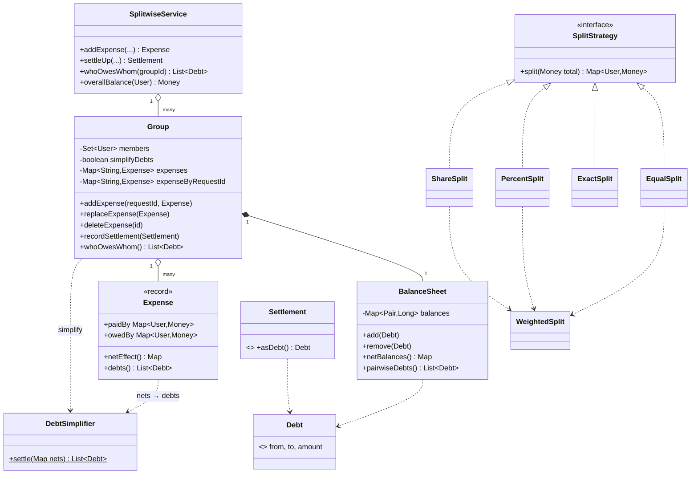
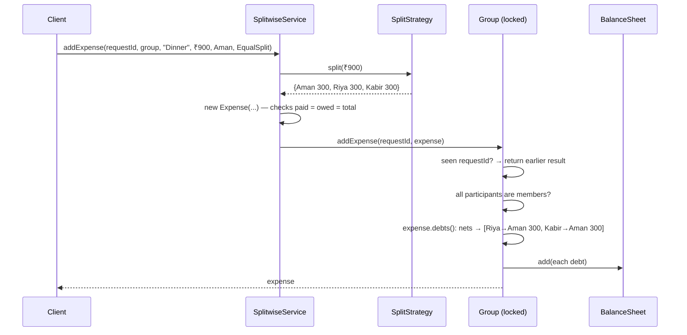

# LLD Q3 — Design Splitwise (Java)

> **How these notes are organised**
>
> - **Part A — The method.** Seven steps that work for *any* LLD question. This is the part to keep in your head.
> - **Part B — Splitwise, step by step.** The method applied, including the reasoning at each step. Look for the **Think first** prompts: answer them yourself before reading on.
> - **Part C — The code.** Compiled, run and tested. The walkthroughs show real output.
> - **Part D — Using it on new problems.** Patterns that repeat across questions, plus a worked example on a problem you haven't seen.
>
> The aim is that when you see an unfamiliar question, you know which questions to ask yourself, not just what the Splitwise answer looks like.

---

## Table of Contents

**Part A — The method**
1. [The 7-Step LLD Method](#1-the-7-step-lld-method)

**Part B — Splitwise, step by step**

2. [Step 1: Clarify and Scope](#2-step-1-clarify-and-scope)
3. [Step 2: Find the Core Idea](#3-step-2-find-the-core-idea)
4. [Step 3: Entities and Who Owns What](#4-step-3-entities-and-who-owns-what)
5. [Step 4: What Varies → Patterns](#5-step-4-what-varies--patterns)
6. [Step 5: Data Structures and Algorithms](#6-step-5-data-structures-and-algorithms)
7. [Step 6: API, Class Diagram, Flow](#7-step-6-api-class-diagram-flow)
8. [Step 7: Edge Cases and Failure Modes](#8-step-7-edge-cases-and-failure-modes)
9. [Decision Log](#9-decision-log)

**Part C — The code**

10. [The Code](#10-the-code)
11. [Walkthrough: A Goa Trip (real output)](#11-walkthrough-a-goa-trip-real-output)
12. [Testing](#12-testing)

**Part D — Using it on new problems**

13. [Extensibility, Database, Scaling](#13-extensibility-database-scaling)
14. [Patterns That Transfer to Other Problems](#14-patterns-that-transfer-to-other-problems)
15. [Worked Example: Applying the Method to BookMyShow](#15-worked-example-applying-the-method-to-bookmyshow)
16. [Interview Cheat Sheet](#16-interview-cheat-sheet)

---

# Part A — The Method

## 1. The 7-Step LLD Method

Every LLD question, whether it's Splitwise, a parking lot, BookMyShow or an elevator, can be done with the same seven steps. What changes is the *answers*, not the *questions*.

| Step | Ask yourself | Output | Time (45 min) |
|---|---|---|---|
| **1. Clarify & scope** | What must it do? What can I leave out? What are the numbers (users, size)? | 5–8 use cases, a list of what's out of scope | 5 min |
| **2. Find the core idea** | What is the **one fact** everything else can be worked out from? What must **always be true** (the invariant)? | One or two sentences | 3 min |
| **3. Entities & ownership** | Nouns → classes. Verbs → methods. **Who owns each piece of state?** Who is allowed to change it? | Class list with one responsibility each | 5 min |
| **4. What varies → patterns** | Which rules will have many versions, or change later? Hide each behind an interface. | Strategy / Factory / Observer / State, only where earned | 3 min |
| **5. Data structures & algorithms** | What must be fast? How is state stored? Is there a known algorithm? | Chosen structures + the one tricky algorithm | 5 min |
| **6. API & diagrams** | What does a caller actually call? Draw the class diagram and one request flow. | Service methods, diagram | 4 min |
| **7. Edge cases & failures** | Bad input? Retries? Two users at once? Undo/edit? Deletion? | A list, and the fixes in code | 5 min |
| *Code* | Write the core classes. Skip getters and boilerplate; write the interesting parts. | Working core | 15 min |

### The questions that do the most work

These are worth memorising, because they apply to almost every problem:

1. **"What is the source of truth, and what is derived?"** Store the facts; calculate the rest. (Splitwise: store expenses and debts; calculate balances and payment plans.)
2. **"What must always be true?"** Write it down and make the code guarantee it. (Splitwise: all balances in a group add up to zero.)
3. **"What will have many versions?"** That's your Strategy interface. (Splitwise: split types.)
4. **"Who owns this state, and what's the unit of locking?"** Usually one "aggregate" object guards its own data. (Splitwise: the Group.)
5. **"What happens if this request arrives twice?"** Idempotency. (Splitwise: phone retries "add expense".)
6. **"How do I undo it?"** Edit and delete are where weak designs break. (Splitwise: delete = apply the reverse.)
7. **"Is there money, time or counting involved?"** Then think about precision, rounding and time zones early. (Splitwise: paise, not doubles.)

> **The common mistake** is jumping from step 1 straight to writing classes. Steps 2 and 5 are where the interesting design lives; the classes fall out of them.

---

# Part B — Splitwise, Step by Step

## 2. Step 1: Clarify and Scope

**Think first:** what questions would you ask before designing Splitwise? Try to list five.

| # | Question | Why it matters | Assumption |
|---|---|---|---|
| 1 | Which split types? | Decides the Strategy interface | Equal, exact amounts, percentages, shares |
| 2 | Can more than one person pay for one expense? | Changes the Expense model | **Yes** (two people split the bill at the counter). The model gets simpler, not harder (§3). |
| 3 | Groups only, or also 1-to-1 between friends? | One ledger type or two? | Both. A friend expense is stored as a hidden 2-person group. |
| 4 | Should debts be "simplified"? | The main algorithm | Yes, as an option per group |
| 5 | Can expenses be edited or deleted? | Undo logic | Yes |
| 6 | Multiple currencies? | Money model | One currency (INR) for now; §13 shows how to extend it |
| 7 | Scale? | In-memory vs database | Design in-memory classes; §13 covers the database and scaling |

### Requirements

| # | Functional |
|---|---|
| F1 | Create users and groups; add and remove members. |
| F2 | Add an expense: who paid (one or more people), total, how it's split. |
| F3 | Split types: EQUAL, EXACT, PERCENT, SHARES. |
| F4 | Show balances: per group, between two people, and overall for a user. |
| F5 | Show "who owes whom", either simplified (fewest payments) or raw. |
| F6 | Record a settlement (someone pays someone back). |
| F7 | Edit and delete expenses. |

| # | Non-functional | How the design meets it |
|---|---|---|
| N1 | **Correct to the paisa** | Money stored as whole paise; rounding always hands out the exact total |
| N2 | **Balances always add up** | Every change is a set of debts that sum to zero; tested on 3,000 random operations |
| N3 | **Safe under retries** | Every add-expense request carries a `requestId` |
| N4 | **Safe with concurrent users** | Each group is locked as a unit |
| N5 | **Easy to add split types** | `SplitStrategy` interface |

**Out of scope:** payments integration, notifications, receipts/OCR, currency conversion, authentication.

---

## 3. Step 2: Find the Core Idea

**Think first:** Aman pays ₹900 for dinner for Aman, Riya and Kabir. Forget classes for a moment. What *facts* does this create?

### The answer: everything is "X owes Y ₹n"

That dinner creates two facts:

```
Riya  owes Aman ₹300
Kabir owes Aman ₹300
```

That's it. Every feature of Splitwise can be built from facts of this shape, called a **Debt**:

| Feature | In terms of debts |
|---|---|
| Add expense | Add some debts |
| Delete expense | Add the same debts **reversed** |
| Edit expense | Delete the old version + add the new one |
| Settle up (Riya pays Aman ₹300) | Add "Aman owes Riya ₹300". It cancels the old debt. |
| Balance between two people | Sum of debts between them |
| A person's overall balance | Sum of all debts to and from them |
| Simplify debts | Find a *different, shorter* set of debts with the same totals per person |

### The invariant

Money only moves between people in the group. It's never created or destroyed. So:

> **In any group, everyone's net balance adds up to exactly zero.**

If Aman is owed ₹600, then other people owe exactly ₹600 between them. This gives you a free sanity check: the code checks it every time it simplifies, and the tests check it after thousands of random operations.

### How multiple payers become simple

Look at each person's **net effect** from one expense: *what they paid − their share*.

```
Dinner ₹600. Neha paid ₹400, Aman paid ₹200. Shares: Riya ₹300, Kabir ₹150, Neha ₹150.

           paid    share    net
Neha       400  −  150   = +250    (group owes Neha 250)
Aman       200  −    0   = +200
Riya         0  −  300   = −300    (Riya owes 300)
Kabir        0  −  150   = −150
                           ────
                             0     ← invariant holds
```

Now we just need to turn these nets into debts ("Riya owes Neha 250, …"). That is **exactly the same problem as "simplify debts"**, so one algorithm does both jobs. One payer, several payers, and simplification all use the same code.

> **How to find the core idea in any problem:** ask *"what is the smallest fact that, if I stored only that, I could work out everything else?"* For Splitwise it's a debt. For a bank it's a transaction. For BookMyShow it's "seat S is held by booking B until time T" (§15).

---

## 4. Step 3: Entities and Who Owns What

**Think first:** list the nouns in the requirements. Which ones hold state that changes?

Nouns: user, group, member, expense, payer, share, split, balance, settlement, debt.

| Class | Responsibility (one sentence) | Owns / changes |
|---|---|---|
| `User` | Identifies a person | nothing (immutable record) |
| `Money` | An amount in paise, with safe arithmetic | nothing (immutable record) |
| `SplitStrategy` (+4 types) | Turns a total into each person's share | nothing (pure calculation) |
| `Expense` | Who paid, whose share; checks both add up | nothing (immutable record) |
| `Settlement` | Someone paid someone back | nothing (immutable record) |
| `Debt` | "X owes Y ₹n" | nothing (immutable record) |
| `DebtSimplifier` | Turns net balances into a short list of payments | nothing (pure algorithm) |
| `BalanceSheet` | One running number per pair of people | **the balances** |
| `Group` | Members, expenses, balance sheet; enforces the rules | **everything in the group**, under one lock |
| `SplitwiseService` | Entry point: ids, lookups, totals across groups | the maps of users and groups |

Two things to notice:

1. **Most classes are immutable or stateless.** Only `BalanceSheet` and `Group` change. Fewer moving parts means fewer bugs, and it makes concurrency easy: lock the group and you're done.
2. **"Balance" is not a class with stored totals per user.** It's calculated. Storing a derived number next to the facts it comes from is how numbers drift out of sync.

### Why is `Group` the owner?

One expense changes the balances of several people at once. Those changes must happen **all together or not at all**. The natural boundary for "all together" is the group, because an expense never crosses groups. In DDD terms, the group is the **aggregate**: the one object that guards its own consistency. That also answers the concurrency question: **lock the group.**

---

## 5. Step 4: What Varies → Patterns

**Think first:** which part of Splitwise will keep getting new versions?

### Split types → Strategy

```java
interface SplitStrategy {
    Map<User, Money> split(Money total);   // each person's share, adding up exactly to total
}
```

`EqualSplit`, `ExactSplit`, `PercentSplit` and `ShareSplit` each implement it. `Expense` and `Group` never know which one was used; they only see the resulting shares. Adding a new type (for example "equal, but Aman pays ₹50 extra for the dessert") means writing one new class and changing nothing else.

### The insight that shrinks the code: three of the four are the same

| Split | Is really… |
|---|---|
| EQUAL between 3 | weights 1 : 1 : 1 |
| PERCENT 50 / 30 / 20 | weights 50 : 30 : 20 |
| SHARES 2 : 1 : 1 | weights 2 : 1 : 1 |
| EXACT | not weighted; just check the amounts add up |

So `EqualSplit`, `PercentSplit` and `ShareSplit` are thin wrappers that build a weight map and call one shared function, `WeightedSplit.split()`. The tricky rounding logic exists in **one place**.

> **General lesson:** when you see several "types" of something, check whether they're the same algorithm with different parameters before writing N separate implementations.

### Other patterns (only where they earn their place)

| Pattern | Where | Why |
|---|---|---|
| **Strategy** | `SplitStrategy` | Many split rules, more will come |
| **Facade** | `SplitwiseService` | One simple entry point; hides groups, ids, lookups |
| **Aggregate** (DDD) | `Group` | Owns its data, guards the invariant, is the unit of locking |
| **Value objects** | `Money`, `User`, `Debt`, `Expense` | Immutable, compared by value, can't be half-changed |

What we deliberately **didn't** use: no Factory for splits (constructors are already clear), no Observer (notifications are out of scope; §13 shows where one would go), no class hierarchy for expense types (a settlement is just another debt).

---

## 6. Step 5: Data Structures and Algorithms

### 6.1 Money: whole paise, never `double`

```java
0.1 + 0.2 == 0.30000000000000004   // double
```

With doubles, balances stop adding up to zero after enough expenses, and "settled up" shows ₹0.00000001 owed. So `Money` wraps a `long` number of **paise**. `Money.of("1.234")` is rejected, because a fraction of a paisa doesn't exist. (`BigDecimal` also works, but a `long` is faster, simpler, and big enough.)

### 6.2 Rounding: the largest remainder method

**Think first:** split ₹100 equally between 3 people. What does each person owe, and does it add up?

₹33.33 × 3 = ₹99.99. One paisa is missing. The fix:

```
1. Give everyone the rounded-down share:      33.33   33.33   33.33    (1 paisa left)
2. Hand out the leftover paise one at a time to whoever lost the most to rounding.
   All three lost the same, so the tie goes to whoever is listed first:
                                              33.34   33.33   33.33    = 100.00 ✓
```

Guarantees: the shares always add up to the exact total, and no one is off by more than 1 paisa. It's the same method used to split parliament seats by vote share.

Real output from the code:

```
₹100   equal between 3          → Aman ₹33.34, Riya ₹33.33, Kabir ₹33.33
₹10.01 at 33% / 33% / 34%       → Aman ₹3.30,  Riya ₹3.30,  Kabir ₹3.41
₹0.02  equal between 3          → Aman ₹0.01,  Riya ₹0.01,  Kabir ₹0.00
```

In the second case Kabir gets the extra paisa, because his exact share (₹3.4034) lost the most to rounding.

### 6.3 Storing balances: one signed number per pair

**Think first:** how would you store "who owes whom"?

| Option | Problem |
|---|---|
| List of every debt ever | Grows forever; every read adds them all up |
| `Map<User, Map<User, Long>>` (both directions) | Aman→Riya and Riya→Aman can both be non-zero; you must keep them in sync |
| **`Map<Pair, Long>`, pair stored once with the smaller id first, signed** ✅ | One number per pair. + means "first owes second", − means the reverse |

```
(Aman, Riya) → +500    Aman owes Riya ₹5
(Aman, Riya) → −500    Riya owes Aman ₹5
```

"Aman owes Riya 100" followed by "Riya owes Aman 100" automatically nets to zero, and the entry is removed. Adding a debt is O(1).

From this map we can calculate:

- **Net balance per person:** walk the map once, O(pairs).
- **Raw who-owes-whom:** each non-zero pair is one line.

### 6.4 Simplifying debts: greedy with two heaps

**Think first:** Aman is owed ₹500, Kabir owes ₹150, Neha owes ₹350. What's the fewest number of payments?

Two: Neha → Aman ₹350, Kabir → Aman ₹150. The algorithm:

```
1. Work out each person's net balance. Split people into
   creditors (owed money) and debtors (owe money), each in a max-heap.
2. Repeat until empty:
     take the biggest creditor C and the biggest debtor D
     amount = min(what C is owed, what D owes)
     record "D pays C amount"
     put whoever still has something left back into their heap
```

**Why it works:** every round settles at least one person completely, so with `n` people there are **at most n − 1 payments**. It's O(n log n).

**Is it optimal?** Not always. Finding the true minimum number of payments is **NP-hard**. You'd need to find as many groups of people whose balances cancel exactly as possible, which is a subset-sum problem. Real output from the code:

```
Balances: P +800, T +900, Q −200, R −700, S −800

Greedy (4 payments):   S→T 800, R→P 700, Q→P 100, Q→T 100
Optimal (3 payments):  S→P 800, R→T 700, Q→T 200      (S and P cancel exactly)
```

Interview line: *"Greedy guarantees at most n − 1 payments in O(n log n). The true minimum is NP-hard, and greedy is what real apps use. For tiny groups you could try to find exactly cancelling subsets first."*

**The rule simplification must never break:** everyone's net balance stays the same. It changes *who pays whom*, never *how much each person is up or down*. That's the property test in §12.

> **Product note:** simplification can make you pay someone you never had an expense with (in §11, Neha ends up paying Aman instead of Kabir). Some people dislike that, which is why it's a per-group setting.

### 6.5 Costs

| Operation | Cost |
|---|---|
| Split a total between p people | O(p log p) (sort by remainder) |
| Add an expense | O(p log p): split + turn nets into debts + O(1) per debt |
| Net balances for a group | O(pairs) |
| Simplify | O(n log n) |
| Delete / edit | same as add |

---

## 7. Step 6: API, Class Diagram, Flow

### 7.1 The API (what a caller uses)

```java
User    addUser(String name)
Group   createGroup(String name, List<User> members)
Group   friendship(User a, User b)                     // hidden 2-person group

Expense addExpense(requestId, groupId, description, total, User paidBy, SplitStrategy split)
Expense addExpense(requestId, groupId, description, total, Map<User, Money> paidBy, SplitStrategy split)
Expense editExpense(groupId, expenseId, description, total, paidBy, split)
void    deleteExpense(groupId, expenseId)
Settlement settleUp(groupId, User payer, User receiver, Money amount)

List<Debt>       whoOwesWhom(groupId)                  // simplified or raw, per group setting
Map<User, Money> balances(groupId)                     // net per person
Money            overallBalance(User user)             // home screen number
Money            amountOwedOverall(User debtor, User creditor)
```

Usage:

```java
app.addExpense("req-81", goa.id(), "Hotel", Money.rupees(1200), aman,
               new EqualSplit(List.of(aman, riya, kabir, neha)));
```

### 7.2 Class diagram



### 7.3 Flow of "add expense"



Note the order: **validate everything before changing anything**. The split, the expense constructor and the membership check can all throw. None of them touch the balance sheet, so a bad request leaves no half-applied state behind.

---

## 8. Step 7: Edge Cases and Failure Modes

**Think first:** list five ways this could go wrong in production.

| # | Case | Handling |
|---|---|---|
| 1 | Percentages add up to 90 | `PercentSplit` rejects it: "percentages add up to 90, not 100" |
| 2 | Exact amounts don't match the total | `ExactSplit` rejects it: "amounts add up to ₹100.00, but the total is ₹150.00" |
| 3 | Payers don't add up to the total | `Expense` constructor rejects it |
| 4 | ₹1.234 | `Money.of` rejects it (no fractions of a paisa) |
| 5 | ₹100 split 3 ways | Largest-remainder rounding: 33.34 / 33.33 / 33.33 |
| 6 | Someone in the split isn't in the group | `Group` rejects it: "Kabir is not in Flat" |
| 7 | **Phone retries "add expense" after a timeout** | Same `requestId` → the earlier expense is returned, nothing added twice |
| 8 | **Two people add expenses at the same time** | Every `Group` method is `synchronized`: one expense is fully applied before the next starts. Tested with 8 threads, 2,000 expenses plus 2,000 retries. |
| 9 | Delete an expense | Apply its debts reversed. Balances return to exactly what they were. |
| 10 | Edit an expense | Undo the old version + apply the new one, **under the same lock**, so no one sees the in-between state |
| 11 | A member leaves while owing money | Rejected: "Riya still has a balance of −₹30.00" |
| 12 | Someone pays back more than they owe | Allowed; the debt flips direction (that's what Splitwise does) |
| 13 | Pay yourself / owe yourself | Rejected by `Settlement` and `Debt` |
| 14 | Balance between two people across several groups | Summed over every group, using what each group *shows* (simplified or raw), so the friend screen matches the group screens |
| 15 | Very large amounts | `Math.addExact` / `multiplyExact` throw instead of silently overflowing |

### Idempotency, in more detail

A mobile client sends "add ₹500 dinner", the server applies it, and the response is lost. The client retries. Without protection, the dinner is counted twice.

The fix: the client creates a `requestId` (a UUID) **once per user action** and sends it on every retry. The group remembers which request ids it has seen. The check and the insert happen under the same lock, so two retries arriving at the same moment still create one expense.

In a real system the seen-ids table lives in the database with a unique index, and old entries expire after a day or so.

### Concurrency, in more detail

- **Why lock?** One expense does several `balances.add()` calls. If two threads interleave, one update can overwrite another, or a reader sees half an expense.
- **Why per group, not one global lock?** Groups are independent, so two different groups never wait for each other.
- **What about `overallBalance`, which reads many groups?** Each group is read under its own lock, so each group's number is consistent. The total might mix "just before" and "just after" a concurrent expense in another group. That's acceptable for a display number. If you needed an exact snapshot, you'd use database transactions.

---

## 9. Decision Log

In an interview, saying *why* you chose something, and what you rejected, counts as much as the choice itself.

| Decision | Alternatives considered | Why this one |
|---|---|---|
| Money as `long` paise | `double`; `BigDecimal` | `double` is wrong. `BigDecimal` is correct but slower and wordier; one currency with 2 decimals fits in a `long`. |
| Everything becomes `Debt`s | Separate logic per split type or expense type | One simple fact type: add, delete, edit and settle all become "add some debts". |
| Balances derived from debts, not stored per user | A "balance" field on each user | A stored total can drift from the facts. Derived numbers can't. |
| Pairwise signed map | Nested maps; a list of debts | One number per pair, O(1) updates, cancels automatically. |
| One algorithm for "nets → debts" | Special code for one payer vs many payers | Multiple payers come for free; less code. |
| Equal/percent/shares share one engine | Three separate implementations | Rounding logic in one place. |
| Friend expenses = hidden 2-person group | A separate "friendship ledger" type | One ledger type in the whole system. |
| Simplify at read time | Store the simplified plan | The plan is derived. Recalculating on read is cheap (n is small), and it can't go stale. |
| Lock per group | One global lock; lock-free | An expense never crosses groups, so the group is the natural boundary. |
| `requestId` for idempotency | Detect duplicates by content | Two real ₹100 cabs on the same day are *not* duplicates. Only the client knows it's a retry. |

---

# Part C — The Code

## 10. The Code

> Java 17+. All classes are in `package com.splitwise;`; package and import lines are left out below. This code has been compiled and run, and the tests in §12 pass.

### 10.0 Reading order

| # | Files | Read it for |
|---|---|---|
| 1 | `Money`, `User`, `Debt` | The basic facts |
| 2 | `SplitStrategy`, `WeightedSplit`, the four splits | Strategy + rounding |
| 3 | `Expense`, `Settlement` | How everything turns into debts |
| 4 | `DebtSimplifier` | The algorithm |
| 5 | `BalanceSheet` | How balances are stored |
| 6 | `Group` | Rules, locking, idempotency, undo |
| 7 | `SplitwiseService` | The entry point |

### 10.1 Basic values

```java
// Money.java
/**
 * Money is stored as a whole number of PAISE (1 rupee = 100 paise), never as a double.
 * 0.1 + 0.2 != 0.3 in floating point - and a ledger that is off by 0.0000001 never balances.
 */
public record Money(long paise) implements Comparable<Money> {

    public static final Money ZERO = new Money(0);

    public static Money rupees(long rupees) { return new Money(Math.multiplyExact(rupees, 100)); }

    /** "123.45" -> 12345 paise. Rejects "1.234" (no fractions of a paisa). */
    public static Money of(String amount) {
        return new Money(new BigDecimal(amount).movePointRight(2).longValueExact());
    }

    public Money plus(Money other)  { return new Money(Math.addExact(paise, other.paise)); }
    public Money minus(Money other) { return new Money(Math.subtractExact(paise, other.paise)); }
    public Money negate()           { return new Money(-paise); }
    public Money abs()              { return new Money(Math.abs(paise)); }

    public boolean isZero()     { return paise == 0; }
    public boolean isPositive() { return paise > 0; }
    public boolean isNegative() { return paise < 0; }

    public static Money min(Money a, Money b) { return a.compareTo(b) <= 0 ? a : b; }

    @Override public int compareTo(Money other) { return Long.compare(paise, other.paise); }

    @Override public String toString() {
        String sign = paise < 0 ? "-" : "";
        long abs = Math.abs(paise);
        return "%s₹%d.%02d".formatted(sign, abs / 100, abs % 100);
    }
}
```

```java
// User.java
public record User(String id, String name) implements Comparable<User> {
    @Override public int compareTo(User other) { return id.compareTo(other.id); }
    @Override public String toString() { return name; }
}
```

```java
// Debt.java
/** "from owes to this much." The one fact everything else is built from. */
public record Debt(User from, User to, Money amount) {
    public Debt {
        if (from.equals(to))         throw new IllegalArgumentException("can't owe yourself");
        if (!amount.isPositive())    throw new IllegalArgumentException("debt must be positive");
    }
    @Override public String toString() { return from + " owes " + to + " " + amount; }
}
```

### 10.2 Splits — Strategy + one shared rounding engine

```java
// SplitStrategy.java
/**
 * Strategy: turns a total into "how much each person's share is".
 * The result always adds up EXACTLY to the total - to the paisa.
 */
public interface SplitStrategy {
    Map<User, Money> split(Money total);
}
```

The heart of the splitting. Read the class comment first; the code is just those two steps.

```java
// WeightedSplit.java
/**
 * The shared engine behind EQUAL, PERCENT and SHARES splits.
 * All three are "split by weights":  equal = weight 1 each,  percent = weight = %,  shares = weight = shares.
 *
 * Rounding: ₹100 between 3 people can't be 33.333... each. We use the LARGEST REMAINDER method:
 *   1. give everyone the rounded-down share  -> 33.33, 33.33, 33.33  (1 paisa left over)
 *   2. hand leftover paise, one each, to whoever lost the most in rounding (ties: listed order)
 *   -> 33.34, 33.33, 33.33   Total is exact, nobody is off by more than 1 paisa.
 */
final class WeightedSplit {

    private WeightedSplit() {}

    private record Share(User user, long paise, long remainder) {}

    static Map<User, Money> split(Money total, Map<User, Long> weights) {
        if (!total.isPositive()) throw new IllegalArgumentException("total must be positive");
        if (weights.isEmpty())   throw new IllegalArgumentException("nobody to split between");

        long totalWeight = 0;
        for (long w : weights.values()) {
            if (w <= 0) throw new IllegalArgumentException("weights must be positive");
            totalWeight += w;
        }

        // Step 1: rounded-down shares, remembering what each person lost to rounding.
        List<Share> shares = new ArrayList<>();
        long handedOut = 0;
        for (Map.Entry<User, Long> e : weights.entrySet()) {
            long exact = Math.multiplyExact(total.paise(), e.getValue());   // share x totalWeight
            shares.add(new Share(e.getKey(), exact / totalWeight, exact % totalWeight));
            handedOut += exact / totalWeight;
        }

        // Step 2: the leftover paise (always fewer than the number of people).
        long leftover = total.paise() - handedOut;
        List<Share> byRemainder = new ArrayList<>(shares);
        byRemainder.sort((a, b) -> Long.compare(b.remainder(), a.remainder()));  // stable: ties keep order

        Map<User, Long> extra = new LinkedHashMap<>();
        for (int i = 0; i < leftover; i++) extra.put(byRemainder.get(i).user(), 1L);

        Map<User, Money> result = new LinkedHashMap<>();
        for (Share s : shares) {
            result.put(s.user(), new Money(s.paise() + extra.getOrDefault(s.user(), 0L)));
        }
        return result;
    }
}
```

Three of the four split types are thin wrappers around it:

```java
// EqualSplit.java
public final class EqualSplit implements SplitStrategy {

    private final List<User> people;

    public EqualSplit(List<User> people) {
        if (people.stream().distinct().count() != people.size()) {
            throw new IllegalArgumentException("same person listed twice");
        }
        this.people = List.copyOf(people);
    }

    @Override
    public Map<User, Money> split(Money total) {
        Map<User, Long> weights = new LinkedHashMap<>();
        for (User u : people) weights.put(u, 1L);
        return WeightedSplit.split(total, weights);
    }
}
```

```java
// PercentSplit.java
public final class PercentSplit implements SplitStrategy {

    private final Map<User, Integer> percents;

    public PercentSplit(Map<User, Integer> percents) {
        int sum = percents.values().stream().mapToInt(Integer::intValue).sum();
        if (sum != 100) throw new IllegalArgumentException("percentages add up to " + sum + ", not 100");
        this.percents = new LinkedHashMap<>(percents);
    }

    @Override
    public Map<User, Money> split(Money total) {
        Map<User, Long> weights = new LinkedHashMap<>();
        percents.forEach((user, pct) -> weights.put(user, (long) pct));
        return WeightedSplit.split(total, weights);
    }
}
```

```java
// ShareSplit.java
/** "Aman had 2 drinks, Riya had 1" -> shares 2 : 1. */
public final class ShareSplit implements SplitStrategy {

    private final Map<User, Integer> shares;

    public ShareSplit(Map<User, Integer> shares) {
        this.shares = new LinkedHashMap<>(shares);
    }

    @Override
    public Map<User, Money> split(Money total) {
        Map<User, Long> weights = new LinkedHashMap<>();
        shares.forEach((user, n) -> weights.put(user, (long) n));
        return WeightedSplit.split(total, weights);
    }
}
```

EXACT is the odd one out. There's nothing to calculate, only a check:

```java
// ExactSplit.java
/** "Aman's meal was ₹450, Riya's was ₹300." The amounts must add up to the total. */
public final class ExactSplit implements SplitStrategy {

    private final Map<User, Money> amounts;

    public ExactSplit(Map<User, Money> amounts) {
        this.amounts = new LinkedHashMap<>(amounts);
    }

    @Override
    public Map<User, Money> split(Money total) {
        Money sum = Money.ZERO;
        for (Money m : amounts.values()) {
            if (!m.isPositive()) throw new IllegalArgumentException("amounts must be positive");
            sum = sum.plus(m);
        }
        if (!sum.equals(total)) {
            throw new IllegalArgumentException("amounts add up to " + sum + ", but the total is " + total);
        }
        return new LinkedHashMap<>(amounts);
    }
}
```

### 10.3 Expense and Settlement — everything becomes debts

Notice `netEffect()` (paid − share for each person) and `debts()`, which hands those nets to the same algorithm that simplifies debts. That one line is why several payers need no special code.

```java
// Expense.java
/**
 * An expense records two facts:  who PAID how much,  and whose SHARE was how much.
 * Both sides must add up to the total. Supports several payers (e.g. two people split the bill at the counter).
 */
public record Expense(String id, String groupId, String description, Money total,
                      Map<User, Money> paidBy, Map<User, Money> owedBy) {

    public Expense {
        if (!total.isPositive()) throw new IllegalArgumentException("total must be positive");
        requireAddsUpTo(total, paidBy, "paid");
        requireAddsUpTo(total, owedBy, "owed");
        paidBy = Collections.unmodifiableMap(new LinkedHashMap<>(paidBy));
        owedBy = Collections.unmodifiableMap(new LinkedHashMap<>(owedBy));
    }

    private static void requireAddsUpTo(Money total, Map<User, Money> amounts, String what) {
        Money sum = Money.ZERO;
        for (Money m : amounts.values()) {
            if (!m.isPositive()) throw new IllegalArgumentException(what + " amounts must be positive");
            sum = sum.plus(m);
        }
        if (!sum.equals(total)) {
            throw new IllegalArgumentException(what + " amounts add up to " + sum + ", not " + total);
        }
    }

    /**
     * What this expense does to each person's balance:  paid - owed.
     * Positive = the group now owes them.  Negative = they owe the group.  Always sums to zero.
     */
    public Map<User, Money> netEffect() {
        Map<User, Money> net = new LinkedHashMap<>();
        paidBy.forEach((user, amount) -> net.merge(user, amount, Money::plus));
        owedBy.forEach((user, amount) -> net.merge(user, amount.negate(), Money::plus));
        return net;
    }

    /** The same effect expressed as "X owes Y" facts. With one payer: every other person owes the payer. */
    public List<Debt> debts() {
        return DebtSimplifier.settle(netEffect());
    }

    public List<User> participants() {
        Set<User> all = new LinkedHashSet<>(paidBy.keySet());
        all.addAll(owedBy.keySet());
        return List.copyOf(all);
    }
}
```

```java
// Settlement.java
/**
 * "payer handed receiver this much cash/UPI."
 * On the books it cancels debt:  if A owes B ₹100 and A pays B ₹100, the effect is "B owes A ₹100",
 * which exactly cancels the old debt. So a settlement is just one more Debt, pointing the other way.
 */
public record Settlement(String id, String groupId, User payer, User receiver, Money amount) {

    public Settlement {
        if (!amount.isPositive())      throw new IllegalArgumentException("amount must be positive");
        if (payer.equals(receiver))    throw new IllegalArgumentException("can't pay yourself");
    }

    public Debt asDebt() {
        return new Debt(receiver, payer, amount);
    }
}
```

### 10.4 `DebtSimplifier` — the algorithm

```java
// DebtSimplifier.java
/**
 * Turns net balances into a short list of payments.
 *
 *   Input:  Aman +300, Riya -100, Kabir -200   (+ = is owed money, - = owes money; sums to 0)
 *   Output: Kabir pays Aman 200, Riya pays Aman 100
 *
 * Greedy: repeatedly match the person owed the MOST with the person who owes the MOST.
 * Each round settles at least one person completely, so n people need at most n-1 payments.
 */
public final class DebtSimplifier {

    private DebtSimplifier() {}

    private record Position(User user, long paise) {}   // paise is always > 0 inside the heaps

    private static final Comparator<Position> BIGGEST_FIRST =
            Comparator.comparingLong(Position::paise).reversed()
                      .thenComparing(Position::user);          // tie-break by id: deterministic

    public static List<Debt> settle(Map<User, Money> netBalances) {
        PriorityQueue<Position> owedMoney = new PriorityQueue<>(BIGGEST_FIRST);  // creditors
        PriorityQueue<Position> owesMoney = new PriorityQueue<>(BIGGEST_FIRST);  // debtors

        long sum = 0;
        for (Map.Entry<User, Money> e : netBalances.entrySet()) {
            long paise = e.getValue().paise();
            sum += paise;
            if (paise > 0) owedMoney.add(new Position(e.getKey(), paise));
            if (paise < 0) owesMoney.add(new Position(e.getKey(), -paise));
        }
        if (sum != 0) throw new IllegalStateException("balances don't add up to zero: " + sum);

        List<Debt> payments = new ArrayList<>();
        while (!owedMoney.isEmpty()) {
            Position creditor = owedMoney.poll();
            Position debtor   = owesMoney.poll();
            long amount = Math.min(creditor.paise(), debtor.paise());

            payments.add(new Debt(debtor.user(), creditor.user(), new Money(amount)));

            // Whoever isn't fully settled goes back in with what's left.
            if (creditor.paise() > amount) owedMoney.add(new Position(creditor.user(), creditor.paise() - amount));
            if (debtor.paise()   > amount) owesMoney.add(new Position(debtor.user(),   debtor.paise()   - amount));
        }
        return payments;
    }
}
```

### 10.5 `BalanceSheet` — one signed number per pair

```java
// BalanceSheet.java
/**
 * Who owes whom, one number per PAIR of people.
 *
 * Each pair is stored once, with the "smaller" user first:
 *   (Aman, Riya) -> +500   means Aman owes Riya ₹5
 *   (Aman, Riya) -> -500   means Riya owes Aman ₹5
 * So "A owes B 100" followed by "B owes A 100" nets to zero automatically.
 */
final class BalanceSheet {

    private record Pair(User low, User high) {
        static Pair of(User a, User b) { return a.compareTo(b) < 0 ? new Pair(a, b) : new Pair(b, a); }
    }

    private final Map<Pair, Long> balances = new HashMap<>();

    void add(Debt debt)    { adjust(debt.from(), debt.to(), debt.amount().paise()); }
    void remove(Debt debt) { adjust(debt.from(), debt.to(), -debt.amount().paise()); }

    private void adjust(User from, User to, long paise) {
        Pair pair = Pair.of(from, to);
        long signed = from.equals(pair.low()) ? paise : -paise;   // + always means "low owes high"
        long updated = balances.getOrDefault(pair, 0L) + signed;
        if (updated == 0) balances.remove(pair);                   // keep the map small
        else              balances.put(pair, updated);
    }

    /** Each person's total position. Positive = others owe them. The values always sum to zero. */
    Map<User, Money> netBalances() {
        Map<User, Money> net = new TreeMap<>();
        balances.forEach((pair, paise) -> {
            net.merge(pair.high(), new Money(paise), Money::plus);   // high is owed `paise`
            net.merge(pair.low(), new Money(-paise), Money::plus);   // low owes `paise`
        });
        net.values().removeIf(Money::isZero);
        return net;
    }

    /** Every non-zero pair as "X owes Y", without any simplification. */
    List<Debt> pairwiseDebts() {
        List<Debt> debts = new ArrayList<>();
        balances.forEach((pair, paise) -> debts.add(paise > 0
                ? new Debt(pair.low(), pair.high(), new Money(paise))
                : new Debt(pair.high(), pair.low(), new Money(-paise))));
        debts.sort(Comparator.comparing(Debt::from).thenComparing(Debt::to));
        return debts;
    }
}
```

### 10.6 `Group` — the aggregate: rules, locking, idempotency, undo

This is where all the edge cases from §8 are handled. Every public method is `synchronized`, so each expense is applied completely before anyone else can read or write.

```java
// Group.java
/**
 * A group owns its members, its expenses and its balance sheet.
 * Every method is synchronized: one expense touches several balances, and all of them must
 * change together (no one should ever see half an expense applied).
 */
public final class Group {

    private final String id;
    private final String name;
    private final Set<User> members = new LinkedHashSet<>();
    private boolean simplifyDebts = true;

    private final BalanceSheet balances = new BalanceSheet();
    private final Map<String, Expense> expenses = new LinkedHashMap<>();
    private final Map<String, Settlement> settlements = new LinkedHashMap<>();
    private final Map<String, Expense> expenseByRequestId = new HashMap<>();   // idempotency

    public Group(String id, String name, Collection<User> members) {
        this.id = id;
        this.name = name;
        this.members.addAll(members);
    }

    // ---- members --------------------------------------------------------------

    public synchronized void addMember(User user) { members.add(user); }

    /** You can't leave a group while you owe money or are owed money. */
    public synchronized void removeMember(User user) {
        Money balance = balances.netBalances().getOrDefault(user, Money.ZERO);
        if (!balance.isZero()) {
            throw new IllegalStateException(user + " still has a balance of " + balance);
        }
        members.remove(user);
    }

    // ---- expenses -------------------------------------------------------------

    /**
     * Adds the expense unless this requestId was already seen. A phone that retries after a
     * timeout sends the same requestId, so the expense is never added twice.
     */
    public synchronized Expense addExpense(String requestId, Expense expense) {
        Expense earlier = expenseByRequestId.get(requestId);
        if (earlier != null) return earlier;

        requireMembers(expense.participants());
        apply(expense);
        expenses.put(expense.id(), expense);
        expenseByRequestId.put(requestId, expense);
        return expense;
    }

    /** Undo the old version, apply the new one - together, under one lock. */
    public synchronized Expense replaceExpense(Expense updated) {
        Expense old = requireExpense(updated.id());
        requireMembers(updated.participants());
        undo(old);
        apply(updated);
        expenses.put(updated.id(), updated);
        return updated;
    }

    public synchronized void deleteExpense(String expenseId) {
        undo(requireExpense(expenseId));
        expenses.remove(expenseId);
    }

    private void apply(Expense e) { e.debts().forEach(balances::add); }
    private void undo(Expense e)  { e.debts().forEach(balances::remove); }

    // ---- settlements ----------------------------------------------------------

    public synchronized void recordSettlement(Settlement s) {
        requireMembers(List.of(s.payer(), s.receiver()));
        balances.add(s.asDebt());
        settlements.put(s.id(), s);
    }

    // ---- reading balances -----------------------------------------------------

    /** What the app shows: the simplified payment plan, or the raw pairwise debts. */
    public synchronized List<Debt> whoOwesWhom() {
        return simplifyDebts ? DebtSimplifier.settle(balances.netBalances())
                             : balances.pairwiseDebts();
    }

    /**
     * Between two people, based on what the app SHOWS (whoOwesWhom), so the friend screen and the
     * group screen never disagree. Positive = debtor owes creditor.
     */
    public synchronized Money amountOwed(User debtor, User creditor) {
        Money total = Money.ZERO;
        for (Debt d : whoOwesWhom()) {
            if (d.from().equals(debtor)   && d.to().equals(creditor)) total = total.plus(d.amount());
            if (d.from().equals(creditor) && d.to().equals(debtor))   total = total.minus(d.amount());
        }
        return total;
    }

    public synchronized Map<User, Money> netBalances()               { return balances.netBalances(); }
    public synchronized void setSimplifyDebts(boolean on)            { simplifyDebts = on; }
    public synchronized Set<User> members()                          { return Set.copyOf(members); }
    public synchronized boolean hasMember(User user)                 { return members.contains(user); }
    public synchronized Expense expense(String expenseId)            { return requireExpense(expenseId); }

    public String id()   { return id; }
    public String name() { return name; }

    // ---- checks ---------------------------------------------------------------

    private void requireMembers(Collection<User> users) {
        for (User u : users) {
            if (!members.contains(u)) throw new IllegalArgumentException(u + " is not in " + name);
        }
    }

    private Expense requireExpense(String expenseId) {
        Expense e = expenses.get(expenseId);
        if (e == null) throw new IllegalArgumentException("no expense " + expenseId);
        return e;
    }
}
```

### 10.7 `SplitwiseService` — the entry point

```java
// SplitwiseService.java
/**
 * The entry point (Facade). Creates ids, finds groups, builds expenses from a SplitStrategy,
 * and adds up balances ACROSS groups. The real rules live in Group, Expense and the splits.
 */
public final class SplitwiseService {

    private final Map<String, User> users = new ConcurrentHashMap<>();
    private final Map<String, Group> groups = new ConcurrentHashMap<>();
    private final AtomicLong nextId = new AtomicLong(1);

    // ---- users and groups -----------------------------------------------------

    public User addUser(String name) {
        User user = new User("u" + nextId.getAndIncrement(), name);
        users.put(user.id(), user);
        return user;
    }

    public Group createGroup(String name, List<User> members) {
        Group group = new Group("g" + nextId.getAndIncrement(), name, members);
        groups.put(group.id(), group);
        return group;
    }

    /**
     * Expenses between two friends outside any group go into a hidden 2-person group.
     * That way there is only ONE kind of ledger in the whole system.
     */
    public Group friendship(User a, User b) {
        User first  = a.compareTo(b) < 0 ? a : b;
        User second = a.compareTo(b) < 0 ? b : a;
        String id = "friends:" + first.id() + ":" + second.id();
        return groups.computeIfAbsent(id, key -> new Group(key, first + " & " + second, List.of(first, second)));
    }

    // ---- expenses -------------------------------------------------------------

    /** The common case: one person paid. */
    public Expense addExpense(String requestId, String groupId, String description,
                              Money total, User paidBy, SplitStrategy split) {
        return addExpense(requestId, groupId, description, total, Map.of(paidBy, total), split);
    }

    /** General case: several people may have paid. */
    public Expense addExpense(String requestId, String groupId, String description,
                              Money total, Map<User, Money> paidBy, SplitStrategy split) {
        String expenseId = "e" + nextId.getAndIncrement();
        Expense expense = new Expense(expenseId, groupId, description, total, paidBy, split.split(total));
        return group(groupId).addExpense(requestId, expense);
    }

    public Expense editExpense(String groupId, String expenseId, String description,
                               Money total, Map<User, Money> paidBy, SplitStrategy split) {
        Expense updated = new Expense(expenseId, groupId, description, total, paidBy, split.split(total));
        return group(groupId).replaceExpense(updated);
    }

    public void deleteExpense(String groupId, String expenseId) {
        group(groupId).deleteExpense(expenseId);
    }

    public Settlement settleUp(String groupId, User payer, User receiver, Money amount) {
        Settlement s = new Settlement("s" + nextId.getAndIncrement(), groupId, payer, receiver, amount);
        group(groupId).recordSettlement(s);
        return s;
    }

    // ---- balances -------------------------------------------------------------

    public List<Debt> whoOwesWhom(String groupId)     { return group(groupId).whoOwesWhom(); }
    public Map<User, Money> balances(String groupId)  { return group(groupId).netBalances(); }

    /** The number on the home screen: + you are owed overall, - you owe overall. */
    public Money overallBalance(User user) {
        Money total = Money.ZERO;
        for (Group g : groups.values()) {
            total = total.plus(g.netBalances().getOrDefault(user, Money.ZERO));
        }
        return total;
    }

    /** Across every group: positive = debtor owes creditor. */
    public Money amountOwedOverall(User debtor, User creditor) {
        Money total = Money.ZERO;
        for (Group g : groups.values()) {
            total = total.plus(g.amountOwed(debtor, creditor));
        }
        return total;
    }

    public Group group(String groupId) {
        Group g = groups.get(groupId);
        if (g == null) throw new IllegalArgumentException("no group " + groupId);
        return g;
    }
}
```

---

## 11. Walkthrough: A Goa Trip (real output)

Four friends: **Aman, Riya, Kabir, Neha**. One group. Every number below comes from running the code.

### 11.1 Four expenses, four split types

| # | Expense | Paid by | Split | Shares | Debts it creates |
|---|---|---|---|---|---|
| 1 | Hotel ₹1,200 | Aman | EQUAL, 4 people | 300 each | Riya → Aman 300, Kabir → Aman 300, Neha → Aman 300 |
| 2 | Dinner ₹900 | Riya | EXACT | Aman 200, Riya 300, Kabir 400 | Kabir → Riya 400, Aman → Riya 200 |
| 3 | Cab ₹1,000 | Kabir | PERCENT 40 / 30 / 30 | Aman 400, Kabir 300, Neha 300 | Aman → Kabir 400, Neha → Kabir 300 |
| 4 | Drinks ₹600 | **Neha 400 + Aman 200** | SHARES 2 : 1 : 1 | Riya 300, Kabir 150, Neha 150 | Riya → Neha 250, Kabir → Aman 150, Riya → Aman 50 |

How expense 4 (two payers) was turned into debts:

```
net = paid − share:   Neha +250,  Aman +200,  Riya −300,  Kabir −150
biggest owed (Neha 250) ← biggest owing (Riya 300):  Riya → Neha 250   (Riya has 50 left)
biggest owed (Aman 200) ← biggest owing (Kabir 150): Kabir → Aman 150  (Aman has 50 left)
Aman 50 ← Riya 50:                                    Riya → Aman 50
```

### 11.2 Balances

```
Net balances:   Aman +₹500    Riya ₹0    Kabir −₹150    Neha −₹350      (sum = 0 ✓)
```

**Raw view** (simplify OFF), 6 payments:

```
Riya  owes Aman  ₹150.00
Riya  owes Neha  ₹250.00
Kabir owes Aman  ₹50.00
Kabir owes Riya  ₹400.00
Neha  owes Aman  ₹300.00
Neha  owes Kabir ₹300.00
```

**Simplified view** (simplify ON), 2 payments:

```
Neha  owes Aman ₹350.00
Kabir owes Aman ₹150.00
```

Look at Riya. In the raw view she owes ₹400 to two people and is owed ₹400 by Kabir. Her *net* is zero, so in the simplified view she doesn't appear at all. That is exactly what simplification is for.

### 11.3 Changes

| Action | Result |
|---|---|
| Neha pays Aman ₹350 (`settleUp`) | Who owes whom: `[Kabir owes Aman ₹150.00]` |
| Phone retries expense 4 with the same `requestId` | Nothing changes |
| Add ₹90 snacks, then delete it | Balances are exactly as before |
| Edit the hotel from ₹1,200 to ₹1,600 | Aman +₹450, Riya −₹100, Kabir −₹250, Neha −₹100 |

Checking the edit by hand: Aman's net from the hotel goes from +900 (1200 − 300) to +1200 (1600 − 400), so +300 more. Everyone else's share goes up by 100. Before the edit, after Neha's payment: Aman +150, Kabir −150, others 0. After: Aman +450, Kabir −250, Riya −100, Neha −100 ✓.

### 11.4 Across groups

Aman and Riya also share a **Flat** group (Aman paid ₹60 for milk, split between the two) and a **friendship** (Riya paid ₹500 for a movie, split between the two).

```
Goa (simplified):  Riya owes Aman ₹100
Flat:              Riya owes Aman ₹30
Friendship:        Aman owes Riya ₹250
───────────────────────────────────────
Aman owes Riya overall: ₹120   (250 − 100 − 30)
```

---

## 12. Testing

| What | Test |
|---|---|
| Rounding | ₹100 / 3 → 33.34 + 33.33 + 33.33; shares always add up to the total |
| Validation | Percent ≠ 100, exact ≠ total, payers ≠ total, non-member, ₹1.234 |
| Basic balance | One payer: everyone else owes the payer their share |
| Several payers | §11.1 expense 4 |
| **Invariant** | After every operation, net balances sum to zero (3,000 random add / delete / settle operations) |
| **Simplification** | Never changes anyone's net; never more than n − 1 payments (1,000 random cases) |
| Undo | Add then delete → back to exactly the same balances |
| Idempotency | Same `requestId` three times → counted once |
| Concurrency | 8 threads, 2,000 expenses + 2,000 retries → exact expected balances |
| Leaving a group | Rejected while the balance isn't zero |

The two most valuable tests are the **property tests**: random operations, then check the invariant. They find the bugs you didn't think to write a test for.

Example tests (JUnit 5, run against the code above):

```java
// SplitwiseTest.java
class SplitwiseTest {

    private final SplitwiseService app = new SplitwiseService();
    private final User aman  = app.addUser("Aman");
    private final User riya  = app.addUser("Riya");
    private final User kabir = app.addUser("Kabir");

    @Test
    void equalSplitAddsUpToThePaisa() {
        Map<User, Money> shares = new EqualSplit(List.of(aman, riya, kabir)).split(Money.rupees(100));

        assertEquals(Money.of("33.34"), shares.get(aman));    // first in line gets the extra paisa
        assertEquals(Money.of("33.33"), shares.get(riya));
        assertEquals(Money.of("33.33"), shares.get(kabir));
    }

    @Test
    void oneExpenseMeansEveryoneOwesThePayer() {
        Group trip = app.createGroup("Trip", List.of(aman, riya, kabir));
        app.addExpense("req-1", trip.id(), "Hotel", Money.rupees(900), aman,
                       new EqualSplit(List.of(aman, riya, kabir)));

        assertEquals(Money.rupees(600),  app.balances(trip.id()).get(aman));
        assertEquals(Money.rupees(-300), app.balances(trip.id()).get(riya));
        assertEquals(Money.rupees(300),  trip.amountOwed(riya, aman));
    }

    @Test
    void retryWithSameRequestIdIsIgnored() {
        Group trip = app.createGroup("Trip", List.of(aman, riya));
        for (int attempt = 0; attempt < 3; attempt++) {           // phone retries after a timeout
            app.addExpense("req-1", trip.id(), "Cab", Money.rupees(200), aman,
                           new EqualSplit(List.of(aman, riya)));
        }
        assertEquals(Money.rupees(100), trip.amountOwed(riya, aman));
    }

    @Test
    void deletingAnExpenseUndoesItCompletely() {
        Group trip = app.createGroup("Trip", List.of(aman, riya, kabir));
        Expense e = app.addExpense("req-1", trip.id(), "Snacks", Money.rupees(90), riya,
                                   new EqualSplit(List.of(aman, riya, kabir)));
        app.deleteExpense(trip.id(), e.id());

        assertTrue(app.balances(trip.id()).isEmpty(), "everyone is back to zero");
    }

    @Test
    void settlingUpClearsTheDebt() {
        Group trip = app.createGroup("Trip", List.of(aman, riya));
        app.addExpense("req-1", trip.id(), "Lunch", Money.rupees(400), aman,
                       new EqualSplit(List.of(aman, riya)));
        app.settleUp(trip.id(), riya, aman, Money.rupees(200));

        assertTrue(app.whoOwesWhom(trip.id()).isEmpty());
    }

    @Test
    void simplifyingNeverChangesAnyonesNetBalance() {
        Random random = new Random(7);
        List<User> people = List.of(aman, riya, kabir, app.addUser("Neha"), app.addUser("Dev"));

        for (int round = 0; round < 1_000; round++) {
            Map<User, Money> net = new HashMap<>();
            long sum = 0;
            for (int i = 0; i < people.size() - 1; i++) {
                long paise = random.nextInt(20_001) - 10_000;
                net.put(people.get(i), new Money(paise));
                sum += paise;
            }
            net.put(people.get(people.size() - 1), new Money(-sum));   // make it add up to zero

            List<Debt> plan = DebtSimplifier.settle(net);

            Map<User, Money> afterPaying = new HashMap<>();
            for (Debt d : plan) {
                afterPaying.merge(d.to(),   d.amount(),          Money::plus);
                afterPaying.merge(d.from(), d.amount().negate(), Money::plus);
            }
            for (User u : people) {
                assertEquals(net.get(u), afterPaying.getOrDefault(u, Money.ZERO));
            }
            assertTrue(plan.size() <= people.size() - 1, "at most n-1 payments");
        }
    }
}
```

---

# Part D — Using It on New Problems

## 13. Extensibility, Database, Scaling

### 13.1 Extensions

| Want | How | Change |
|---|---|---|
| New split type ("equal + Aman pays ₹50 extra") | New `SplitStrategy` | +1 class |
| Multiple currencies | `Money` gets a currency; keep one balance sheet per currency inside a group; convert only when displaying, or when the user asks to settle in one currency | `Money` + `Group` |
| Notifications ("Riya added Dinner") | `ExpenseListener` interface (Observer); `Group` calls listeners after a change is applied | +1 interface |
| Activity feed / audit | Keep every change as an event (added, edited, deleted); the balance sheet can be rebuilt from it (event sourcing) | +1 class |
| Recurring expenses (rent) | A scheduler that calls `addExpense` monthly with `requestId = "rent-2026-10"`; idempotency makes duplicate runs harmless | +1 class |
| Itemised bills | Each item has its own split; the expense's shares are the sum of the item shares | +1 class, `SplitStrategy` stays the same |
| Payment integration (UPI) | When the payment succeeds, call `settleUp` with the payment id as the idempotency key | none in the core |

### 13.2 Database schema

```
users           (id PK, name, email UNIQUE)
groups          (id PK, name, simplify_debts BOOL)
group_members   (group_id FK, user_id FK, PRIMARY KEY (group_id, user_id))

expenses        (id PK, group_id FK, description, total_paise BIGINT,
                 created_by FK, created_at, deleted_at NULL, version INT)
expense_payers  (expense_id FK, user_id FK, paid_paise BIGINT)
expense_shares  (expense_id FK, user_id FK, owed_paise BIGINT)
settlements     (id PK, group_id FK, payer_id FK, receiver_id FK, amount_paise BIGINT, created_at)

balances        (group_id, user_low, user_high, amount_paise BIGINT,
                 PRIMARY KEY (group_id, user_low, user_high))     ← cache, can be rebuilt

idempotency_keys (request_id PK, expense_id, created_at)          ← unique index does the work
```

- **Source of truth:** expenses, payers, shares and settlements. `balances` is a cache that can always be rebuilt from them. (Same rule as in the code: store facts, derive totals.)
- **Add expense in one transaction:** insert the expense + payers + shares + idempotency key, and update the `balances` rows. If any step fails, nothing is saved.
- **Concurrency:** lock the group's balance rows (`SELECT … FOR UPDATE`), or use the `version` column for optimistic locking on edits.
- **Soft delete** (`deleted_at`) keeps history for the activity feed.

### 13.3 Scaling (if they push toward system design)

- Groups are independent, so **shard by `group_id`**. Every write touches exactly one group, and there are no cross-shard transactions.
- The only cross-group read is a user's overall balance. Keep a per-user summary table, updated asynchronously from an event stream (for example Kafka). It may lag by a second, which is fine for a home screen.
- Simplification is calculated on read. Groups are small (usually under 50 people), so it's cheap; cache it until the next change in that group.

---

## 14. Patterns That Transfer to Other Problems

These are the ideas from this problem that will come back in others. When you see a new question, run through this table.

| Idea from Splitwise | The general form | Also shows up in |
|---|---|---|
| Everything is a `Debt`; balances are derived | **Ledger:** store immutable facts; calculate totals | Wallet / payments, bank account, inventory (stock movements), loyalty points |
| Net balances sum to zero | **Find the invariant and check it** | Inventory can't go negative; a seat has at most one booking; an elevator never moves with the doors open |
| Split types | **Strategy** for a rule with many versions | Parking fees, pricing and discounts, ride fares, notification channels, elevator dispatch |
| 3 of 4 splits are "weighted" | **Look for one algorithm with parameters** before writing N classes | Discounts (percent vs flat are both "reduce by x") |
| Paise, not doubles; largest remainder | **Money needs whole units and exact rounding** | Any billing, invoicing, tax or fare split |
| Group = aggregate, lock per group | **Find the consistency boundary; lock that** | Show (BookMyShow), parking floor, account, order |
| `requestId` | **Idempotency key for any write that can be retried** | Payments, bookings, orders, message sending |
| Delete = apply the reverse | **Every write needs an undo story** | Cancel booking, refund, return item |
| Simplify is computed on read | **Derived views are calculated, not stored** (or cached and rebuildable) | Leaderboards, dashboards, reports |
| Friend = hidden 2-person group | **Reduce special cases to the general case** | A 1-person "team", a direct message as a 2-person chat |
| Greedy, NP-hard for optimal | **Know when "good enough" is the right answer**, and say so | Bin packing, scheduling, route planning |

---

## 15. Worked Example: Applying the Method to BookMyShow

Here's the same method on a problem these notes haven't covered, to show it transfers. This is only steps 1–5, the part that is thinking rather than typing.

**Step 1 — Clarify.** Browse movies → pick a show → choose seats → pay → get a ticket. Many users try for the same seats at once. Seats can be held for a few minutes while the user pays. Out of scope: reviews, recommendations.

**Step 2 — Core idea & invariant.**
- *Smallest fact:* "seat S in show X is **held** by user U until time T" or "**booked** by booking B".
- *Invariant:* **a seat is held or booked by at most one person at any time.** Everything else (available seats, the booking list, revenue) is derived.

**Step 3 — Entities & ownership.** `Movie`, `Theatre`, `Screen`, `Seat` (mostly static). `Show` = a movie on a screen at a time; **the Show owns its seat states**, just as the Group owns its balances. `Booking` (immutable once confirmed), `Payment`.

**Step 4 — What varies.** Pricing (by seat type, weekday, demand) → `PricingStrategy`. Payment methods → `PaymentGateway` interface. Seat states: `AVAILABLE → HELD → BOOKED` (and `HELD → AVAILABLE` on timeout) → a small state machine, like the elevator door.

**Step 5 — Data structures & the tricky part.**
- Seat state per show: `Map<SeatId, SeatState>` with `heldUntil` timestamps.
- **The tricky part is concurrency:** two users click the same seat. Lock at the **Show** level (the aggregate), and do "check all requested seats are free, then hold all of them" under that lock. It's all or nothing: you never hold 2 of the 3 seats someone wanted.
- Holds expire. Either a sweeper releases them, or you treat a seat as free when `heldUntil < now` (lazy expiry, simpler).
- `requestId` on "confirm booking", so a payment retry doesn't book twice.

Compare with Splitwise: a different domain, but the same answers to the same questions. There's a ledger-like source of truth, an invariant, an aggregate that is locked, a strategy for the rule that varies, and idempotency on writes that can be retried. **That's what "being able to design something new" looks like in practice.**

---

## 16. Interview Cheat Sheet

### 16.1 The 60-second opener

> "The core idea is that every action in Splitwise can be expressed as simple facts of the form 'X owes Y some amount'. An expense creates debts, a settlement creates a debt the other way, deleting applies the reverse, and editing is delete plus add. Balances are never stored per user; they're derived. So the invariant is easy to state and test: in a group, all net balances add up to zero. Split types are a Strategy, and three of them (equal, percent, shares) are really one weighted split with largest-remainder rounding, so shares always add up to the exact paisa. Money is a long number of paise, never a double. Balances are stored as one signed number per pair of people. 'Simplify debts' is a greedy match of the biggest creditor with the biggest debtor using two heaps: at most n − 1 payments, O(n log n). The true minimum is NP-hard. The group is the unit of consistency, so I lock per group, and every add-expense call carries an idempotency key so retries don't double-count."

### 16.2 Lines that earn points

- "Store the facts, derive the totals. A balance is calculated, not stored."
- "The invariant is that net balances sum to zero; I check it in tests after random operations."
- "Money in paise, never `double`."
- "Largest-remainder rounding: shares add up exactly, no one is off by more than a paisa."
- "Equal, percent and shares are the same algorithm with different weights."
- "Several payers need no special code: compute each person's paid − share, then match debtors to creditors."
- "Simplification changes who pays whom, never how much anyone is up or down."
- "Greedy gives at most n − 1 payments; optimal is NP-hard."
- "Delete is apply-the-reverse; edit is undo + apply under the same lock."
- "Lock per group, because an expense never crosses groups."
- "Idempotency key from the client, because only the client knows a request is a retry."

### 16.3 Common traps

| Question | Weak answer | Strong answer |
|---|---|---|
| How do you store money? | `double` | `long` paise (or `BigDecimal`), and here's why |
| ₹100 split 3 ways? | 33.33 each | Largest remainder: 33.34 / 33.33 / 33.33 |
| How do you store balances? | A `balance` field per user | Pairwise signed map; per-user nets are derived |
| Multiple payers? | "Not supported" / special case | Net = paid − share, then the same matching algorithm |
| How do you simplify debts? | Try all combinations | Greedy two-heap, ≤ n − 1 payments; optimal is NP-hard |
| Edit an expense? | Update the numbers in place | Undo the old debts, apply the new ones, atomically |
| Double-tap / retry? | (not considered) | Idempotency key |
| Concurrency? | `synchronized` on the whole service | Lock per group (the aggregate) |
| Split types? | A switch statement on an enum | Strategy; 3 share one engine |

### 16.4 If they push further

- **Multiple currencies:** one balance sheet per currency per group; convert only for display or on settle.
- **Optimal simplification:** NP-hard (subset-sum style). For small groups, first find subsets that cancel exactly, then run greedy on the rest.
- **Scale:** shard by group; the per-user overall balance is an async summary built from events.
- **Audit / history:** event-sourced expenses; balances are a rebuildable cache.

---

*End of Q3.*
